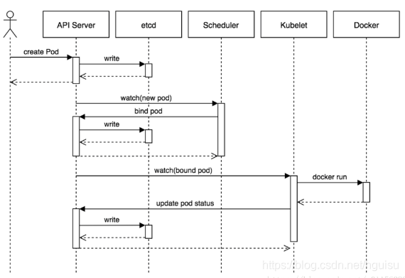

# 关键组件
##  Pod

Pod可以有一个或者多个容器

## 	静态Pod

​		仅存在于特定节点上的Pod，不能通过API Server 进行管理。

- ​	创建静态Pod 有两种方式：配置文件和Http方式	

  ## ConfigMap

使用ConfigMap的限制条件：

1. 必须再Pod 之前创建

2. 只有处于相同Namespace的才能用

3. > 配额管理未能实现? 1.24.3 ***也没有实现吗？还是废弃了***

4. kubelet 只支持可以被API server管理的Pod使用ConfigMap，静态Pod不支持使用

5. POd对ConfigMap进行挂载的时候只能挂载为目录，如果有相同的目录，则已有的目录被ConfigMap的目录覆盖。解决这种问题需要先挂载到临时目录，然后通过cp或者link的方式应用的实际配置目录下

   ## Downward API

容器内部获取Pod信息

Pod注入信息到容器的方式：

1. 环境变量，单个变量的注入
2. volume 挂载：将组类信息生成文件并挂载到容器内部。

价值：

实现节点自动发现。

##     健康检查

1. LIvenessProbe 探针：判断容器是否存活，如果容器不包含Liveness Probe 探针，那么kubelet认为该容器LivenessProbe探针返回的永远是Success

2. ReadinessProbe探针：判断容器的服务是否可用

   LivenessPro和ReadinessPro均可以用如下方式实现：

   配置方式：

   1. ExecAction:在容器内部执行一个命令如果返回码为0则表明容器健康
   2. TCPSocketAction: 通过容器地址内的和端口号执行tcp检查
   3. HttpGetAction:通过探测容器的IP地址端口以及请求路径，如果返回值为200-400之间则认为容器健康

   ## Pod调度

   1.9之后RC被删除之后Pod副本一并会被删除，如果需要取消：

   ```
   --casecade=false
   ```

   调度方式：

   1. Deployment或者RC 全自动调度

   2. NodeSelector:定向调度

      通过在节点上打标签的方式，创建Pod的时候指定nodeSelector

   3. Node亲和性调度
      1. requiredDuringSchedulingIgnoredDuringExecution 相当于nodeSelector定向调度，硬限制
      2. preferredDuringSchedulingIgnoredDuringExecution:软限制尝试调度pod到node上。还可以设置多个软限制并定义权重以实现执行的先后顺序。IgnoredDuringExecution为如果pod在运行期间node的属性发生了变更，则系统会忽略变更，该pod可以继续在该节点运行

   4. Pod 亲和度调度和互斥策略

   5. 容忍和污点：Taints及Tolerations

      1.**添加污点** 为k8s-node02添加污点，污点程度为`NoSchedule`，`type=calculate`为标签
      
      ```text
      kubectl taint node k8s-node02 type=calculate:NoSchedule
      ```
      
      **2.查看污点**
      
      ```text
       kubectl describe nodes k8s-node02 | grep Taints
      ```
      
      
      
      https://blog.csdn.net/qq_34857250/article/details/90259693

   ### kube-scheduler 调度流程

   ​	

   

   1. 过滤（Predicates 预选策略）

       	过滤阶段会将所有满足 Pod 调度需求的 Node 选出来。

   2. 打分（Priorities 优选策略）

      ​	在过滤阶段后调度器会为 Pod 从所有可调度节点中选取一个最合适的 Node。根据当前启用的打分规则，调度器会给每一个可调度节点进行打分

   1. 用户提交pod请求：用户提交创建Pod的请求，可以通过API Server的REST API ，也可用Kubectl命令行工具，支持Json和Yaml两种格式；

   2. API Server 处理请求：API Server 处理用户请求，存储Pod数据到Etcd；

   3. Schedule调度pod：Schedule通过和 API Server的watch机制，查看到新的pod，按照预定的调度策略将Pod调度到相应的Node节点上；

                        1）过滤主机：调度器用一组规则过滤掉不符合要求的主机，比如Pod指定了所需要的资源，那么就要过滤掉资源不够的主机；

                       2）主机打分：对第一步筛选出的符合要求的主机进行打分，在主机打分阶段，调度器会考虑一些整体优化策略，比如把一个Replication Controller的副本分布到不同的主机上，使用最低负载的主机等；

                       3）选择主机：选择打分最高的主机，进行binding操作，结果存储到Etcd中；

   4. kubelet创建pod:  kubelet根据Schedule调度结果执行Pod创建操作: 调度成功后，会启动container, docker run, scheduler会调用API Server的API在etcd中创建一个bound pod对象，描述在一个工作节点上绑定运行的所有pod信息。运行在每个工作节点上的kubelet也会定期与etcd同步bound pod信息，一旦发现应该在该工作节点上运行的bound pod对象没有更新，则调用Docker API创建并启动pod内的容器。


    

# Pod升级回退

Pod如果是通过Deployment 创建的，则升级回退就是要使用Deployment的升级回退策略

##  Deployment  

1. 只能管理无状态应用

   ### Deployment更新方式

   1. kubectl set image
   2. kubectl edit deployment 直接修改镜像

   ### Deployment更新策略

   1. Recreate
   2. RollingUpdate：滚动更新，为默认方式

   ### DaemonSet更新策略

   1. OnDelete：新的Daemonset配置创建之后并不立即创建新的Pod，只有在手动删除旧的之后才创建

   2. RollingUpdate：

      注意：

      1.不支持查看和管理Daemonset的更新历史记录

      2.不能直接通过 使用kubectl rollback来实现，需要提供旧版本的配置文件

   ### StatefuleSet

   - 创建StorageClass，用于StatefulSet自动为各个应用申请PVC
   - 创建一个Headlesse Service用户维护Mongo DB的集群状态
   - 创建一个StatefulSet


##  service 
解决的是容器负载的问题。解决的是：

 服务发现（防止pod 失联）防止Pod失联；定义一组Pod的访问策略

负载均衡（轮询转发请求到后端集群中的pod

1. 可以这么理解？ 
    service 对一组具有相同功能的***容器***  应用提供一个统一的入口。并且将请求负载分发到后端的各个容器应用上

    如果两个tomcat pod 对外提供服务，由于POD随时可漂移性IP访问方式并不可靠，所以需要做一个前端做一个负载均衡转发

    - Service 的类型：

2.  服务创建命令

    1.  创建应用 kubectl create -f webapp-rc.yaml，创建应用副本

    2. kubectl expose rc "webapp"  ,创建服务之后，使用命令 kubectl get svc  查看，可以看到已经分配好了cluster IP 

        ```go
        kubectl  expose  --help
        
        kubectl     expose     deployment 　　　　　 nginx-dep1   --port=2022         --target-port=80  　　--type=NodePort 　　　　　　　　-n kzf
        
                   　　　　     service代理资源类型    资源名称　　　代理对外端口　         pod 中内部端口　　　   端口暴露类型（默认ClusterIp）　　 命名空间
        ```

        方式二 创建yaml

        ```yaml
        apiVersion: v1
        kind: Service
        metadata:
          name: service-kzf1
          namespace: asdf
        spec:
          clusterIP: NodePort　　　　　　　　　　　　#不写默认类型为Clusterip
          ports:
          - port: 2021　　　　　　　　　　　　　　　　 #clusterip 集群端口
            targetPort: 80　　　　　　　　　　　　　　#pod 内部端口
          selector:
            app: nginx-label　　　　　　　　　　　　　#通过标签选择pod
        ```
    
    3. Service的访问被分发到了后端的Pod上去 负载分发策略
    
    4. roundRobin 轮询模式
    5. SessionAffinity  基于客户端IP保持会话模式，如果是相同客户端的请求会被转发到同一个Pod上
    
4. 外部服务
   1. 先创建一个无Label Slector Service,  无法选则后端Pod
   2. 手动创建与Service同名称的Endpoint

5. Headless Service 作用是不使用 Kubernetes 默认的负载均衡策略 ，clusterIP 设置为None

6. Cassadnra 根据Service 自动实现查找pod

7. 从集群外部访问Pod或者Service，Pod和Service都是Kubernetes的虚拟概念不能对外提供服务

   1. 将容器的Port映射到宿主机上

      ```yaml
      ports:
      - containerPort: 8080
       hostPort: 8081
      ```

   2.  将Service的Port映射到宿主机上，同时service type设置为nodePort

      ```yaml
      spec:
       type: NodePort
       ports:
       - port: 8080
         targetPort: 8080
         nodePort: 8081
      ```

8. 最佳实践
   
- 创建完成deployment之后，直接expose生成service，减少手动配置
   
9. service 的三种形式
   1. ClusterIP　 **集群IP，仅供k8s内部访问(只能在pod 或node 上访问，无法外部访问)，相当于service 加了1个vip，通过vip 提供访问地址，再转发给各个Pod**
   2. NodePort　　在每个node 节点为相应Pod启动一个对外端口（默认30000起步），映射pod 内部端口。通过任意一个Pod 所在的节点ip+port 就能访问pod ，多个pod 需要在service 前面加一个LB（lvs/proxy）把每个节点的ip+port 加入，才能实现负载均衡,这样每个服务都得添加一次，增加了管理维护成本
   3. Loadblance   云服务厂商提供的，自动添加service 映射对外端口到负载上面，例如阿里云可以通过SLB为service 提供负载均衡。只有云服务厂商的k8s 才有此形式
   
   ## 将服务暴露给外部客户端

#### 方式一：NodePort

将服务的类型设置成NodePort每个集群节点都会在节点上打开 一个端口， 对于NodePort服务， 每个集群节点在节点本身（因此得名叫NodePort)上打开一个端口，并将在该端口上接收到的流量重定向到基础服务。该服务仅在内部集群 IP 和端口上才可访间， 但也可通过任意一个节点上的专用端口访问。因为nodeport 是clusterip 的拓展，所以此类型既可以通过clusterip 在集群内部访问也可以通过node-IP：port 在外部访问

#### 方式二：LoadBalance

将服务的类型设置成LoadBalance, NodePort类型的一 种扩展一这使得服务可以通过一个专用的负载均衡器来访问， 这是由Kubernetes中正在运行的云基础设施提供的。 负载均衡器将流量重定向到跨所有节点的节点端口。客户端通过负载均衡器的 IP 连接到服务。

#### 方式三：Ingress

创建一 个Ingress资源， 这是一 个完全不同的机制， 通过一 个IP地址公开多个服务——它运行在 HTTP 层（网络协议第7 层）上， 因此可以提供比工作在第4层的服务更多的功能。


## service 负载功能实现原理

service 负载均衡实现主要有两种方式

#### iptables(早期)

iptables 是一个工具它通过linux 的netfilter 来进行ip 包的过滤处理。主要通过维护一张规则表，从上到下匹配表中规则，每次变动都不是增量而是全表变动。随着表的增大效率降低。

#### ipvs(k8s version:1.11以后)

ipvs实际上就是lvs 的原理。采用它的轮询策略（w,rr/wrr.lc,wlc），内核级别的，效率高。


# CoreDns

1.作用 集群内部需要通过服务名称对服务进行访问，就需要一个域名和IP的解析


# Ingress

 用于将不同的URL 访问转发到后端不同的Service，解决的是外部客户端访问一组服务的问题。

ngress相当于一个7层的负载均衡器，是Kubernetes对反向代理的一个抽象，它的工作原理类似于Nginx，可以理解成在Ingress里建立诸多映射规则，Ingress Controller通过监听这些配置规则并转化成Nginx的反向代理配置 , 然后对外部提供服务。在这里有两个核心概念：

Ingress：Kubernetes中的一个对象，作用是定义请求如何转发到Service的规则
Ingress Controller：具体实现反向代理及负载均衡的程序，对Ingress定义的规则进行解析，根据配置的规则来实现请求转发，实现方式有很多，比如Nginx、Haproxy 

​	1.使用Ingress ,需要创建Ingress controller，backend服务，Ingress 策略。创建Ingress 需要保证后端的服务已经创建完成否则会报错。

- ​	创建Ingress Controller，以Pod形式运行，监控Api Serverd的ingress接口后端的backend Service，如果service 有变化，则Ingress Controller自动更新其转发规则。
- 第一步：创建backend 服务，先创建默认
- 第二步：创建 Ingress Controller
- 第三步：定义转发策略

2. Ingress Controller 基于Ingress 转发规则将客户端 直接转发到service对应的后端Endpoint上，会跳过kube-proxy的转发功能，导致kube-proxy不再起作用。
3. Ingress 转发策略
   1. 单个后端服务
   2. 同一域名不同Url转发到不同的服务上
   3. 不同域名的服务转发到不同的服务上
   4. 不使用域名转发规则，用于一个网站不使用域名直接提供服务的场景。
      1. 默认开启https，需要修改INgress annotation，关闭默认转发
      2. 

# 集群安全机制


# 1. 安装的两种方式

 kubeadm 安装
 二进制安装
 https://blog.csdn.net/aa18855953229/article/details/108988316
 https://blog.csdn.net/redrose2100/article/details/123254371?spm=1001.2101.3001.6661.1&utm_medium=distribute.pc_relevant_t0.none-task-blog-2%7Edefault%7ECTRLIST%7Edefault-1-123254371-blog-108988316.pc_relevant_multi_platform_whitelistv1&depth_1-utm_source=distribute.pc_relevant_t0.none-task-blog-2%7Edefault%7ECTRLIST%7Edefault-1-123254371-blog-108988316.pc_relevant_multi_platform_whitelistv1&utm_relevant_index=1

## 1.2 

# 2 docker 和containerd 区别

Docker作为k8s容器运行时，调用关系如下:
kubelet --> docker shim(在 kubelet进程中) --> dockerd --> containerd

Containerd作为k8s容器运行时，调用关系如下:
kubelet --> cri plugin (在 containerd进程中)--> containerd
其中dockerd虽增加了swarm cluster、docker build、docker API等功能，但也会引入一些bug，而与containerd相比，多了一层调用。
区别：
1、containerd不需要经过dockershim，所以调用链更短，组件更少，更稳定，占用节点资源更少，docker需要经过所以调用链更长；
2、docker调用cni是“docker-shim”，containerd调用cni是“containerd-cri”。

| docker | containerd |      |
| ------ | ---------- | ---- |
|        |            |      |
|        |            |      |
|        |            |      |

containerd 其实就是用来替换Docker的

## 2.1 Docker相关操作

 	

# 3. 容器 service, Inress, 微服务负载均衡怎么做

# 4. 镜像怎么打包、发布
# 5. 容器网络,网络插件优缺点使用场景 
# 6. ks8集群 升级 回退，扩缩容
## 6.1 集群的集群怎么做
# 7. 微服务场景应用
# 8. k8s 容量，多少节点可以提供多少服务能力
## 8.2 一个集群能管理多少节点

# 9.RS 和Deployment的区别