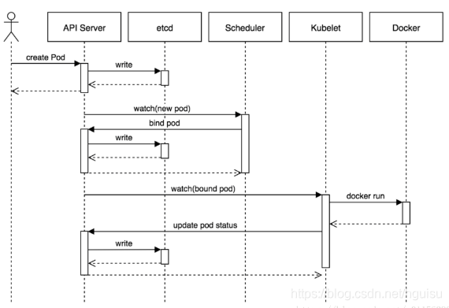

# 关键组件
# k8s架构


**1）Master**

K8S中的Master是集群控制节点，负责整个集群的管理和控制

在Master上运行着以下关键进程：

kube-apiserver：提供了HTTP Rest接口的关键服务进程，是K8S里所有资源的增删改查等操作的唯一入口，也是集群控制的入口进程
kube-controller-manager：K8S里所有资源对象的自动化控制中心，集群内各种资源Controller的核心管理者，针对每一种资源都有相应的Controller，保证其下管理的每个Controller所对应的资源始终处于期望状态
kube-scheduler：负责资源调度（Pod调度）的进程，通过API Server的Watch接口监听新建Pod副本信息，并通过调度算法为该Pod选择一个最合适的Node
etcd：K8S里的所有资源对象以及状态的数据都被保存在etcd中
**2）Node**

Node是K8S集群中的工作负载节点，每个Node都会被Master分配一些工作负载，当某个Node宕机时，其上的工作负载会被Master自动转移到其他节点上

在每个Node上都运行着以下关键进程：

kubelet：负责Pod对应的容器的创建、启停等任务，同时与Master密切协作，实现集群管理的基本功能
kube-proxy：实现Kubernetes Service的通信与负载均衡机制的重要组件
Docker Engine：Docker引擎，负责本机的容器创建和管理工作
在默认情况下Kubelet会向Master注册自己，一旦Node被纳入集群管理范围，kubelet进程就会定时向Master汇报自身的信息（例如机器的CPU和内存情况以及有哪些Pod在运行等），这样Master就可以获知每个Node的资源使用情况，并实现高效均衡的资源调度策略。而某个Node在超过指定时间不上报信息时，会被Master判定为失败，Node的状态被标记为不可用，随后Master会触发工作负载转移的自动流程

# API Server

- 是集群管理的API入口。
- 是资源配额控制的入口。
- 提供了完备的集群安全机制


##  Pod

Pod可以有一个或者多个容器

## 	静态Pod

​		仅存在于特定节点上的Pod，不能通过API Server 进行管理。

- ​	创建静态Pod 有两种方式：配置文件和Http方式	

  ## ConfigMap

使用ConfigMap的限制条件：

1. 必须再Pod 之前创建

2. 只有处于相同Namespace的才能用

3. > 配额管理未能实现? 1.24.3 ***也没有实现吗？还是废弃了***

4. kubelet 只支持可以被API server管理的Pod使用ConfigMap，静态Pod不支持使用

5. POd对ConfigMap进行挂载的时候只能挂载为目录，如果有相同的目录，则已有的目录被ConfigMap的目录覆盖。解决这种问题需要先挂载到临时目录，然后通过cp或者link的方式应用的实际配置目录下

   ## Downward API

容器内部获取Pod信息

Pod注入信息到容器的方式：

1. 环境变量，单个变量的注入
2. volume 挂载：将组类信息生成文件并挂载到容器内部。

价值：

实现节点自动发现。

##     健康检查

1. LIvenessProbe 探针：判断容器是否存活，如果容器不包含Liveness Probe 探针，那么kubelet认为该容器LivenessProbe探针返回的永远是Success

2. ReadinessProbe探针：判断容器的服务是否可用

   LivenessPro和ReadinessPro均可以用如下方式实现：

   配置方式：

   1. ExecAction:在容器内部执行一个命令如果返回码为0则表明容器健康
   2. TCPSocketAction: 通过容器地址内的和端口号执行tcp检查
   3. HttpGetAction:通过探测容器的IP地址端口以及请求路径，如果返回值为200-400之间则认为容器健康

   ## Pod调度

   1.9之后RC被删除之后Pod副本一并会被删除，如果需要取消：

   ```
   --casecade=false
   ```

   调度方式：

   1. Deployment或者RC 全自动调度

   2. NodeSelector:定向调度

      通过在节点上打标签的方式，创建Pod的时候指定nodeSelector

   3. Node亲和性调度
      1. requiredDuringSchedulingIgnoredDuringExecution 相当于nodeSelector定向调度，硬限制
      2. preferredDuringSchedulingIgnoredDuringExecution:软限制尝试调度pod到node上。还可以设置多个软限制并定义权重以实现执行的先后顺序。IgnoredDuringExecution为如果pod在运行期间node的属性发生了变更，则系统会忽略变更，该pod可以继续在该节点运行

   4. Pod 亲和度调度和互斥策略

   5. 容忍和污点：Taints及Tolerations

      1.**添加污点** 为k8s-node02添加污点，污点程度为`NoSchedule`，`type=calculate`为标签
      
      ```text
      kubectl taint node k8s-node02 type=calculate:NoSchedule
      ```
      
      **2.查看污点**
      
      ```text
       kubectl describe nodes k8s-node02 | grep Taints
      ```
      
      
      
      https://blog.csdn.net/qq_34857250/article/details/90259693

   ### kube-scheduler 创建流程

   ​	

   

   

   1. 用户提交pod请求：用户提交创建Pod的请求，可以通过API Server的REST API ，也可用Kubectl命令行工具，支持Json和Yaml两种格式；

   2. API Server 处理请求：API Server 处理用户请求，存储Pod数据到Etcd；

   3. Schedule调度pod：Schedule通过和 API Server的watch机制，查看到新的pod，按照预定的调度策略将Pod调度到相应的Node节点上；

                        1）过滤主机：调度器用一组规则过滤掉不符合要求的主机，比如Pod指定了所需要的资源，那么就要过滤掉资源不够的主机；

                       2）主机打分：对第一步筛选出的符合要求的主机进行打分，在主机打分阶段，调度器会考虑一些整体优化策略，比如把一个Replication Controller的副本分布到不同的主机上，使用最低负载的主机等；

                       3）选择主机：选择打分最高的主机，进行binding操作，结果存储到Etcd中；

   4. kubelet创建pod:  kubelet根据Schedule调度结果执行Pod创建操作: 调度成功后，会启动container, docker run, scheduler会调用API Server的API在etcd中创建一个bound pod对象，描述在一个工作节点上绑定运行的所有pod信息。运行在每个工作节点上的kubelet也会定期与etcd同步bound pod信息，一旦发现应该在该工作节点上运行的bound pod对象没有更新，则调用Docker API创建并启动pod内的容器。

   #### 选择node机制

   1. 过滤（Predicates 预选策略）

      	过滤阶段会将所有满足 Pod 调度需求的 Node 选出来。

   2. 打分（Priorities 优选策略）

      ​	在过滤阶段后调度器会为 Pod 从所有可调度节点中选取一个最合适的 Node。根据当前启用的打分规则，调度器会给每一个可调度节点进行打分


​    

# Pod升级回退

Pod如果是通过Deployment 创建的，则升级回退就是要使用Deployment的升级回退策略

##  Deployment  

1. 只能管理无状态应用, 总结k8s中的Pod、ReplicaSet、Deployment之间的管理关系，自顶到下为：Deployment=>ReplicaSet=>Pod。

   ### Deployment更新方式

   1. kubectl set image

   ```
   kubectl set image deployment/nginx-deployment nginx=nginx:1.16.1 --record
   ```

   2. kubectl edit deployment 直接修改镜像

   3. \# 扩容    kubectl scale deployment nginx-deployment --replicas=5

   4.   缩容   kubectl scale --current-replicas=5 --replicas=3 deployment nginx-deployment

   5.   \# 删除deployment资源(基于yaml)    kubectl delete -f nginx.yml

   6. ```
      查看历史deployment
      kubectl rollout history deployment nginx-deployment   
       kubectl rollout status deployment nginx-deployment
      ```

   7.  \# 通过--to-revision指定回滚到特定的修订如：--to-revision=2    kubectl rollout undo deployment nginx-deployment

   ### Deployment更新策略

   1. Recreate
   2. RollingUpdate：滚动更新，为默认方式

   

   ### DaemonSet更新策略

   1. OnDelete：新的Daemonset配置创建之后并不立即创建新的Pod，只有在手动删除旧的之后才创建

   2. RollingUpdate：

      注意：

      1.不支持查看和管理Daemonset的更新历史记录

      2.不能直接通过 使用kubectl rollback来实现，需要提供旧版本的配置文件

   ### StatefuleSet

   - 创建StorageClass，用于StatefulSet自动为各个应用申请PVC
   - 创建一个Headlesse Service用户维护Mongo DB的集群状态
   - 创建一个StatefulSet

## Pod 驱逐策略

驱逐策略


#  service 
解决的是容器负载的问题。service的引入旨在保证pod的动态变化对访问端透明，访问端只需要知道service的地址，由service来提供代理**解决的是**： 

 服务发现（防止pod 失联）防止Pod失联；定义一组Pod的访问策略

负载均衡（轮询转发请求到后端集群中的pod

1. 可以这么理解？ 
    service 对一组具有相同功能的***容器***  应用提供一个统一的入口。并且将请求负载分发到后端的各个容器应用上

    如果两个tomcat pod 对外提供服务，由于POD随时可漂移性IP访问方式并不可靠，所以需要做一个前端做一个负载均衡转发

    - Service 的类型：

2.  服务创建命令

    1.  创建应用 kubectl create -f webapp-rc.yaml，创建应用副本

    2. kubectl expose rc "webapp"  ,创建服务之后，使用命令 kubectl get svc  查看，可以看到已经分配好了cluster IP 

        ```go
        kubectl  expose  --help
        
        kubectl     expose     deployment 　　　　　 nginx-dep1   --port=2022         --target-port=80  　　--type=NodePort 　　　　　　　　-n kzf
        
                   　　　　     service代理资源类型    资源名称　　　代理对外端口　         pod 中内部端口　　　   端口暴露类型（默认ClusterIp）　　 命名空间
        ```

        方式二 创建yaml

        ```yaml
        apiVersion: v1
        kind: Service
        metadata:
          name: service-kzf1
          namespace: asdf
        spec:
          clusterIP: NodePort　　　　　　　　　　　　#不写默认类型为Clusterip
          ports:
          - port: 2021　　　　　　　　　　　　　　　　 #clusterip 集群端口
            targetPort: 80　　　　　　　　　　　　　　#pod 内部端口
          selector:
            app: nginx-label　　　　　　　　　　　　　#通过标签选择pod
        ```
    
    3. Service的访问被分发到了后端的Pod上去 负载分发策略
    
    4. **负载分发策略：**
    
        4. roundRobin 轮询模式
        2.  SessionAffinity  基于客户端IP保持会话模式，如果是相同客户端的请求会被转发到同一个Pod上
    
4. 外部服务
   1. 先创建一个无Label Slector Service,  无法选则后端Pod
   2. 手动创建与Service同名称的Endpoint

5. Headless Service 作用是不使用 Kubernetes 默认的负载均衡策略 ，clusterIP 设置为None

6. Cassadnra 根据Service 自动实现查找pod

7. 从集群外部访问Pod或者Service，Pod和Service都是Kubernetes的虚拟概念不能对外提供服务

   1. 将容器的Port映射到宿主机上

      ```yaml
      ports:
      - containerPort: 8080
       hostPort: 8081
      ```

   2.  将Service的Port映射到宿主机上，同时service type设置为nodePort

      ```yaml
      spec:
       type: NodePort
       ports:
       - port: 8080
         targetPort: 8080
         nodePort: 8081
      ```

8. 最佳实践
   
- 创建完成deployment之后，直接expose生成service，减少手动配置
  
9. service 的三种形式
   1. ClusterIP　 **集群IP，仅供k8s内部访问(只能在pod 或node 上访问，无法外部访问)，相当于service 加了1个vip，通过vip 提供访问地址，再转发给各个Pod**
   2. NodePort　　在每个node 节点为相应Pod启动一个对外端口（默认30000起步），映射pod 内部端口。通过任意一个Pod 所在的节点ip+port 就能访问pod ，多个pod 需要在service 前面加一个LB（lvs/proxy）把每个节点的ip+port 加入，才能实现负载均衡,这样每个服务都得添加一次，增加了管理维护成本
   3. Loadblance   云服务厂商提供的，自动添加service 映射对外端口到负载上面，例如阿里云可以通过SLB为service 提供负载均衡。只有云服务厂商的k8s 才有此形式
   
   
   
   #### EndPoint
   
   Endpoint是可被访问的服务端点，即一个状态为running的pod，它是service访问的落点，只有service关联的pod才可能成为endpoint。
   Endpoint、service和pod的关系：
   
   
   
   
   
   ## 将服务暴露给外部客户端

#### 方式一：NodePort

将服务的类型设置成NodePort每个集群节点都会在节点上打开 一个端口， 对于NodePort服务， 每个集群节点在节点本身（因此得名叫NodePort)上打开一个端口，并将在该端口上接收到的流量重定向到基础服务。该服务仅在内部集群 IP 和端口上才可访间， 但也可通过任意一个节点上的专用端口访问。因为nodeport 是clusterip 的拓展，所以此类型既可以通过clusterip 在集群内部访问也可以通过node-IP：port 在外部访问

#### 方式二：LoadBalance

将服务的类型设置成LoadBalance, NodePort类型的一 种扩展一这使得服务可以通过一个专用的负载均衡器来访问， 这是由Kubernetes中正在运行的云基础设施提供的。 负载均衡器将流量重定向到跨所有节点的节点端口。客户端通过负载均衡器的 IP 连接到服务。

#### 方式三：Ingress

创建一 个Ingress资源， 这是一 个完全不同的机制， 通过一 个IP地址公开多个服务——它运行在 HTTP 层（网络协议第7 层）上， 因此可以提供比工作在第4层的服务更多的功能。


## service 负载功能实现原理

service 负载均衡实现主要有两种方式

#### iptables(早期)

iptables 是一个工具它通过linux 的netfilter 来进行ip 包的过滤处理。主要通过维护一张规则表，从上到下匹配表中规则，每次变动都不是增量而是全表变动。随着表的增大效率降低。

#### 缺点：

宿主机上有大量 Pod 的时候，成百上千条 iptables 规则不断地被刷新，会大量占用该宿主机的 CPU 资源，甚至会让宿主机“卡”在这个过程中。所以说，一直以来，基于 iptables 的 Service 实现，都是制约 Kubernetes 项目承载更多量级的 Pod 的主要障碍 

#### ipvs(k8s version:1.11以后)

ipvs实际上就是lvs 的原理。采用它的轮询策略（w,rr/wrr.lc,wlc），内核级别的，效率高。

原理：

IPVS 模式的工作原理，其实跟 iptables 模式类似。当我们创建了前面的 Service 之后，kube-proxy 首先会在宿主机上创建一个虚拟网卡（叫作：kube-ipvs0），并为它分配 Service VIP 作为 IP 地址，如下所示：

```
# ip addr
  ...
  73：kube-ipvs0：<BROADCAST,NOARP>  mtu 1500 qdisc noop state DOWN qlen 1000
  link/ether  1a:ce:f5:5f:c1:4d brd ff:ff:ff:ff:ff:ff
  inet 10.0.1.175/32  scope global kube-ipvs0
  valid_lft forever  preferred_lft forever
```

而接下来，kube-proxy 就会通过 Linux 的 IPVS 模块，为这个 IP 地址设置三个 IPVS 虚拟主机，并设置这三个虚拟主机之间使用轮询模式 (rr) 来作为负载均衡策略。我们可以通过 ipvsadm 查看到这个设置，如下所示

```
# ipvsadm -ln
 IP Virtual Server version 1.2.1 (size=4096)
  Prot LocalAddress:Port Scheduler Flags
    ->  RemoteAddress:Port           Forward  Weight ActiveConn InActConn     
  TCP  10.102.128.4:80 rr
    ->  10.244.3.6:9376    Masq    1       0          0         
    ->  10.244.1.7:9376    Masq    1       0          0
    ->  10.244.2.3:9376    Masq    1       0          0
```

这三个 IPVS 虚拟主机的 IP 地址和端口，对应的正是三个被代理的 Pod。

这时候，任何发往 10.102.128.4:80 的请求，就都会被 IPVS 模块转发到某一个后端 Pod 上了。

而相比于 iptables，IPVS 在内核中的实现其实也是基于 Netfilter 的 NAT 模式，所以在转发这一层上，理论上 IPVS 并没有显著的性能提升。但是，IPVS 并不需要在宿主机上为每个 Pod 设置 iptables 规则，而是把对这些“规则”的处理放到了内核态，从而极大地降低了维护这些规则的代价。这也正印证了我在前面提到过的，“将重要操作放入内核态”是提高性能的重要手段。

不过需要注意的是，IPVS 模块只负责上述的负载均衡和代理功能。而一个完整的 Service 流程正常工作所需要的包过滤、SNAT 等操作，还是要靠 iptables 来实现。只不过，这些辅助性的 iptables 规则数量有限，也不会随着 Pod 数量的增加而增加。 


# CoreDns

### 1.作用 集群内部需要通过服务名称对服务进行访问，就需要一个域名和IP的解析

### 2.Pod 如何知道 DNS服务器地址

kubelet会将DNS Server 的 IP地址写到容器的/etc/resolv.conf文件中

具体来说

集群内 DNS 服务启动后，会获得 Cluster IP (就是Service 的IP，但只能在集群内使用)
系统（安装程序）会给kubelet配置 --cluster-dns=<dns service ip>
该 DNS IP 则会在容器启动时传递，写入到每个容器的 /etc/resolv.conf文件中 

### DNS域名解析原理

对于 Service，K8s DNS服务器会生成三类 DNS 记录，分别是 A 记录、 SRV 记录、 CNAME 记录

#### A记录

- 用于将域或子域指向某个IP地址，是DNS记录的最基本类型
- 记录包含域名，解析它的IP地址和以秒为单位的TTL，TTL代表生存时间，是此记录的到期时间
- 普通Service的A记录的映射关系
  - {service name}.{service namespace}.svc.{domin} --> Cluster IP
- headless Service 的 A 记录映射关系：
  - {service name}.{service namespace}.svc.{domin} --> 后端Pod IP 列表
- 如果 Pod Spec 指定 hostname 和 subdomin，那么会额外生成 Pod 的 A 记录
  - 
    如果 Pod Spec 指定 hostname 和 subdomin，那么会额外生成 Pod 的 A 记录
    {hostname}.{subdomain}.{pod namespace}.pod.cluster.local --> Pod IP

#### SRV 记录

通过描述某些服务协议和地址促进服务发现
定义一个符号名称和作为域名一部分的传输协议，并定义给定服务的优先级、权重、端口和目标
_sip._tcp.example.com.   3600 IN   SRV 10   70   5060 srvrecord.example.com
_sip._tcp.example.com.   3600 IN   SRV 10   20   5060 srvrecord2.ex

_sip 是服务的符号名称
_tcp 是服务使用的传输协议
两个记录都定义了10的优先级
第一个指定权重70，第二个指定权重20
最后两值定义了要连接的端口和主机名，以便与服务通信

 ```
_sip._tcp.example.com.   3600 IN   SRV 10   70   5060 srvrecord.example.com
_sip._tcp.example.com.   3600 IN   SRV 10   20   5060 srvrecord2.ex

_sip 是服务的符号名称
_tcp 是服务使用的传输协议
两个记录都定义了10的优先级
第一个指定权重70，第二个指定权重20
最后两值定义了要连接的端口和主机名，以便与服务通信
 ```

- k8s DNS 的 SRV 记录按照一个约定出城的规定实现了对服务端口的查询
  _{port name}._{port protocol}.{service name}.{service namespace}.svc.cluster.local --> Service Port
  SRV 记录是为 普通 或 headless 服务的部分指定端口创建的
  普通服务
  被解析的端口号和域名是 my-svc.my-namespace.svc.cluster.local
  Headless 服务
  此 name 解析为多个 answer，每个 answer 都支持服务
  每个 answer 都包含 auto-generated-name.my-svc.my-namespace.svc.cluster.local 表单的 Pod 端口号和域名

#### CNAME 记录

别名
用于将域或子域指向另一个主机名
可用于联合服务的跨集群服务发现 

## CoreDNS配置解析

配置模板

```
apiVersion: v1
kind: ConfigMap
metadata:
  name: coredns
  namespace: namespace-test
data:
  Corefile: |
    .:53 {
        errors
        health
        ready
        kubernetes cluster.local  10.200.0.0/16 {
          pods insecure
          upstream 114.114.114.114
          fallthrough in-addr.arpa ip6.arpa
          namespaces namespace-test
        }
        prometheus :9153
        forward . /etc/resolv.conf
        cache 30
        loop
        reload
        loadbalance
    }
```


CoreDNS的主要功能是通过插件系统实现的。它实现了一种链式插件的结构，将dns的逻辑抽象成了一个个插件。常见的插件如下：

loadbalance：提供基于dns的负载均衡功能
loop：检测在dns解析过程中出现的简单循环问题
cache：提供前端缓存功能
health：对Endpoint进行健康检查
kubernetes：从kubernetes中读取zone数据
etcd：从etcd读取zone数据，可以用于自定义域名记录
file：从文件中读取zone数据
hosts：使用/etc/hosts文件或者其他文件读取zone数据，可以用于自定义域名记录
auto：从磁盘中自动加载区域文件
reload：定时自动重新加载Corefile配置文件的内容
forward：转发域名查询到上游dns服务器
proxy：转发特定的域名查询到多个其他dns服务器，同时提供到多个dns服务器的负载均衡功能
prometheus：为prometheus系统提供采集性能指标数据的URL
pprof：在URL路径/debug/pprof下提供运行是的西能数据
log：对dns查询进行日志记录
errors：对错误信息镜像日志记录

# Ingress

**Kubernetes 暴露服务的有三种方式，分别为 LoadBlancer Service、NodePort Service、Ingress**。

 用于将不同的URL 访问转发到后端不同的Service，解决的是外部客户端访问一组服务的问题。

ngress相当于一个7层的负载均衡器，是Kubernetes对反向代理的一个抽象，它的工作原理类似于Nginx，可以理解成在Ingress里建立诸多映射规则，Ingress Controller通过监听这些配置规则并转化成Nginx的反向代理配置 , 然后对外部提供服务。在这里有两个核心概念：

Ingress：Kubernetes中的一个对象，作用是定义请求如何转发到Service的规则
Ingress Controller：具体实现反向代理及负载均衡的程序，对Ingress定义的规则进行解析，根据配置的规则来实现请求转发，实现方式有很多，比如Nginx、Haproxy 

## Ingress-nginx介绍

1）Ingress-nginx组成
ingress-nginx-controller：根据用户编写的ingress规则（创建的ingress的yaml文件），动态的去更改nginx服务的配置文件，并且reload重载使其生效（是自动化的，通过lua脚本来实现）
ingress资源对象：将Nginx的配置抽象成一个Ingress对象，每添加一个新的Service资源对象只需写一个新的Ingress规则的yaml文件即可（或修改已存在的ingress规则的yaml文件）

2）Ingress-nginx工作流程
Ingress 的实现分为两个部分 Ingress Controller 和 Ingress .

截至目前，nginx-ingress 已经能够完成 7/4 层的代理功能（4 层代理基于 ConfigMap，感觉还有改进的空间）；Nginx 的 7 层反向代理模式，可以简单用下图表示：

Nginx 对后端运行的服务（Service1、Service2）提供反向代理，在配置文件中配置了域名与后端服务 Endpoints 的对应关系。
客户端通过使用 DNS 服务或者直接配置本地的 hosts 文件，将域名都映射到 Nginx 代理服务器。
当客户端访问 service1.com 时，浏览器会把包含域名的请求发送给 nginx 服务器，nginx 服务器根据传来的域名，选择对应的 Service，这里就是选择 Service 1 后端服务，然后根据一定的负载均衡策略，选择 Service1 中的某个容器接收来自客户端的请求并作出响应。
过程很简单，nginx 在整个过程中仿佛是一台根据域名进行请求转发的“路由器”，这也就是7层代理的整体工作流程了！

3）工作原理
对于 Nginx 反向代理做了什么，我们已经大概了解了。在 k8s 系统中，后端服务的变化是十分频繁的，单纯依靠人工来更新nginx 的配置文件几乎不可能，nginx-ingress 由此应运而生。Nginx-ingress 通过监视 k8s 的资源状态变化实现对 nginx 配置文件的自动更新，下面本文就来分析下其工作原理。


nginx-ingress 模块在运行时主要包括三个主体：NginxController、Store、SyncQueue。
Store 主要负责从 kubernetes APIServer 收集运行时信息，感知各类资源（如 ingress、service等）的变化，并及时将更新事件消息（event）写入一个环形管道。
SyncQueue 协程定期扫描 syncQueue 队列，发现有任务就执行更新操作，即借助 Store 完成最新运行数据的拉取，然后根据一定的规则产生新的 nginx 配置，（有些更新必须 reload，就本地写入新配置，执行 reload），然后执行动态更新操作，即构造 POST 数据，向本地 Nginx Lua 服务模块发送 post 请求，实现配置更新。
NginxController 作为中间的联系者，监听 updateChannel，一旦收到配置更新事件，就向同步队列 syncQueue 里写入一个更新请求。

​	1.使用Ingress ,需要创建Ingress controller，backend服务，Ingress 策略。创建Ingress 需要保证后端的服务已经创建完成否则会报错。

- ​	创建Ingress Controller，以Pod形式运行，监控Api Serverd的ingress接口后端的backend Service，如果service 有变化，则Ingress Controller自动更新其转发规则。
- 第一步：创建backend 服务，先创建默认
- 第二步：创建 Ingress Controller
- 第三步：定义转发策略

2. Ingress Controller 基于Ingress 转发规则将客户端 直接转发到service对应的后端Endpoint上，会跳过kube-proxy的转发功能，导致kube-proxy不再起作用。

3. Ingress 转发策略
   1. 单个后端服务
   2. 同一域名不同Url转发到不同的服务上
   3. 不同域名的服务转发到不同的服务上
   4. 不使用域名转发规则，用于一个网站不使用域名直接提供服务的场景。
      1. 默认开启https，需要修改INgress annotation，关闭默认转发
   
   总结各方式利弊
   hostPort和hostNetwork直接使用节点网络**，部署时节点需固定**，访问ip也固定(也可以用host)，端口为正常端口
   
   nodeport方式部署时不要求固定节点，可通过集群内任一ip进行访问，就是端口为30000以上，很多时候由于公司安全策略导致不能访问。
   
   LoadBalancer依赖于**云服务商提供的LoadBalancer**的实现机制。
   
   ingress需要额外安装**ingress模块**，配置路由规则，且仅能通过所配置域名访问，配置好域名后，可以直接对外提供服务，和传统的nginx作用类似


###  Ingress-Nginx的四层代理

1. **TCP服务如何用Ingress-Nginx做服务发现。**

   ```
   # 首先，看下它的ConfigMap 其中有一项是tcp-service。它是在部署时创建的。
   kubectl get cm -n ingress-nginx
   kubectl get cm -n ingress-nginx -o yaml
   
   # 使用配置文件tcp-config.yaml 30000是我要暴露的执行机的对外端口 后面是暴露的服务
   # dev命名空间下web-demo服务的80端口
   apiVersion: v1
   kind: ConfigMap
   metadata:
     name: tcp-services
     namespace: ingress-nginx
   data:
     "30000": dev/web-demo:80
   
   kubectl apply -f tcp-config.yaml
   # 查看执行机是否监听30000
   netstat -ntlp|grep 30000
   # 直接通过ip+端口访问测试 这种方式很简单 主要用来测试一些东西方便
   http://192.168.242.131:30000/
   ```

### Ingress-Nginx的定制配置

##### 自定义配置-**改一些配置参数**

```
# 进入到容器中
docker ps | grep ingress-nginx
docker exec -it e45667e1185b bash
# 查看nginx的配置文件
ps -ef | grep nginx
more /etc/nginx/nginx.conf
# 1. 这里通过ConfigMap修改一些配置参数 具体可以修改的参数参考github官网:https://github.com/kubernetes/ingress-nginx
# 详细用法:https://kubernetes.github.io/ingress-nginx/user-guide/nginx-configuration/configmap/
kind: ConfigMap
apiVersion: v1
metadata:
  name: nginx-configuration
  namespace: ingress-nginx
  labels:
    app: ingress-nginx
data:
  proxy-body-size: "64m"
  proxy-read-timeout: "180"
  proxy-send-timeout: "180"
  
# 应用全局配置查看是否生效
kubectl apply -f nginx-config.yaml
docker exec -it e45667e1185b bash
# 这里字段可能不完全一样 可以去上面地址文档查询
more /etc/nginx/nginx.conf
```

##### 自定义配置-**定义全局的header**

```
# 2. 自定义全局的header
apiVersion: v1
kind: ConfigMap
data:
  proxy-set-headers: "ingress-nginx/custom-headers"
metadata:
  name: nginx-configuration
  namespace: ingress-nginx
  labels:
    app.kubernetes.io/name: ingress-nginx
    app.kubernetes.io/part-of: ingress-nginx
---
apiVersion: v1
kind: ConfigMap
data:
  X-Different-Name: "true"
  X-Request-Start: t=${msec}
  X-Using-Nginx-Controller: "true"
metadata:
  name: custom-headers
  namespace: ingress-nginx

# 测试一下
kubectl apply -f custom-header-global.yaml
docker exec -it 15b497b1108e bash
more /etc/nginx/nginx.conf

```

##### 自定义配置-**自定义ingress下的header**

```
# 3. 自定义ingress下的header nginx.ingress.kubernetes.io/configuration-snippet
apiVersion: extensions/v1beta1
kind: Ingress
metadata:
  annotations:
    nginx.ingress.kubernetes.io/configuration-snippet: |
      more_set_headers "Request-Id: $req_id";
  name: web-demo
  namespace: dev
spec:
  rules:
  - host: web-dev.mooc.com
    http:
      paths:
      - backend:
          serviceName: web-demo
          servicePort: 80
        path: /

# 测试一下
kubectl create -f custom-header-global.yaml
docker exec -it 15b497b1108e bash
more /etc/nginx/nginx.conf

```

##### TSL配置HTTPS的配置

```
编写一个脚本生成证书，然后创建一个secret。
#!/bin/bash
openssl req -x509 -nodes -days 365 -newkey rsa:2048 -keyout mooc.key -out mooc.crt -subj "/CN=*.mooc.com/O=*.mooc.com"
kubectl create secret tls mooc-tls --key mooc.key --cert mooc.crt

# 查看生成的secret
kubectl get secret mooc-tls -o yaml
# 进入容器中 查看证书文件怎么使用 --default-ssl-certificate
docker ps | grep ingress-nginx
docker exec -it db2305dcc074 bash
/nginx-ingress-controller -h

# 修改nginx-ingress-controller.yaml文件参数加入证书 default命名空间下的mooc-tls
- --default-ssl-certificate=default/mooc-tls

# 重新应用
kubectl apply -f nginx-ingress-controller.yaml
kubectl get pod -n ingress-nginx

# 试一下我们的https 返现返回default backend - 404 没有找到服务
https://web-dev.mooc.com/

# 除了给ingress-nginx配置好证书之后，还需要在具体域名下给域名指定证书
# 否则并不会创建web-dev.mooc.com Https的服务
apiVersion: extensions/v1beta1
kind: Ingress
metadata:
  name: web-demo
  namespace: dev
spec:
  rules:
  - host: web-dev.mooc.com
    http:
      paths:
      - backend:
          serviceName: web-demo
          servicePort: 80
        path: /
  tls:
    - hosts:
      - web-dev.mooc.com
      secretName: mooc-tls

# 启动并访问 发现正常返回
kubectl create -f web-ingress.yaml
https://web-dev.mooc.com/hello?name=qierj
```

##### 访问控制session保持

```
# 查看两个的pod的镜象
kubectl get deploy -n dev web-demo -o yaml| grep image
kubectl get deploy -n dev web-demo-new -o yaml| grep image
# 修改一个镜像为spring-web 这样可以区分不同的服务 一个域名下两个服务靠刷新切换
# 如果保持会话让它在一个会话中只访问一个后端 只要配置下annotations下三个即可
apiVersion: extensions/v1beta1
kind: Ingress
metadata:
  annotations:
    nginx.ingress.kubernetes.io/affinity: cookie
    nginx.ingress.kubernetes.io/session-cookie-hash: sha1
    nginx.ingress.kubernetes.io/session-cookie-name: route
  name: web-demo
  namespace: dev
spec:
  rules:
  - host: web-dev.mooc.com
    http:
      paths:
      - backend:
          serviceName: web-demo
          servicePort: 80
        path: /

# 再次刷新页面就能看到效果
kubectl apply -f ingress-session.yaml
https://web-dev.mooc.com/hello?name=qierj

```


##### 小流量和定向流量控制

```
比如：服务上去之后不知道有没有问题，先给切流量10%过去，测试下有没有问题。没有问题之后再给他慢慢开启流量。
ingress-nginx也帮我们想到这些问题了。但是是比较新的版本。。。

vi nginx-ingress-controller.yaml
# 把版本修改为0.23.0
image: quay.io/kubernetes-ingress-controller/nginx-ingress-controller:0.23.0
kubectl apply -f nginx-ingress-controller.yaml

实现小流量控制
# 创建canary命名空间
kubectl create ns canary

vimdiff web-canary-a.yaml web-canary-b.yaml
kubectl apply -f web-canary-a.yaml
kubectl apply -f web-canary-b.yaml

kubectl apply -f ingress-common.yaml
docker logs db2305dcc074
# 服务没启动 因为之前用的nginx.tmpl从0.19.0中复制过来的 可以先去掉 不适用最新版本
kubectl apply -f nginx-ingress-controller.yaml
kubectl get pods -n ingress-nginx
docker logs f3bacef5f19f
# 这时访问:http://canary.mooc.com/hello?name=michael 一直访问的是web-canary-a的服务
# 上线web-canary-b 这里设置10%的流量会到新服务上web-canary-b 
#ingress canary-weight
apiVersion: extensions/v1beta1
kind: Ingress
metadata:
  name: web-canary-b
  namespace: canary
  annotations:
    nginx.ingress.kubernetes.io/canary: "true"
    nginx.ingress.kubernetes.io/canary-weight: "10"
spec:
  rules:
  - host: canary.mooc.com
    http:
      paths:
      - path: /
        backend:
          serviceName: web-canary-b
          servicePort: 80
          
kubectl apply -f ingress-weight.yaml
# 创建成功后 刷新访问http://canary.mooc.com/hello?name=michael 或者循环访问 有10%的流量给到服务web-canary-b
while sleep 0.2;do curl http://canary.mooc.com/hello?name=michael && echo ""; done
```

通过标签选择： name: web-canary-b ，添加 nginx.ingress.kubernetes.io/canary: "true"    nginx.ingress.kubernetes.io/canary-weight: "10" 注解权重

##### 还有一种需求并**不让线上的用户访问，只让测试人员测试下有没有问题**。测试后在走上线流程。**通过cookie做一个定向流量控制**

  nginx.ingress.kubernetes.io/canary: "true"
  nginx.ingress.kubernetes.io/canary-by-cookie: "web-canary"

```
#ingress canary-by-cookie
apiVersion: extensions/v1beta1
kind: Ingress
metadata:
  name: web-canary-b
  namespace: canary
  annotations:
    nginx.ingress.kubernetes.io/canary: "true"
    nginx.ingress.kubernetes.io/canary-by-cookie: "web-canary"
spec:
  rules:
  - host: canary.mooc.com
    http:
      paths:
      - path: /
        backend:
          serviceName: web-canary-b
          servicePort: 80
          
kubectl apply -f ingress-cookie.yaml
# 刷新访问http://canary.mooc.com/hello?name=michael 发现全是A版本, 那如何访问到b呢。
# 在浏览器端手动修改cookie的名字为:web-canary 值为:always
# 然后访问http://canary.mooc.com/hello?name=michael 测试全是B版本

```

**通过header定向流量**

```
#ingress canary-by-header
apiVersion: extensions/v1beta1
kind: Ingress
metadata:
  name: web-canary-b
  namespace: canary
  annotations:
    nginx.ingress.kubernetes.io/canary: "true"
    nginx.ingress.kubernetes.io/canary-by-header: "web-canary"
spec:
  rules:
  - host: canary.mooc.com
    http:
      paths:
      - path: /
        backend:
          serviceName: web-canary-b
          servicePort: 80
          
kubectl apply -f ingress-header.yaml
# 返回一直是b版本
curl -H "web-canary: always" http://canary.mooc.com/hello?name=michael

```

##### **通过组合方式定向流量**

```
#ingress 这里从上到下优先级
apiVersion: extensions/v1beta1
kind: Ingress
metadata:
  name: web-canary-b
  namespace: canary
  annotations:
    nginx.ingress.kubernetes.io/canary: "true"
    nginx.ingress.kubernetes.io/canary-by-header: "web-canary"
    nginx.ingress.kubernetes.io/canary-by-cookie: "web-canary"
    nginx.ingress.kubernetes.io/canary-weight: "90"
spec:
  rules:
  - host: canary.mooc.com
    http:
      paths:
      - path: /
        backend:
          serviceName: web-canary-b
          servicePort: 80


kubectl apply -f ingress-compose.yaml

```


### 参考资料：

https://liugp.blog.csdn.net/article/details/120499402

https://blog.csdn.net/aa18855953229/article/details/109188201

# 集群安全机制


## Kubernetes 的安全机制 APIServer 认证、授权、准入控制

Kubernetes安全
安全永远是一个重大的话题，特别是云计算平台，更需要设计出一套完善的安全方案，以应对复杂的场景。 Kubernetes主要使用Docker作为应用承载环境，Kubernetes首先设计出一套API和敏感信息处理方案，当然也基于Docker提供容器安全控制。以下是Kubernetes的安全设计原则：

1. 保证容器与其运行的宿主机之间有明确的隔离
2. 限制容器对基础设施或者其它容器造成不良影响的能力
3. 最小特权原则——限定每个组件只被赋予了执行操作所必需的最小特权，由此确保可能产生的损失达到最小
4. 允许系统用户明确区别于管理员
5. 允许赋予管理权限给用户
6. 允许应用能够从公开数据中提取敏感信息（keys, certs, passwords）


kubenetes 默认在两个端口提供服务：一个是基于 https 安全端口 6443，另一个是基于 http 的非安全端口 8080。其中非安全端口 8080 限制只能本机访问，即绑定的是 localhost。

**对于安全端口来讲，一个 API 请求到达 6443 端口后，主要经过以下几步处理：**

- **认证**
- **授权**
- **准入控制**
- **实际的 API 请求**

## API Server**的** 认证Authentication

API Server认证 Authentication提供管理三种级别的客户端身份认证方式：

最严格的HTTPS证书认证：基于CA根证书签名的双向数字证书认证方式；
HTTP Token认证：通过一个Token来识别合法用户；
HTTP Base认证：通过用户名+密码的方式认证；
1、HTTPS证书认证：
HTTPS通信双方的务器端向CA机构申请证书，CA机构是可信的第三方机构，它可以是一个公认的权威的企业，也可以是企业自身。企业内部系统一般都使用企业自身的认证系统。CA机构下发根证书、服务端证书及私钥给申请者；
HTTPS通信双方的客户端向CA机构申请证书，CA机构下发根证书、客户端证书及私钥个申请者；
客户端向服务器端发起请求，服务端下发服务端证书给客户端。客户端接收到证书后，通过私钥解密证书，并利用服务器端证书中的公钥认证证书信息比较证书里的消息，例如域名和公钥与服务器刚刚发送的相关消息是否一致，如果一致，则客户端认为这个服务器的合法身份；
客户端发送客户端证书给服务器端，服务端接收到证书后，通过私钥解密证书，获得客户端的证书公钥，并用该公钥认证证书信息，确认客户端是否合法；
客户端通过随机秘钥加密信息，并发送加密后的信息给服务端。服务器端和客户端协商好加密方案后，客户端会产生一个随机的秘钥，客户端通过协商好的加密方案，加密该随机秘钥，并发送该随机秘钥到服务器端。服务器端接收这个秘钥后，双方通信的所有内容都都通过该随机秘钥加密；
 

上述是双向SSL协议的具体通信过程，这种情况要求服务器和用户双方都有证书。单向认证SSL协议不需要客户拥有CA证书，对应上面的步骤，只需将服务器端验证客户端证书的过程去掉，以及在协商对称密码方案和对称通话秘钥时，服务器端发送给客户端的是没有加过密的（这并不影响SSL过程的安全性）密码方案。


2、HTTP Token原理：
HTTP Token的认证是用一个很长的特殊编码方式的并且难以被模仿的字符串——Token来表明客户身份的一种方式。在通常情况下，Token是一个复杂的字符串，比如我们用私钥签名一个字符串的数据就可以作为一个Token，此外每个Token对应一个用户名，存储在API Server能访问的一个文件中。当客户端发起API调用请求时，需要在HTTP Header里放入Token，这样一来API Server就能够识别合法用户和非法用户了。

3、HTTP Base：
常见的客户端账号登录程序，这种认证方式是把“用户名+冒号+密码”用BASE64算法进行编码后的字符串放在HTTP REQUEST中的Header Authorization域里发送给服务端，服务端收到后进行解码，获取用户名及密码，然后进行用户身份的鉴权过程。


## APIServer 授权


对合法用户进行授权（Authorization）并且随后在用户访问时进行鉴权，是权限与安全系统的重要一环。授权就是授予不同用户不同访问权限：

API Server 目前支持以下几种授权策略 (通过 API Server 的启动参数 --authorization-mode 设置)

- AlwaysDeny：标识拒绝所有的请求，一般用于测试


- AlwaysAllow：允许接受所有请求，如果集群不需要授权流程，则可以采用该策略


- ABAC：（Attribute-Base Access Control）基于属性的访问控制，表示使用用户配置的授权规则对用户请求进行匹配和控制，淘汰


- Webbook：通过调用外部 REST 服务对用户进行授权


- RBAC：基于角色的访问控制，现行默认规则，常用


ABAC授权模式：
为了简化授权的复杂度，对于ABAC模式的授权策略，Kubernetes仅有下面四个基本属性：

用户名（代表一个已经被认证的用户的字符型用户名）
是否是只读请求（REST的GET操作是只读的）
被访问的是哪一类资源，例如Pod资源/api/v1/namespaces/default/pods
被访问对象所属的Namespace
当API Server启用ABAC模式时，需要指定授权文件的路径和名字（--authorization_policy_file=SOME_FILENAME）,授权策略文件里的每一行都是一个Map类型的JOSN对象，被称为访问策略对象，我们可以通过设置“访问策略对象”中的如下属性来确定具体的授权行为：

user：字符串类型，来源于Token文件或基本认证文件中的用户名字段的值；
readonly：true时表示该策略允许GET请求通过；
resource：来自于URL的资源，例如“Pod”；
namespace：表明该策略允许访问某个namespace的资源；
eg：

{"user":"alice"}
{"user":"kubelet","resource":"Pods","readonly":true}
{"user":"kubelet","resource":"events"}
{"user":"bob","resource":"Pods","readonly":true,"ns":"myNamespace"}
RBAC 授权模式
 RBAC 基于角色的访问控制，在 kubernetes1.5 中引入，现行版本成为默认标准。相对其他访问控制方式，拥有以下优势：

对集群中的资源和非资源拥有完整的覆盖
整个 RBAC 完全由几个API 对象完成。同其他 API 对象一样，可以用 kubectl 或 API 进行操作。
可以在运行时进行调整，无需重启 API Server。
RBAC 的 API 资源对象说明
 RBAC 引入了 4个新的顶级资源对象：Role、ClusterRole、RoleBinding、ClusterRoleBinding、4种对象类型均可以通过 kubectl 与 API 操作。

Role：普通角色 | ClusterRole：集群角色

Rolebinding：普通角色绑定 ClusterRoleBinding：集群角色绑定 

## Admission Control 准入控制

通过了前面的认证和授权之后，还需要经过准入控制处理通过之后，apiserver 才会处理这个请求。Admission Control 有一个准入控制列表，我们可以通过命令行设置选择执行哪几个准入控制器。只有所有的准入控制器都检查通过之后，apiserver 才执行该请求，否则返回拒绝。

当前可配置的准入控制器主要有：

- 在认证和授权之外，Admission Controller也可以对Kubernetes API Server的访问控制，任何请求在访问API Server时需要经过一系列的验证，任何一环拒绝了请求，则会返回错误。
  实际上Admission Controller是作为Kubernetes API Serve的一部分，并以插件代码的形式存在，在API Server启动的时候，可以配置需要哪些Admission Controller，以及它们的顺序，如：

  --admission_control=NamespaceLifecycle,NamespaceExists,LimitRanger,SecurityContextDeny,ServiceAccount,ResourceQuota

  Admission Controller支持的插件如下：
  AlwaysAdmit：允许所有请求；
  AlwaysPullmages：在启动容器之前总去下载镜像，相当于在每个容器的配置项imagePullPolicy=Always
  AlwaysDeny：禁止所有请求，一般用于测试；
  DenyExecOnPrivileged：它会拦截所有想在Privileged Container上执行命令的请求，如果你的集群支持Privileged Container，你又希望限制用户在这些Privileged Container上执行命令，强烈推荐你使用它；
  Service Account：这个plug-in将ServiceAccount实现了自动化，默认启用，如果你想使用ServiceAccount对象，那么强烈你推荐使用它；
  SecurityContextDeny：这个插件将使用SecurityContext的Pod中的定义全部失效。SecurityContext在Container中定义了操作系统级别的安全设定（uid，gid，capabilityes，SELinux等）
  ResourceQuota：用于配额管理目的，作用于namespace上，它会观察所有请求，确保在namespace上的配额不会超标。推荐在Admission Control参数列表中这个插件排最后一个；
  LimitRanger：用于配额管理，作用于Pod与Container，确保Pod与Container上的配额不会超标；
  NamespaceExists（已过时）：对所有请求校验namespace是否已存在，如果不存在则拒绝请求，已合并至NamespaceLifecycle。
   NamespaceAutoProvision（已过时）：对所有请求校验namespace，如果不存在则自动创建该namespace，推荐使用NamespaceLifecycle。
  NamespaceLifecycle：如果尝试在一个不存在的namespace中创建资源对象，则该创建请求将被拒绝。当删除一个namespace时，系统将会删除该namespace中所有对象，保存Pod，Service等。
  在API Server上设置--admission-control参数，即可定制我们需要的准入控制链，如果启用多种准入控制选项，则建议的设置如下：

  --admission-control=NamespaceLifecycle，LimitRanger，SecurityContextDeny，ServiceAccount，ResourceQuota
  下面着重介绍三个准入控制器：

  SecurityContextDeny
  Security Context时运用于容器的操作系统安全设置（uid、gid、capabilities、SELinux role等），Admission Control的SecurityContextDeny插件的作用是，禁止创建设置了Security Context的Pod，例如包含以下配置项的Pod：

  spec.containers.securityContext.seLinuxOptions
  spec.containers.securityContext.runAsUser
  ResourceQuota
  ResourceQuota不仅能够限制某个Namespace中创建资源的数量，而且能够限制某个namespace中被Pod所请求的资源总量。该准入控制器和资源对象ResourceQuota一起实现了资源的配额管理；

  LimitRanger
  准入控制器LimitRanger的作用类似于上面的ResourceQuota控制器，这对Namespace资源的每个个体的资源配额。该插件和资源对象LimitRange一起实现资源限制管理 

  # Secrets

  Kubernetes提供了Secret来处理敏感信息，目前Secret的类型有3种：

  Opaque(default): 任意字符串
  kubernetes.io/service-account-token: 作用于ServiceAccount
  kubernetes.io/dockercfg: 作用于Docker registry

#    ServiceAccount

什么是service account? 顾名思义，相对于user account（比如：kubectl访问APIServer时用的就是user account），service account就是Pod中的Process用于访问Kubernetes API的account，它为Pod中的Process提供了一种身份标识。相比于user account的全局性权限，service account更适合一些轻量级的task，更聚焦于授权给某些特定Pod中的Process所使用。

 

Service Account概念的引入是基于这样的使用场景：运行在pod里的进程需要调用Kubernetes API以及非Kubernetes API的其它服务（如image repository/被mount到pod上的NFS volumes中的file等）。我们使用Service Account来为pod提供id。
Service Account和User account可能会带来一定程度上的混淆，User account可以认为是与Kubernetes交互的个体，通常可以认为是human, 目前并不作为一个代码中的类型单独出现，比如第一节中配置的用户，它们的区别如下。

Kubernetes有User Account和Service Account两套独立的账号系统：
1.User Account是给人用的，Service Account 是给Pod 里的进程使用的，面向的对象不同。
2.User Account是全局性的，即跨namespace使用。 Service Account 是属于某个具体的Namespace，即仅在所属的namespace下使用。
3.User Account是与后端的用户数据库同步的。创建一个新的user account通常需要较高的特权并且需要经过比较复杂的business process（即对于集群的访问权限的创建），而service account则不然。

 

如果kubernetes开启了ServiceAccount（–admission_control=…,ServiceAccount,… ）那么会在每个namespace下面都会创建一个默认的default的ServiceAccount。即service account作为一种resource存在于Kubernetes cluster中，我们可以通过kubectl获取

1、当前cluster中的service acount列表：

kubectl get serviceaccount --all-namespaces


# iptables


# ETCD


# Namespace

命名空间主要有两个方面的作用:

**资源隔离：**可为不同的团队/用户（或项目）提供虚拟的集群空间，共享同一个Kubernetes集群的资源。比如可以为团队A创建一个Namespace ns-a，团队A的项目都部署运行在 ns-a 中，团队B创建另一个Namespace ns-b，其项目都部署运行在 ns-b 中，或者为开发、测试、生产环境创建不同的Namespace，以做到彼此之间相互隔离，互不影响。我们可以使用 ResourceQuota 与 Resource LimitRange 来指定与限制 各个namesapce的资源分配与使用
**权限控制：**可以指定某个namespace哪些用户可以访问，哪些用户不能访问 

# 1. 安装的两种方式

 kubeadm 安装
 二进制安装
 https://blog.csdn.net/aa18855953229/article/details/108988316
 https://blog.csdn.net/redrose2100/article/details/123254371?spm=1001.2101.3001.6661.1&utm_medium=distribute.pc_relevant_t0.none-task-blog-2%7Edefault%7ECTRLIST%7Edefault-1-123254371-blog-108988316.pc_relevant_multi_platform_whitelistv1&depth_1-utm_source=distribute.pc_relevant_t0.none-task-blog-2%7Edefault%7ECTRLIST%7Edefault-1-123254371-blog-108988316.pc_relevant_multi_platform_whitelistv1&utm_relevant_index=1

## 1.2 

# 2 docker 和containerd 区别

Docker作为k8s容器运行时，调用关系如下:
kubelet --> docker shim(在 kubelet进程中) --> dockerd --> containerd

Containerd作为k8s容器运行时，调用关系如下:
kubelet --> cri plugin (在 containerd进程中)--> containerd
其中dockerd虽增加了swarm cluster、docker build、docker API等功能，但也会引入一些bug，而与containerd相比，多了一层调用。
区别：
1、containerd不需要经过dockershim，所以调用链更短，组件更少，更稳定，占用节点资源更少，docker需要经过所以调用链更长；
2、docker调用cni是“docker-shim”，containerd调用cni是“containerd-cri”。

dockershim 将会从 Kubernetes 1.24 中完全移除，

| docker | containerd |      |
| ------ | ---------- | ---- |
|        |            |      |
|        |            |      |
|        |            |      |

**containerd 其实就是用来替换Docker的**

 

## 2.1 Docker相关操作

 	

# 3. 容器 service, Inress, 微服务负载均衡怎么做

# 4. 镜像怎么打包、发布

## 4.1 搭建私有镜像仓库

### Harbor搭建：

# 5. 容器网络,网络插件优缺点使用场景 

- veth 设备对

- 网桥

   ip route list 查看当前路由表

  netstat -rn  查看路由表

#### 		5.1 Docker 网络

- host
- container
- none
- bridge  默认类型

##### 5.2 Docker使用到的与Linux网络有关的主要技术：

- Network Namespace(网络命名空间)
- Veth设备对
- Iptables/Netfilter
- 网桥
- 路由

##### 5.3 Kubernets 网络

**K8s网络模型设计的一个基础原则是：**

每个Pod都拥有一个独立的IP地址，而且假定所有Pod都在一个可以直接连通的、扁平的网络空间中。
同一个Pod内的不同容器将会共享一个网络命名空间，也就是说同一个Linux网络协议栈。同一个Pod内的容器可以通过localhost来连接对方的端口。

1. 容器之间直接通信

   - 同Pod之内的容器直接通过localhost就可以
   - 不容Pod节点的容器？

2. pod到Pod之间的通讯

   - 同一个Node内的通信。在同一个网桥上，IP地址段相同直接可以通讯

   - 不同Node之间的Pod通信。需要规划docker0 IP地址不能冲突。

     **多机网络模式：**

     一类是 Docker 在 1.9 版本中引入Libnetwork项目，对跨节点网络的原生支持CNM；

     一类是通过插件（plugin）方式引入的第三方实现方案，CNI比如 Flannel，Calico 等等

3. Pod到Service 之间的通信

4. 集群外部与内部的通信

##### 5.4   开源网络插件

 1. Flannel

    Flannel之所以可以搭建kubernets依赖的底层网络，是因为它可以实现以下两点：

- 它给每个node上的docker容器分配相互不想冲突的IP地址；

- 它能给这些IP地址之间建立一个覆盖网络，同过覆盖网络，将数据包原封不动的传递到目标容器内。

  **Flannel介绍**

  - Flannel是CoreOS团队针对Kubernetes设计的一个网络规划服务，简单来说，它的功能是让集群中的不同节点主机创建的Docker容器都具有全集群唯一的虚拟IP地址。
  - 在默认的Docker配置中，每个节点上的Docker服务会分别负责所在节点容器的IP分配。这样导致的一个问题是，不同节点上容器可能获得相同的内外IP地址。并使这些容器之间能够之间通过IP地址相互找到，也就是相互ping通。
  - Flannel的设计目的就是为集群中的所有节点重新规划IP地址的使用规则，从而使得不同节点上的容器能够获得“同属一个内网”且”不重复的”IP地址，并让属于不同节点上的容器能够直接通过内网IP通信。
  - Flannel实质上是一种“覆盖网络(overlaynetwork)”，也就是将TCP数据包装在另一种网络包里面进行路由转发和通信，目前已经支持udp、vxlan、host-gw、aws-vpc、gce和alloc路由等数据转发方式，默认的节点间数据通信方式是UDP转发。

 	1. Open vSwitch
 	2. Calico
 	 - Calico是一个纯3层的数据中心网络方案，而且无缝集成像OpenStack这种IaaS云架构，能够提供可控的VM、容器、裸机之间的IP通信。Calico不使用重叠网络比如flannel和libnetwork重叠网络驱动，它是一个纯三层的方法，使用虚拟路由代替虚拟交换，每一台虚拟路由通过BGP协议传播可达信息（路由）到剩余数据中心。
 	 - Calico在每一个计算节点利用Linux Kernel实现了一个高效的vRouter来负责数据转发，而每个vRouter通过BGP协议负责把自己上运行的workload的路由信息像整个Calico网络内传播——小规模部署可以直接互联，大规模下可通过指定的BGP route reflector来完成。
 	 - Calico节点组网可以直接利用数据中心的网络结构（无论是L2或者L3），不需要额外的NAT，隧道或者Overlay Network。
 	 - Calico基于iptables还提供了丰富而灵活的网络Policy，保证通过各个节点上的ACLs来提供Workload的多租户隔离、安全组以及其他可达性限制等功能。

 **可不可以这么理解：docker 网络模型是解决docker容器的网络联通问题， Kubernets 网络解决的是Pod的联通问题**？


# 6. ks8集群 升级 回退，扩缩容
## 6.1 集群的集群怎么做


# 7. 微服务场景应用
# 8. k8s 容量，多少节点可以提供多少服务能力
## 8.2 一个集群能管理多少节点

# 9.RS 和Deployment的区别

# 10.监控和日志

# 11.haproxy+keepalived

### haproxy 是一个开源的，高性能的，负载均衡软件，借助haproxy可以快速，可靠的构建一个负载均衡群集。

优点如下：

可靠性和稳定性非常好，可以和硬件级的负载均衡设备F5相媲美。

最高可同时维护40000-50000个并发连接，单位时间内处理的最大请求数为20000个。

#### keepalived keepalived基于vrrp协议，两台主机之间生成一个虚拟的ip，我们称漂移ip，漂移ip由主服务器承担，一但主服务器宕机，备份服务器就会抢占漂移ip，继续工作，有效的解决了群集中的单点故障。两者相结合，挺好的。

让haproxy监听keepalived的漂移ip工作，一但haproxy宕机，备份抢占漂移ip继续承担着代理的工作。

keepalived：就是对haproxy集群代理的单点IP做个虚拟IP保证可靠性，提高系统可用性。

# 12 K8s的服务发现

### 12.1集群内部服务访问

### 12.2集群内部服务访问

# 13 共享存储

PV 定义存储资源

PVC 定义资源使用多少

StorageClass 可以认为是具体的资源和实际的物理资源的绑定关系

# 14 K8s容器子网隔离实现方案

# 15.**技术术语：**

**IPAM：**IP地址管理；这个IP地址管理并不是容器所特有的，传统的网络比如说DHCP其实也是一种IPAM，到了容器时代我们谈IPAM，主流的两种方法： 基于CIDR的IP地址段分配地或者精确为每一个容器分配IP。但总之一旦形成一个容器主机集群之后，上面的容器都要给它分配一个全局唯一的IP地址，这就涉及到IPAM的话题。

**Overlay：**在现有二层或三层网络之上再构建起来一个独立的网络，这个网络通常会有自己独立的IP地址空间、交换或者路由的实现。

**IPSesc：**一个点对点的一个加密通信协议，一般会用到Overlay网络的数据通道里。

**vxLAN：**由VMware、Cisco、RedHat等联合提出的这么一个解决方案，这个解决方案最主要是解决VLAN支持虚拟网络数量（4096）过少的问题。因为在公有云上每一个租户都有不同的VPC，4096明显不够用。就有了vxLAN，它可以支持1600万个虚拟网络，基本上公有云是够用的。

**网桥Bridge：** 连接两个对等网络之间的网络设备，但在今天的语境里指的是Linux Bridge，就是大名鼎鼎的Docker0这个网桥。

**BGP：** 主干网自治网络的路由协议，今天有了互联网，互联网由很多小的自治网络构成的，自治网络之间的三层路由是由BGP实现的。

**SDN、Openflow：** 软件定义网络里面的一个术语，比如说我们经常听到的流表、控制平面，或者转发平面都是Openflow里的术语。


# 16 **日志和监控**

1. k8s服务
   - 节点不固定
   - 重启服务会漂移
   - 需关注stdout、stderr
2. 所以k8s的日志应该关注两块
   - **stdout、stderr 标准输出和错误输出**。docker本身会进行处理。默认情况会保存在宿主机固定目录中"
   - 应用写入的日志文件 docker不会去管它 所以重启会丢失

## 常见方案

### 16.1 **远程日志**：直接把日志内容写到远端比如: Kafaka, ES,然后在做统一处理。比如汇总到日志服务器

- 优点：这种方式优势是简单，适用于各种场景不管docker还是传统，都可以通过这种方式完成日志采集

- 缺点：这种方式劣势是需要对应用进行改造。

  

### 16.2 **sidecar**：在每个pod中跑一个sidecar,它跟主容器共享volume。它就做一个事把日志文件转发到远端存储。

- 优点：简单，对服务没有沁入。但是它对pod还是有一定沁入的。
- 缺点：虽然与主容器共享volume，但是它依然是一个主进程。内存和cpu消耗不可避免，所以社区并不推荐。

### 16.3 **LogAgent**：在每个节点上部署一个agent, 把sidercar从pod中拿到节点上。通过一个agent采集所有pod日志，然后发送到后端存储。一般以demonset方式运行在集群中。

- 优点：每个节点只运行一个agent，资源消耗小。入侵性小，对pod和应用侵入性都小

- 缺点：要约定所有程序都挂载到特定的目录，导致日志来源哪个pod。还要想着定期清理日志残留文件。

  

# 17 证书体系介绍 （https://blog.csdn.net/weixin_39855998/article/details/114264210）

使用kubeadm创建完Kubernetes集群后, 默认会在`/etc/kubernetes/pki`目录下存放集群中需要用到的证书文件, 整体结构如下图所示:


## **证书分组**

Kubernetes把证书放在了两个文件夹中

- /etc/kubernetes/pki
- /etc/kubernetes/pki/etcd

我们再将这22个文件按照更细的粒度去分组

## Kubernetes 集群根证书

Kubernetes 集群根证书CA(Kubernetes集群组件的证书签发机构)

- /etc/kubernetes/pki/ca.crt
- /etc/kubernetes/pki/ca.key

以上这组证书为签发其他Kubernetes组件证书使用的根证书, 可以认为是Kubernetes集群中证书签发机构之一

由此根证书签发的证书有:

1、kube-apiserver 组件持有的服务端证书

- /etc/kubernetes/pki/apiserver.crt
- /etc/kubernetes/pki/apiserver.key

2、kubelet 组件持有的客户端证书, 用作 kube-apiserver 主动向 kubelet 发起请求时的客户端认证

- /etc/kubernetes/pki/apiserver-kubelet-client.crt

- /etc/kubernetes/pki/apiserver-kubelet-client.key

  **注意: Kubernetes集群组件之间的交互是双向的, kubelet 既需要主动访问 kube-apiserver, kube-apiserver 也需要主动向 kubelet 发起请求, 所以双方都需要有自己的根证书以及使用该根证书签发的服务端证书和客户端证书. 在 kube-apiserver 中, 一般明确指定用于 https 访问的服务端证书和带有CN 用户名信息的客户端证书. 而在 kubelet 的启动配置中, 一般只指定了 ca 根证书, 而没有明确指定用于 https 访问的服务端证书, 这是因为, 在生成服务端证书时, 一般会指定服务端地址或主机名, kube-apiserver 相对变化不是很频繁, 所以在创建集群之初就可以预先分配好用作 kube-apiserver 的 IP 或主机名/域名, 但是由于部署在 node 节点上的 kubelet 会因为集群规模的变化而频繁变化, 而无法预知 node 的所有 IP 信息, 所以 kubelet 上一般不会明确指定服务端证书, 而是只指定 ca 根证书, 让 kubelet 根据本地主机信息自动生成服务端证书并保存到配置的cert-dir文件夹中.**

  

## 汇聚层证书

kube-apiserver 的另一种访问方式就是使用 kubectl proxy 来代理访问, 而该证书就是用来支持SSL代理访问的. 在该种访问模式下, 我们是以http的方式发起请求到代理服务的, 此时, 代理服务会将该请求发送给 kube-apiserver, 在此之前, 代理会将发送给 kube-apiserver 的请求头里加入证书信息, 以下两个配置

API Aggregation允许在不修改Kubernetes核心代码的同时扩展Kubernetes API. 开启 API Aggregation 需要在 kube-apiserver 中添加如下配置:

```sql
--requestheader-client-ca-file=<path to aggregator CA cert>
--requestheader-allowed-names=front-proxy-client
--requestheader-extra-headers-prefix=X-Remote-Extra-
--requestheader-group-headers=X-Remote-Group
--requestheader-username-headers=X-Remote-User
--proxy-client-cert-file=<path to aggregator proxy cert>
--proxy-client-key-file=<path to aggregator proxy key>
```

官方警告: 除非你了解保护 CA 使用的风险和机制, 否则不要在不同上下文中重用已经使用过的 CA

如果 kube-proxy 没有和 API server 运行在同一台主机上，那么需要确保启用了如下 apiserver 标记：

```javascript
--enable-aggregator-routing=true
```

> 客户端 ---发起请求---> 代理 ---Add Header:发起请求---> kube-apiserver
> (客户端证书) (服务端证书)

kube-apiserver 代理根证书(客户端证书)

用在requestheader-client-ca-file配置选项中, kube-apiserver 使用该证书来验证客户端证书是否为自己所签发

- /etc/kubernetes/pki/front-proxy-ca.crt
- /etc/kubernetes/pki/front-proxy-ca.key

由此根证书签发的证书只有一组:

代理层(如汇聚层aggregator)使用此套代理证书来向 kube-apiserver 请求认证

代理端使用的客户端证书, 用作代用户与 kube-apiserver 认证

- /etc/kubernetes/pki/front-proxy-client.crt
- /etc/kubernetes/pki/front-proxy-client.key

参考文档:

kube-apiserver 配置参数: https://kubernetes.io/docs/reference/command-line-tools-reference/kube-apiserver/
使用汇聚层扩展 Kubernetes API: https://kubernetes.io/docs/concepts/extend-kubernetes/api-extension/apiserver-aggregation/
配置汇聚层: https://kubernetes.io/docs/tasks/access-kubernetes-api/configure-aggregation-layer/
至此, 刨除代理专用的证书外, 还剩下 16-4=12 个文件

## etcd 集群根证书

etcd集群所用到的证书都保存在/etc/kubernetes/pki/etcd这路径下, 很明显, 这一套证书是用来专门给etcd集群服务使用的, 设计以下证书文件

etcd 集群根证书CA(etcd 所用到的所有证书的签发机构)

- /etc/kubernetes/pki/etcd/ca.crt
- /etc/kubernetes/pki/etcd/ca.key

由此根证书签发机构签发的证书有:

1、etcd server 持有的服务端证书

- /etc/kubernetes/pki/etcd/server.crt
- /etc/kubernetes/pki/etcd/server.key

2、peer 集群中节点互相通信使用的客户端证书

- /etc/kubernetes/pki/etcd/peer.crt
- /etc/kubernetes/pki/etcd/peer.key

注: Peer：对同一个etcd集群中另外一个Member的称呼

3、pod 中定义 Liveness 探针使用的客户端证书

kubeadm 部署的 Kubernetes 集群是以 pod 的方式运行 etcd 服务的, 在该 pod 的定义中, 配置了 Liveness 探活探针

- /etc/kubernetes/pki/etcd/healthcheck-client.crt
- /etc/kubernetes/pki/etcd/healthcheck-client.key

当你 describe etcd 的 pod 时, 会看到如下一行配置:

```ruby
Liveness: exec [/bin/sh -ec ETCDCTL_API=3 etcdctl --endpoints=https://[127.0.0.1]:2379 --cacert=/etc/kubernetes/pki/etcd/ca.crt --cert=/etc/kubernetes/pki/etcd/healthcheck-client.crt --key=/etc/kubernetes/pki/etcd/healthcheck-client.key get foo] delay=15s timeout=15s period=10s #success=1 #failure=8
```

4、配置在 kube-apiserver 中用来与 etcd server 做双向认证的客户端证书

- /etc/kubernetes/pki/apiserver-etcd-client.crt
- /etc/kubernetes/pki/apiserver-etcd-client.key

至此, 介绍了涉及到 etcd 服务的10个证书文件, 12-10=2, 仅剩两个没有介绍到的文件啦, 胜利✌️在望, 坚持一下~

## Serveice Account秘钥

最后介绍的这组”证书”其实不是证书, 而是一组秘钥. 看着后缀名是不是有点眼熟呢, 没错, 这组秘钥对儿其实跟我们在Linux上创建, 用于免密登录的密钥对儿原理是一样的~

> 这组的密钥对儿仅提供给 kube-controller-manager 使用. kube-controller-manager 通过 sa.key 对 token 进行签名, master 节点通过公钥 sa.pub 进行签名的验证

- /etc/kubernetes/pki/sa.key
- /etc/kubernetes/pki/sa.pub

​    至此, kubeadm 工具帮我们创建的所有证书文件都已经介绍完了, 整个 Kubernetes&etcd 集群中所涉及到的绝大部分证书都差不多在这里了. 有的行家可能会看出来, 至少还少了一组证书呀, 就是 kube-proxy 持有的证书怎么没有自动生成呀. 因为 kubeadm 创建的集群, kube-proxy 是以 pod 形式运行的, 在 pod 中, 直接使用 service account 与 kube-apiserver 进行认证, 此时就不需要再单独为 kube-proxy 创建证书了. 如果你的 kube-proxy 是以守护进程的方式直接运行在宿主机的, 那么你就需要为它创建一套证书了. 创建的方式也很简单, 直接使用上面第一条提到的 Kubernetes 集群根证书 进行签发就可以了(注意CN和O的设置)

## 证书更新

k8s生成证书默认是一年

思路：
1、检查证书是否过期
2、备份集群证书、配置信息
3、执行更新
4、重启相关应用

1、检查证书是否过期
kubeadm alpha certs check-expiration

2、备份集群证书、配置信息
kubeadm config view > kubeadm-cluster.yaml
cp -r /etc/kubernetes/ /etc/kubernetes_bak

3、执行更新
kubeadm alpha certs renew -f kubeadm-cluster.yaml

4、重启相关应用（所有master都要执行）
docker ps |grep -E 'k8s_kube-apiserver|k8s_kube-controller-manager|k8s_kube-scheduler|k8s_etcd_etcd' | awk -F ' ' '{print $1}' |xargs docker restart

# 18 k8s 资源管理

## 资源配额与集群资源总量的关系：

资源配额与集群总量是完全独立的。资源配额是通过绝对单位来配置的，意味着新加入节点资源配额不会自动更新。


# 19 大页内存，NUMA机制

## 大页内存：

 


## NUMA：

# 20 Overlay 


# 21 流表


# 22 VXLAN 

# 23  flannel介绍


# 24  flannel介绍


# 学习材料：

阿里云云原生介绍：

https://developer.aliyun.com/learning/roadmap/cloudnative


中文社区：

https://www.kubernetes.org.cn/6295.html

flannel 网络介绍

https://blog.csdn.net/weixin_38299404/article/details/121409548


