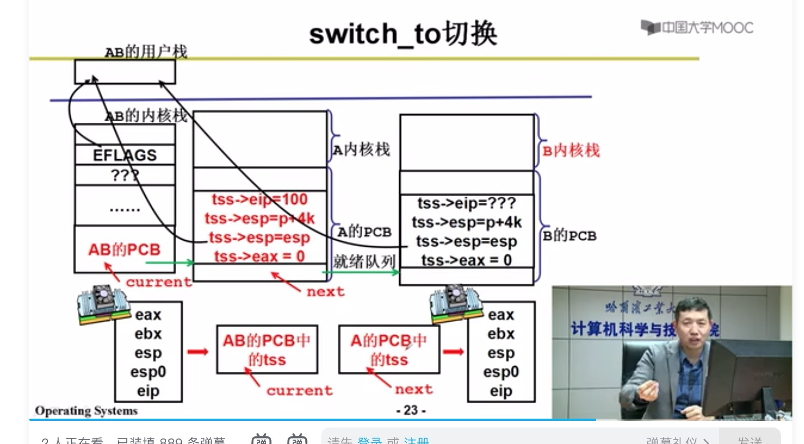

# 操作系统

## 核心思想、技术
- 程序执行、多进程、程序带动其他设备执行的基本结构
-  增加用户使用体验度、编程环境、图形界面

## 1.基础知识

解释一下操作系统的主要目的是什么

操作系统是一种软件，它的主要目的有三种

管理计算机资源，这些资源包括 CPU、内存、磁盘驱动器、打印机等。

提供一种图形界面，就像我们前面描述的那样，它提供了用户和计算机之间的桥梁。

为其他软件提供服务，操作系统与软件进行交互，以便为其分配运行所需的任何必要资源。

计算机如何工作

程序放入内存，有一个指针IP指向指令，cpu执行该地址的程序返回结果（取指执行）

x86:
- x86 PC刚开机时cpu处于是实式

#### 启动过程：

- 引导扇区：
引导扇区的代码是汇编代码，bootsect.s
  

- 加载 setup 即日
   

  - 初始化gdt 表
  -  读取配置参数
  -  head 系统初始化
  

-  system 模块执行
  

- 加载操作系统

系统调用

- int 0x80  是什么
  是一个中断，去idt表中找0x80 的程序去执行
  

## 多进程图谱
CPU 怎么切换任务，只需要切PC地址，还需要保存切换任务的时候运行状态，状态存储在PCB中

### 进程

进程如何切换：
包括指令和数据的切换

创建线程的时候做成能切换的状态，需要有用户栈、线程栈、PCB

### CPU 如何切

copy_process
 

cpu 调度

前台任务关注响应，后台任务关注周转时间

IO密集任务
CPU密集型任务

IO密集型任务相对于CPU密集任务优先级应该高
CPU调度算法：
- 按时间片来执行
  时间片大：响应时间太长；时间片太小影响吞吐量

  Counter 
- 短作业优先
- 定义优先级
信号量：

什么是临界区？

怎么进入临界区：
- 轮换法 
-  互斥进入
-  有空让进
-  有限等待
信号量修改 需要在临界区保护

死锁
根本原因，环路等待，互相等待对方释放资源，就造成了死锁

形成死锁的必要条件：
- 互斥使用
- 不可抢占
- 请求和保持资源
- 循环等待
  
死锁处理方法：
- 死锁预防： 破坏处理死锁处理的条件
  - 一次申请所有需要的资源 
    缺点：需要预知未来，编程困难；资源申请之后很长时间才能用，资源使用效率低
  - 资源按顺序申请
    缺点：资源申请低
- 死锁避免 ： 检测资源如果造成死锁就拒绝
- 死锁检测+恢复： 检测到死锁让一些进程回滚
- 死锁忽略： 

## grub
GRUB 是一个引导加载程序，可以引导各种各样的操作系统

保护模式： 

  

保护模式下地址翻译,

## 寄存器

# 参考材料
 哈工大《操作系统》实验：
https://github.com/hoverwinter/HIT-OSLab
网易云课堂：
https://study.163.com/series/1001245004.htm

# 常见问题总结

