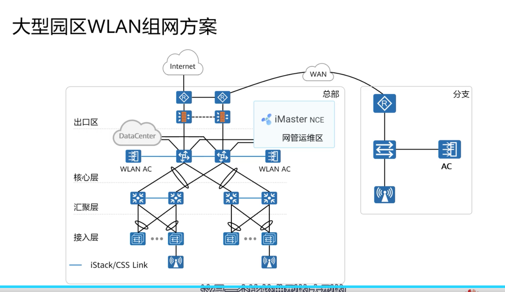
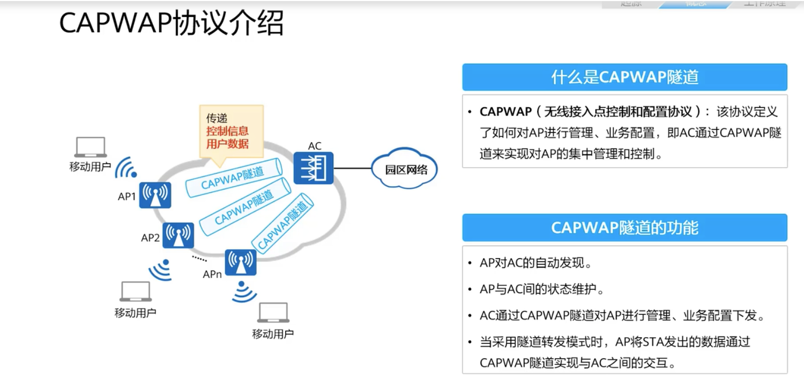
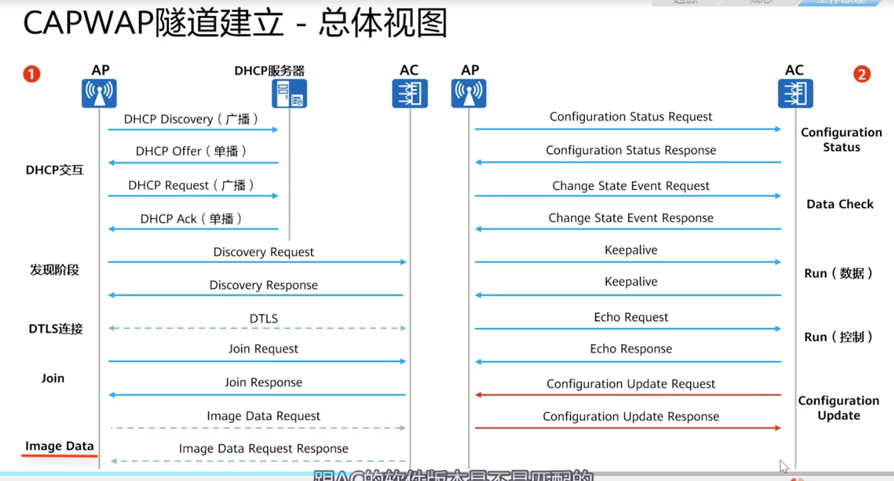
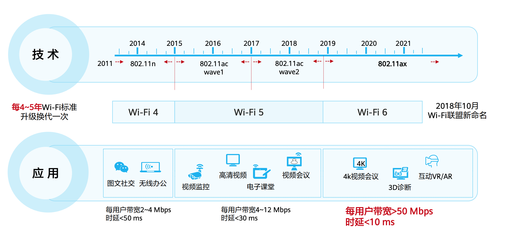
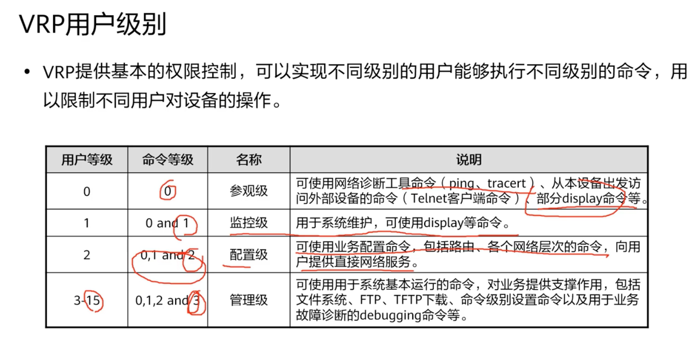

#wlan 技术

华为wifi6 9.6GBPS  

# wlan 解决方案
大型园区Wlan 解决方案

# 无线通信

## 频段 
- 2.4G-2.4835G

## 无线通道
调制解调
- 调频
- 调幅
- 调相
## 子载波
### 信道
什么是信道？
信息传输的通道，无线信道就是空间中无线电波传输信息的通道。

### wlan 如何区分不同的AP

# WLAN 网络架构

## fat AP
- 每个AP独立自治
- 人工成本高
  
## ac+FIT AP 

### 二层组网

## ac可靠性 

### 双链路双机设备

## capwap隧道

## capwap隧道

## WLAN漫游概述
⚫ WLAN漫游是指STA在不同AP覆盖范围之间移动且
保持用户业务不中断的行为。
⚫ 实现WLAN漫游的两个AP必须使用相同的SSID和安
全模板（安全模板名称可以不同，但是安全模板下
的配置必须相同），认证模板的认证方式和认证参
数也要配置相同。
⚫ WLAN漫游策略主要解决以下问题：
- 避免漫游过程中的认证时间过长导致丢包甚至业务中
断。
- 保证用户授权信息不变。
- 保证用户IP地址不变。
### 二层三层漫游
• 二层漫游：1个无线客户端在2个AP（或多个AP）之间来回切换连接无线，前提是这
些AP都绑定的是同1个SSID并且业务VLAN都在同1个VLAN内（在同一个IP地址段），
漫游切换的过程中，无线客户端的接入属性（比如无线客户端所属的业务VLAN、获
取的IP地址等属性）不会有任何变化，直接平滑过渡，在漫游的过程中不会有丢包和
断线重连的现象。
• 三层漫游：漫游前后SSID的业务VLAN不同，AP所提供的业务网络为不同的三层网络，
对应不同的网关。此时，为保持漫游用户IP地址不变的特性，需要将用户流量迂回到
初始接入网段的AP，实现跨VLAN漫游。

# wifi6
## wifi6技术介绍
1. 背景介绍

2. Wi-Fi 6 VS Wi-Fi 5
    | 大带宽 | 高并发| 低时延| 低耗电|
    | :------------- | :----------: | ------------: |------------: |
    |⚫ 速率高达 9.6 Gbps ⚫ 带宽提 升 4 倍| ⚫ 每AP接入 1024 终⚫ 并发用户数提升 4 倍| ⚫ 业务时延低至 20 m s ⚫ 平均时延降低 30%|⚫目标时间唤醒机制⚫ 终端功耗降低 30%|
    

## Wi-Fi 6技术：OFDMA
⚫ OFDMA是正交频分多址技术，同样是通过不同的频率区分不同的用户。但是与传统FDMA相比，OFDMA的频谱利用率有很大的提
升。 OFDMA实现了多个用户同时进行数据传输，增加了空口效率，大大减少了应用的延迟，同时也降低了用户的冲突退避概念。
⚫ 资源单位RU（核心）：
- 802.11ax 将现有的 20 MHz、40 MHz、80 MHz 以及160 MHz 带宽划分成若干个不同的资源单元（RU）。
- 一共定义了7种RU类型，分别是26-tone RU、52-tone RU、106-tone RU、242-tone RU、484-tone RU、996-tone RU 和 2x 996-tone RU，一个
用户可以同时使用多个RU来传输数据。
## Wi-Fi 6技术：TWT (唤醒时间调度)
### 是什么？
Wi-Fi 6还
支持一项称为“唤醒时间调度（TWT）”的新特性，其允许AP告知客户端何时休眠，并给客户端提供何时唤醒的调度表。每次客户端休眠的时间虽然很短，但多次这样的休眠会明显延长设备的续航时间。
• TWT（Target Wakeup Time）：按需唤醒终端Wi-Fi，终端功耗可降低30%。
• TWT 是由 802.11ah 标准首次提出，初衷是针对 IoT 设备，尤其是低业务量的设备（例如智能电表等）设计的一套节能机制，使得 IoT 设备能够尽可能长时间地处于休眠状态，从而实现极低功耗的目的。建立 TWT 协议后，站点无须接收 Beacon 帧，而是按照一个更长的周期醒来。802.11ax 标准对其进行改进，引入了一些针对站点行为的规则，在满足节能的前提下实现了对信道接入的管控。

# 华为VRP系统概述
VRP 

## 设备管理
### web 网管方式

### 命令行方式
### 用户级别
分为0-15级, 0 最低

display lldp

### AC 升级
  -  display startup  查看当前版本
  -  startup system-software 升级包
  -  reboot 重启之后自动版本升级
  -  display ap all 查看所有ap 状态
### AP 升级
display ap ver 

升级步骤：
1.改为AC模式：ap update mode ac-mode
2. 设置更新文件 ap update filename 升级包 aptype 
3. ap reset all  AP  重启
4. dis ap all 查看ap 状态
# 配置FAT AP

1.切换为fat 模式
ap-mode-switch fat

2. wlan 进入wlan 视图
3. country-code CN 

用交换机作为dhcp 分配IP地址
创建vlanif 为 AP分配Ip地址

dhcp enable
interface vlanif 100 
ip address 10.1.100.1 24   设置网关 IP，一般默认使用网段第一个IP做为网关地址
dhcp select interface 

## 创建安全模板
1. security-profile  name test
2. security wap-wapa2 psk pass-phsase 密码 aes   # 设置密码加密方式
## 设置SSID
1.wlan
2. ssid-profile name  test
3. ssid test 

# VAP 模板
创建摸吧
vap-profile  name test

配置wlan 业务
ssid-profile test
security-profile test 
service-vlan vlanid 100

# WLAN 接入安全

# 数据安全
1.主要通过对报文数据进行加密，保证只有特定的设备，可以对数据进行解密
2.wlan 加密方式：
   - TKIP  临时秘钥完整性协议
   -  CCMP 
3.WPA 采用TKIP 加密算法，提供了秘钥重置机制，并增强了秘钥长度，很大程度上弥补了WEP的不足
4. WPA2 CCMP加密协议，该加密机制使用的是AES加密算法，是一种比TYIP 更难破解的对称加密算法。
# WLAN准入 控制
NAC  network admission Control 网络接入控制，通过对接入网络的客户端和用户的认证保证网络的安全，是一种“端到端”的安全技术
NAC与AAA互相配合，共同完成接入认证功能。
• NAC：
- 用于用户和接入设备之间的交互
- NAC负责控制用户的接入方式（802.1X，MAC或Portal认证），接
入过程中的各类参数和定时器
- 确保合法用户和接入设备建立安全稳定的连接。

AAA：
- 用于接入设备与认证服务器之间的交互。
- AAA服务器通过对接入用户进行认证、授权和计费实现对接入用户
访问权限的控制。

## 配置开放认证
创建安全模板
- 创建一个安全模板并进入安全模板视图，缺省情况下，系统已经创建名称为default、default-wds和default-mesh的安全模板。
⚫ 配置安全策略为开放认证
-  配置安全策略为开放认证。缺省情况下，安全策略为open。

• 命令：security { wpa | wpa2 | wpa-wpa2 } psk { pass-phrase | hex } key-value
{ aes | tkip | aes-tkip }
▫ wpa：使用WPA（Wi-Fi网络安全存取版本1）认证方式。
▫ wpa2：使用WPA2（Wi-Fi网络安全存取版本2）认证方式。
▫ wpa-wpa2：使用WPA和WPA2混合方式。用户终端使用WPA或WPA2都可以进
行认证。
▫ psk：采用PSK认证方式。
▫ pass-phrase：密钥短语。
▫ Hex：十六进制数。
▫ key-value：用户口令。
▫ aes：使用AES（对称加密算法）方式加密数据。
▫ tkip：使用TKIP（临时密钥完整性协议）方式加密数据。
▫ aes-tkip：使用AES和TKIP混合加密。用户终端支持AES或TKIP，认证通过后，
即可使用支持的算法加密数据。

## 配置WPA/WPA2-PPSK认证
⚫ 创建安全模板
⚫ 配置安全策略为WPA/WPA2-PPSK
⚫ 配置PPSK关键参数
 创建PPSK用户，配置PPSK用户的密码、用户名、所属用户组、绑定的授权VLAN、过期时间、最大接入用户数、
所属分支组、绑定的MAC地址、接入的SSID。
[AC] wlan
[AC-wlan-view] security-profile name profile-name
[AC-wlan-sec-prof-wlan] security { wpa | wpa2 | wpa-wpa2 } ppsk { aes | tkip | aes-tkip }
[AC-wlan-sec-prof-wlan] quit
[AC-wlan-view] ppsk-user psk { pass-phrase | hex } key-value [ user-name user-name | user-group user-group | vlan vlan-id |
expire-date expire-date [ expire-hour expire-hour ] | max-device max-device-number | branch-group branch-group | macaddress mac-address ]* ssid ssid

## WLAN 业务配置

### vap 模板
1.vap 引入安全模板
安全模板就是创建 密码已经加密方式
ssid 模板就是创建用于链接的标识

SW配置
▫ [SW1] vlan batch 100 101
▫ [SW1] interface gigabitethernet 0/0/1
▫ [SW1-GigabitEthernet0/0/1] port link-type access
▫ [SW1-GigabitEthernet0/0/1] port default vlan 100
▫ [SW1-GigabitEthernet0/0/1] quit
▫ [SW1] interface gigabitethernet 0/0/2
▫ [SW1-GigabitEthernet0/0/2] port link-type trunk
▫ [SW1-GigabitEthernet0/0/2] port trunk allow-pass vlan 100 101
▫ [SW1-GigabitEthernet0/0/2] quit
• AC配置
▫ [AC] vlan batch 100 101
▫ [AC] interface gigabitethernet 0/0/1
▫ [AC-GigabitEthernet0/0/1] port link-type trunk
▫ [AC-GigabitEthernet0/0/1] port trunk allow-pass vlan 100 101
▫ [AC-GigabitEthernet0/0/1] quit

display vap ssid employee查ssid 状态

AC 设置dhcp
dhcp select gloable 

删除capwap 隧道
undo capwap source ip-address 10.10.1.1

配置capwap
capwap source  interface LoopBack 0

创建AP组
ap-group name huawei

设置mac 认证
ap auth-mode mac-auth
添加认证mac
ap-mac mac地址
添加ap 进组
ap-group  huawei