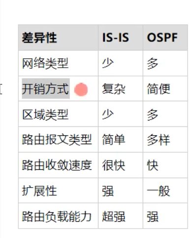

# 计算机网络
主要分析计算机硬件的逻辑实现，基本操作原理


## 计算机网络组成部分：

硬件、软件、协议

带宽：发送端发送数据的速率


协议：为进行网络中的对等实体数据交换而建立的规则、标准或者约定。


表示层：数据格式转换、数据加密解密、数据压缩和恢复

会话层： 表示实体和用户建立连接并在连接上有序的传输数据。
传输层：端到端的通信

​	功能

1. ​	可靠传输、不可靠传输
2. 差错控制
3. 流量控制
4. 服用分用

在RSTP标准中，为了提高收敛速度，将交换机直接与终端相连的端口定义为边缘端口

STP生成树的生成过程大概如下：

1、选举根桥（Root Bridge）

2、选举根端口（Root Port）

3、选举指定端口（Designated Port）

4、阻塞备用端口（Blocking Port）


# RSTP端口状态


生成树端口状态

1、阻塞（disarding）

2、侦听（listening）

3、学习（learning）

4、转发（forwarding）

5、禁用（disabled）


OSPF（Open Shortest Path First）协议共有5种分组类型，包括：

Hello 分组：用于发现邻居、建立邻居关系和检测邻居状态的分组。

DD（Database Description）分组：用于在邻居之间传输每个路由器的链路状态数据库摘要信息，以确定是否存在差异。

LS Request（Link State Request）分组：用于请求某个邻居发送某些路由器的链路状态信息。

LS Update（Link State Update）分组：包含某个路由器更新后的链路状态信息，并通过网络广播给所有邻居。

LS Acknowledge（Link State Acknowledge）分组：用于确认接收到LS Update分组并向发送方报告接收情况。

DIS和DR与所路由器互相都是邻接关系
g

工作过程：
1.形成邻居关系
2.形成邻接关系
3.计算路由

ospf 引入 rip 协议

rip 引入 ospf 路由 cost 1-15 
进入rip 引入ospf 路由
import-route ospf 1 cost 3

通过路由引入可以实现路由信息在不同的路由协议之间传递


```
添加 ospf 
ospf  1 routerid 1.1.1.1
添加进区域
area 0
宣告网络
network 192.168.2.0 0.0.0.255 
查看 连接状态的数据库
dis ospf lsdb 
查看邻居
dis ospf peer
路由表
dis ospf routing-table

路由回灌：可能造成环路

LSA 泛洪

router id 如果没配置 则选择loopback 最大的IP地址作为router id

```


# NAT
1. 静态NAT设计   适用于有较多静态IP且客户端需要使用固定IP地址的场景
2. 动态NAT  取地址池中的地址给用户访问Internet
3. NAPT 与Easy IP  NAPT在动态NAT的基础上对端口也进行转换，提高公网地址利用效率。Easy IP适用于网络出接口地址动态场景。
4. NATS erver 适合内网有服务向外提供服务的场景


# BGP

BGP是一种另外的网关协议，可以做到路由优选、避免路由环路、更高效率传递路由和维护大量的路由信息。

https://blog.csdn.net/u012451051/article/details/125397172

BGP特点：
1.使用TCP作为传输协议，端口号179
2.BGP路由聚合方式：静态路由（直接在network聚合路由）、手动聚合、自动聚合
3.BGP不会周期性泛洪，只传递更新的路由信息
4.路径矢量路由协议：BGP向外通告路由时必须保证该路由在自己的BGP表中是最优的
5.无环路：

6. bgp speaker 


AS之间正常存在大量的BGP邻居关系，且BGP协议不会计算最佳路径；因此在BGP协议中管理员需要进行策略来干涉选路;


BGP对等体：两个建立BGP会话（BGP的会话是基于TCP建立的）的路由器互为BGP对等体，BGP对等体之间可以交换路由表；


BGP对等体分类：BGP对等体可以按照两个路由器是否AS相同，分为EBGP对等体和IBGP对等体


```
bgp 100 
peer 124.124.124.124 as 100
使用loop 123 接口和对方的124IP 建立对等实体
peer 124.124.124.124  connect-interface  LoopBack  123
```

import-route 引入某种协议的路由


BGP 路由聚合 

路由通告原则：
- 最优且有效的原则 ，有效即 下一条可达


# EBGP


### HDLC 

### TCP IP 协议
不支持多播，只能解决两个进程之间的通信问题
- 长度小于64K字节
- IP编组方案
- 分组封装格式
- 分组转发规则

网络层：

​	主要任务是把分组从源端传到目的端，为分组交换网上的不同主机提供通信服务。网络层传输单位是 数据包。


- 路由选择
- 流量控制
- 差错控制
- 拥塞控制


#### 数据帧和IP报文

以太网帧最短帧长度为64Byte（字节）、最长1518Byte，当超过1518Byte之后的数据帧就需要进行一个分片处理。

以太网帧所占用的长度为：DMAC+SMAC+Type+FCS=18Byte。

已知最短帧长为64Byte，减去以太网18Byte之后就说明Date字段封装内容最短需要有46Byte。

46Byte中还包含着IP报头与TCP或UDP报头：

- 46Byte减去IP报头的20Byte=`26Byte`
- 当内部封装TCP时：26Byte减去TCP报头20Byte=`6Byte`
- 当内部封装UDP时：26Byte减去UDP报头8Byte=`18Byte`

##### 如果数据包大小大于1518Byte，我强制不分片会怎样？

 会禁止发送该不正常的数据包。

为什么数据包需要分片呢？
 因为有MTU（最大传输单元）限制，网络设备限制最大传输的MTU大小为1500Byte（此处的1500Byte指的是以太网中Data字段大小限制在1500Byte内），超过MTU值的数据包就需要进行分片，将数据包分成小于/等于MTU值大小的数据分片，到了目的地再组装起来

### PPP 协议

PPP点到点协议工作于OSI参考模型的二层（数据链路层）

2.这种链路提供全双工操作，并按照顺序传递数据包。

3.设计目的主要是用来通过拨号或专线方式建立点对点连接发送数据，使其成为各种主机、网桥和路由器之间简单连接的一种共通的解决方案。

**4.PPP链路的建立：**
LCP即链路控制协议，用于建立和维护点到点链路
NCP即网络控制协议，用于建立和配置网络层协议

### OSPF 协议

自动学习路由


优点：

1. 以累计链路开销作为参考值
2. 采用组播兴试收发部分协议报文
3. 支持区域划分
4. 支持对等价路由进行负载分担
5. 支持报文认证

在OSPFv2中，收到类型未知的LSA将直接丢弃。

ospf 属于一个区域

OSPFv3在LSA的LS Type字段中增加了一个U比特位来位标识对未知类型LSA的处理方式：     

  U 比特置 1，则对于未知类型的 LSA 按照 LSA 中的 LS Type 字段描述的泛洪范围进行泛洪                                              U 比特置 0，对于未知类型的 LSA 仅在链路范围内泛洪   

LSA的泛洪范围已经被明确地定义在LSA的LS Type字段，目前，有三种LSA泛洪范围：

 链路本地范围(Link-local Scope)：LSA 只在本地链路上泛洪，不会超出这个范围， Link-LSA(新增)                                              区域范围(Area Scope)：Router-LSA, Network-LSA, Inter-Area-Prefix-LSA, Inter-Area-Router-LSA, Intra-Area-Prefix-LSA(新增)都是区域范围泛洪的 LSA。                                              自治系统范围(AS Scope)：LSA 将被泛洪到整个路由域，AS-External-LSA

DR 指定路由器 负责建立并维护lsa的同步

router id 

工作过程：
1. 建立邻居

Down 是邻居的初始数

init  收到hello报文但是自己的routerid 不在收到的hello 邻居报文列表中

2-way

发现自己的routerid 在收到的hello报文列表中


启动 ospf  宣告直连网段

net 192.168.2.0 0.0.0.255

查看ospf 信息

dis ospf  brief  

查看ospf  邻居
dis ospf peer brief 
dis ospf lsdb 

ospf 要求所有的区域要和区域0相连接，如果无法连接到区域0需要建立虚连接
vlink peer 对端routerid  需要在两个区域的接口都要配置

ospf 规定 sub区域不能引入外部路由，避免大量的外部路由引入造成设备的资源消耗

NASS 

ospf 路由表合并 asbr

ospf 1 asbr-summary 172.17.0.0 255.255.248.0
#### ospf 安全
slient-interface  设置终端设备不回复hello包

报文认证，只有认证过得报文才会通过

### isis
用在运营商端

#### 扩展性强
支持多种协议
#### 承载更多的路由

#### 更快的收敛速度
局部计算



## IPV6

### NDP 协议  邻居发现协议

邻居发现协议，是IPv6中一种重要协议

在NDP协议中，定义了5种报文：
1、RA报文，Type=134，即Router Advertisement，路由器公告报文，该报文主要是路由器用来周期性的发布自身的hop limit 、link MTU等消息。
2、RS报文，Type=133，即Router Solicitation，路由器信息请求报文，该报文用于请求RA报文，当设备刚上线时，可能会使用该报文请求路由器发送RA报文，该报文可以使得路由器立即发送RA报文而不用等待RA周期。
3、NS报文，Type=135，即Neighbor Solicitation，邻居请求报文，该报文用于请求地址解析。
4、NA报文，Type=136，即Neighbor Advertisements，邻居公告报文，该报文用于答复NS报文，完成地址解析和报文刷新等功能。
5、Redirect报文，Type=137，当路由器发现更好的报文转发路径时，会使用该报文通知其他设备。
 NDP协议作用
NDP协议在IPv6中主要有以下作用：
1、地址解析
所谓地址解析功能，就是替代IPv4中的ARP协议，实现寻找指定IPv6地址对应的MAC地址，该功能主要使用了NS报文和NA报文。
有关该功能的实现原理及细节请见IPv6地址解析详解
2、地址冲突检测
所谓地址冲突检测，就是类似于IPv4中的免费ARP报文功能，主要用于在设备刚上线时查询网络中有无与自己接口IPv6地址相同的IP地址，该功能的实现使用了NS和NA报文。
该功能的实现与地址解析类似，只不过将地址解析中的NS报文源IP地址换成了要检测IPv6地址的被请求节点组播地址，把目的地址换成了ff02::1，该地址是所有运行IPv6协议栈的设备都会监听的一个组播地址，如果接受到了NA回应，说明网络中存在与自己相同的IPv6地址，因此IPv6会把该接口的IP地址设为不可用。如果没有收到NA报文，则说明网络中没有冲突，因此接口IP地址就可以正常使用了。
有关该功能的实现可以参考下列文章的最后一节：IPv6邻居状态与邻居检测机制
3、邻居不可达检测
所谓邻居不可达检测，是IPv6中独特的机制，不同于IPv4的ARP缓存表项，IPv6会维持一个邻居表，当长时间不与该邻居通信后，就会把该邻居的状态置为STALE（陈旧），这样状态的邻居不能够与其直接进行通信，必须要进行邻居不可达检测。该功能的实现依托于NS和NA报文。在华为中，邻居不可达检测又被称为邻居状态监测。
有关该功能的实现原理及细节请见：IPv6邻居状态与邻居检测机制
4、无状态地址配置
所谓无状态地址配置，简称SLAAC，是IPv6中独有的特性。可以实现IPv6设备的即插即用。（DHCP实现的地址配置又叫做有状态地址配置，这里的无状态地址配置与之功能上类似）也可以利用无状态地址配置实现类似VRRP的功能。IPv6无状态地址配置使用了RS和RA报文。
有关该功能的实现原理及细节请见：IPv6 SLAAC原理详解及配置
5、重定向
所谓重定向，是IPv6中与ICMPv4重定向报文类似的一种功能 

## QoS 

QoS（Quality of Service）是服务质量的简称。


目前宽带城域网的QOS要求技术主要有:资源预留:RSVP,区分服务:DiffServ,多协议标记交换:MPLS

### QoS模型

根据网络对应用的控制能力的不同，可以把网络的QoS能力分为三种模型

##### 2.1 Best Effort模型

Best Effort（尽力而为）模型是最简单的服务模型，应用程序可以在任何时候，发出任意数量的报文，网络尽最大的可能性来发送报文，对带宽、时延、抖动和可靠性等不提供任何保证。

Best Effort是Internet的缺省服务模型，通过FIFO（First In First Out，先进先出）队列来实现。

##### 2.2 DiffServ模型

DiffServ（Differentiated Service，区分服务）模型由RFC2475定义，在区分服务中，根据服务要求对不同业务的数据进行分类，对报文按类进行优先级标记，然后有差别地提供服务。

区分服务一般用来为一些重要的应用提供端到端的QoS，它通过下列技术来实现：

1）流量标记与控制技术：它根据报文的CoS（Class of Service，服务等级）域、ToS域（对于IP报文是指IP优先级或者DSCP）、IP报文的五元组（协议、源地址、目的地址、源端口号、目的端口号）等信息进行报文分类，完成报文的标记和流量监管。目前实现流量监管技术多采用令牌桶机制。

2）拥塞管理与拥塞避免技术：WRED、PQ、CQ、WFQ、CBQ等队列技术对拥塞的报文进行缓存和调度，实现拥塞管理与拥塞避免。

##### 2.3 IntServ模型

IntServ（Integrated Service，综合服务）模型由RFC1633定义，在这种模型中，节点在发送报文前，需要向网络申请资源预留，确保网络能够满足数据流的特定服务要求。

### QoS基本原理


IntServ可以提供保证服务和负载控制服务两种服务，保证服务提供保证的延迟和带宽来满足应用程序的要求；负载控制服务保证即使在网络过载的情况下，也能对报文提供与网络未过载时类似的服务。

在IntServ模型中，网络资源的申请是通过信令来完成的，应用程序首先通知网络它自己的流量参数和需要的特定服务质量请求，包括带宽、时延等，应用程序一般在收到网络的确认信息，即确认网络已经为这个应用程序的报文预留了资源后，才开始发送报文。同时应用程序发出的报文应该控制在流量参数描述的范围以内。负责完成保证服务的信令为RSVP（Resource Reservation Protocol，资源预留协议），它通知网络设备应用程序的QoS需求。RSVP是在应用程序开始发送报文之前来为该应用申请网络资源的，所以是带外信令。


RFC定义的四类标准的PHB（Per-Hop Behavior）是：

1. Best Effort (BE)：最佳努力服务，即不提供任何服务质量保证，所有数据包都被视为同等重要，按照先到先服务的原则进行处理。
2. Expedited Forwarding (EF)：加速转发服务，提供低延迟、低抖动、高带宽的服务，适用于实时应用，如VoIP、视频会议等。
3. Assured Forwarding (AF)：保证转发服务，提供不同的服务等级，每个等级都有自己的带宽和延迟保证，适用于需要保证服务质量的应用，如在线游戏、流媒体等。
4. Class Selector (CS)：分类选择服务，提供三个服务等级，分别为CS1、CS2和CS3，适用于需要简单的服务分类，但不需要具体的服务质量保证的应用。


# ISISv6

下列对加快ISIS收敛描述正确的是：

1.在产生LSP时使用了智能定时器，它可以根据路由信息变化频率自动调整延迟时间。

2.当ISIS收到其它路由器发来的比较新的LSP时，在路由计算之前，先将小于指定数目的LSP扩散出去。

3.修改广播网络为点到点可以减少网络中伪节点的数量，从而减少SPF的计算时间。

### 组播协议：

PIM（Protocol Independent Multicast）协议是一种IP组播协议，它可以在不同的网络层协议上实现组播功能。PIM协议的主要作用是构建组播树，以便将组播数据从源主机传递到所有需要接收数据的主机。

PIM协议有两种模式：PIM Sparse Mode（PIM-SM）和PIM Dense Mode（PIM-DM）。PIM-SM是一种基于源的协议，它会动态地构建组播树来传递组播数据。PIM-DM是一种基于接收者的协议，它会将组播数据在整个网络中广播，直到所有需要接收数据的主机都接收到了数据为止。
 在PIM-SM模式下，PIM协议使用的是一种叫做“贪婪算法”的机制。当一个主机需要接收组播数据时，它会向网络中发送一个加入请求，然后PIM协议会自动选择一个最优路径来传递组播数据。PIM协议会构建一棵组播树，以便将组播数据从源主机传递到所有需要接收数据的主机。

在PIM-DM模式下，PIM协议会将组播数据在整个网络中广播，直到所有需要接收数据的主机都接收到了数据为止。这种模式适用于网络中的接收者比较密集的情况。但是，由于它会将组播数据广播到整个网络中，所以会导致网络负载较大。

#### PIM-DM

#### 定义

- PIM密集模式
- 假定网络中组播接收者较多，且分部于大部分设备上，采用推的方式分发组播数据
- 适用于小规模组播网络

#### 邻居发现机制

- PIM路由器之间周期性发送Hello报文来发现、建立和维护邻居关系
- 如网段中IGMP版本是v1，则Hello报文可以选举查询器

####  PIM-SM

#### 定义

- PIM稀疏模式：适用于任何规模的网络
- 采取拉的方式，根据接收者的需求，在组播接收者和组播源之间建立组播分发树
- 无论网段中的IGMP协议是什么版本，都通过Hello报文选举查询器

#### 邻居发现机制

- 与PIM-DM相同

### 数据帧

**MTU 是指数据链路层能够传输的最大数据帧的大小（以字节为单位）**


基带信号：数字1和0直接用两种不同的电压表示，再送到数字信道上去 

宽带信号：将基带信号调制成的频分复用模拟信号

以太网数据帧最短帧长涉及到[CSMA](https://so.csdn.net/so/search?q=CSMA&spm=1001.2101.3001.7020)/CD机制

原因是当数据帧到达网卡时，在物理层上网卡要先去掉前导同步码和帧开始定界符，然后对帧进行CRC检验，如果帧校验和错，就丢弃此帧。如 果校验和正确，就判断帧的目的硬件地址是否符合自己的接收条件（目的地址是自己的物理硬件地址、广播地址、可接收的多播硬件地址等），如果符合，就将帧交 “设备驱动程序”做进一步处理。这时我们的抓包软件才能抓到数据，因此，抓包软件抓到的是去掉前导同步码、帧开始分界符、FCS之外的数据，其最大值是 6＋6＋2＋1500＝1514。

以太网规定，以太网帧数据域部分最小为46字节，也就是以太网帧最小是 6＋6＋2＋46＋4＝64。除去4个字节的FCS，因此，抓包时就是60字节。当数据字段的长度小于46字节时，MAC子层就会在数据字段的后面填充以 满足数据字段到46字节。

总结：
如果MTU是最小的46，则抓包长度是6+6+2+46=60，即最小抓包长度是60
如果MTU是最大的1500，则抓包长度是6+6+2+1500=1514，即最小抓包长度是60

路由协议是指定数据包转送数据包转送方式的网上协议。
常见协议有：RIP，IGRP，EIGRP，
无冲突协议： 令牌协议

CSMA/CD 协议

RFID：是什么？
利用电磁或者电感信好，射频识别

## 性能指标：

1.速率即数据率

主机再数字信道上传送数据位数的速率


# Overlay 

主流的 Overlay 技术主要有VXLAN, GRE/NVGRE和 STT，

体思路均是将以太网报文承载到某种隧道层面，差异性在于选择和构造隧道的不同，而底层均是 IP 转发。

VXLAN利用了现有通用的UDP传输，其成熟性高。总体比较，VLXAN技术相对具有优势。

## VXLAN


# WLAN

1.CSS集群最多支持两台交换机
2.堆叠系统中，主交换机负责管理整个堆叠系统
3.堆叠技术可以简化网络拓扑，使网络结构变得更简单
4.iStack最多支持9台交换机做堆叠


MAC 是确定网络设备身份，

网络节点传输协议：

在AC + FIT AP的组网架构中，AC对FIT AP进行集中的配置管理，AC和AP之间采用CAPWAP（Control and Provisioning of Wireless Access Points）协议进行通信。	


## 网络工具

ATKKping 可以快速检测目标主机到本机的网络状态


## Vlan

创建 vlan

```
vlam 10
#查看vlan
dis vlan 
# 配置vlan
int  g0/0/1
port link-type access

```

trunck 口添加pvid  经过的数据包会去掉对应的vlan 标签

单臂路由：
创建子接口
int g0/0/1.10 
添加 vlan
dot1q termination vid 10 
添加网关
ip add 192.168.10.254 24 
启用arp
arp broadcast enbable

## 子网掩码

就是用来分割子网和区分那些ip是同一个网段的，那些不是同一网段的
子网掩码转为二进制数， 
16位子网掩码：255.255.0.0
 17位子网掩码：255.255.128.0 
 18位子网掩码：255.255.192.0 
 19位子网掩码：255.255.224.0 
 20位子网掩码：255.255.240.0 
 21位子网掩码：255.255.248.0 
 22位子网掩码：255.255.252.0 
 23位子网掩码：255.255.254.0 
 24位子网掩码：255.255.255.0 
 25位子网掩码：255.255.255.128 
 26位子网掩码：255.255.255.192 
 27位子网掩码：255.255.255.224 
 28位子网掩码：255.255.255.240 
 29位子网掩码：255.255.255.248 
 30位子网掩码：255.255.255.252 
 31位子网掩码：255.255.255.254 
 32位子网掩码：255.255.255.255  

 总结： IP 地址+子网掩码 确定一个网址是否在同一个网段，
 子网掩码作用：确定网络位，网络位之后就能确定确定IP是否在同一个网段。

 通信方式：

- 同网段：直接发送数据包
- 不同网段：  找中间设备，路由器转发

A类：1-126 子网掩码 255.0.0.0
B类：128-191 默认子网掩码 255.255.0.0
C类：192-223 默认子网掩码 255.255.255.0
D类：224-239  224.0.0.1～239.255.255.254   支持多播
E类：224-239 240.0.0.1～255.255.255.254

判断一个地址能不能用：主机位不能全为0或者全为255

IP地址的第一个地址用于标识一个网络
最后一个地址是广播地址 也就是该网段全1的地址


子网号

IP地址子网掩码判断：

202.101.35.45/27 根据/27 可知道网络位为27位 即主机位为32-27=5位
子网数为 2^3=8个
每个子网中的主机数有2^5=32个主机 去掉全0和全1 剩余30个主机
由此可知 子网中的主机块范围是
0-31（本地网络去除）
31-63
64-95
96-127
128-159
160-191
192-223
224-255 （子网广播去除）
除去网络位中和主机位中全0和全1的地址，实际可以应用的地址是：
子网1 33～62
子网2 65～94
子网3 97～126
子网4 129～158
子网5 161～190
子网6 193～222
由此可判断同此ip同一子网的应该是
202.101.35.60/27


### 路由器
静态路由是：支持手动配置优先级，可通过配置目的地址/掩码相同，优先级不同、下一跳不同的静态路由实现转发路径的备份
浮动路由：主路由的备份，保证链路故障时提供备份路由。主用路由下一跳可达时该备份路由不会出现在路由表中

ip route-static 192.168.3.1 255.255.255.0 192.168.4.1

ip route-static 192.168.3.254 255.255.255.0 192.168.4.1

ip route-static 192.168.4.254 255.255.255.0 192.168.3.1

华为路由器

```
查看路由表
display ip routing-table
显示mac 地址
display mac-address

查看nat Session 会话
display nat session all
映射公网ip到内网
nat server protocol tcp global current-interface www inside  192.168.200.20  www

```

### spt 生成树
#### 环路
环路影响：
1. 广播风暴
2. mac 地址漂移 
3. 

### 链路可靠性
使用链路聚合


### 域名
定级域名 296


### 网关


ping  -t  目标IP  一直ping
ping -n  数字 目标IP   指定ping几个包
ping -l  数字 目标IP   修改ping包大小


nslookup www.jd.com

###  二层交换机和三层交换机
二层交换机：数据转发 ，只能支持同网段的访问，不支持不同网段访问
二层开启 生成树技术可以防止环路
三层交换机：数据交换+ 路由功能，支持不同网段访问
三层交换机配置不同网段， 性能指标要三层转发性能二层转发性能

通过vlan ip做网关，实现不同vlan的路由，也就是说不同网段的vlanIP 需要配置成网关IP才能支持不同网段互相访问

vlanif是一个三层逻辑端口，在二层网络中作为网关存在。
vlan是二层概念，vlan互通需要三层通信，vlanif应被配置在这个三层网元上。
二层交换机和三层交换机相连的端口属性要设置为Trunk且运行所有vlan通过；

一、Access
Access只能属于一个vlan，一般用来连接计算机的端口 
Access接受和转发的数据包必是无VID的数据包
Access端口发送出去的数据包无VID，可被PC接受或access口接受。
Access : 收到一个报文，先判断是否有vlan消息，无则打上端口的PVID在SW内转交给相同PVID的端口去掉标记的无VID数据包，有则直接丢弃。
二、Trunk
Trunk：可以允许多个vlan通过，可以接收和发送多个vlan的报文，一般用于交换机之间连接端口
Trunk：默认PVID与vlan1相等
在默认状态下，Trunk端口允许所有的Vlan发送和接口传输信息。
Trunk：收到一个报文，先判断是否有vlan消息，无则打上端口的PVID在SW内转交给其它端口;有则先判断trunk端口是否允许该vlan的数据进入，如果可以则转发，否则丢弃。
Trunk：在发送时，比较要发送报文的VID与端口的PVID，不相等则直接发送；相等则剥离VID，再发送
三、区别：
Access口只接收无VID的数据包。
access口发送数据包时对所有数据包去除VID，而trunk口只对与自己端口的PVID相等的数据包去除VID，其它则直接转发。

PVID英文为Port-base VLAN ID，是表示网络通信中基于端口的VLAN ID，一个端口可以属于多个VLAN，但是只能有一个PVID，收到一个不带tag头的数据包时，会打上PVID所表示的VLAN号，视同该VLAN的数据包处理。

```
# 创建vlan   
vlan 10
#  设置vlan 类型
port link-type access
# 添加网口到vlan

port default vlan 10
```

局域网不同网段组件方式：

两个二层交换机，一个三层交换机
在三层交换机上设置vlan 并在vlan 中添加ip 为网关，网关ip为二层互联的同网段ip 一般为254 或者1

三层交换机开启dhcp

LACP模式链路聚合


以AC作为AP的DHCP服务器为例。AC作为DHCP服务器为AP分配IP地址有两种配置方式：

- 基于全局地址池：在DHCP服务器的系统视图下创建IP地址池，在接口视图下配置服务器采用全局地址池来为客户端分配IP地址、网关、DNS服务器地址等信息。
- 基于接口地址池：在DHCP服务器的接口视图下配置服务器采用接口地址池来为客户端分配IP地址、网关、DNS服务器地址等信息。

两者的差异在于全局地址池方式支持DHCP中继场景，接口地址池方式则不支持DHCP中继场景。

- 基于全局地址池的DHCP服务器的配置示例如下：

  1. 在AC上创建全局地址池为AP提供地址。

     ```
     <AC> system-view
     [AC] dhcp enable  //全局模式下开启DHCP功能
     [AC] ip pool huawei  //创建全局地址池
     [AC-ip-pool-huawei] network 10.23.10.0 mask 24  //配置全局地址池下可分配的网段地址
     [AC-ip-pool-huawei] gateway-list 10.23.10.1  //为AP配置网关地址
     [AC-ip-pool-huawei] option 43 sub-option 2 ip-address 10.23.100.1  //配置option 43，为AP指定AC的IP地址
     [AC-ip-pool-huawei] quit
     [AC] interface vlanif 100
     [AC-Vlanif100] dhcp select global  //开启接口采用全局地址池的DHCP Server功能
     [AC-Vlanif100] quit
     ```

  2. 在Switch上配置DHCP中继，代理AC分配IP地址。

     ```
     <Switch> system-view
     [Switch] dhcp enable  //开启DHCP功能
     [Switch] interface vlanif 10
     [Switch-Vlanif10] ip address 10.23.10.1 24
     [Switch-Vlanif10] dhcp select relay  //开启DHCP中继功能
     [Switch-Vlanif10] dhcp relay server-ip 10.23.100.1  //配置DHCP中继所代理的DHCP服务器的IP地址
     [Switch-Vlanif10] quit
     ```

- 基于接口地址池的DHCP服务器的配置示例如下：

  1. 开启DHCP功能。

     ```
     <AC> system-view 
     [AC] dhcp enable
     ```

  2. 使能接口VLANIF100接口采用接口地址池的DHCP服务器功能。

     ```
     [AC] interface vlanif 100
     [AC-Vlanif10] ip address 10.23.100.1 255.255.255.0 //配置接口IP地址
     [AC-Vlanif10] dhcp select interface //配置基于接口地址池的DHCP服务器功能
     [AC-Vlanif10] quit
     ```

1. 配置AP上线

   

   1. 创建AP组，用于将相同配置的AP都加入同一个AP组中。

      ```
      [AC] wlan 
      [AC-wlan-view] ap-group name ap-group1 
      [AC-wlan-ap-group-ap-group1] quit
      [AC-wlan-view] quit
      ```

   2. 配置AC的源接口。

      ```
      [AC] capwap source interface vlanif 100
      ```

   3. 在AC上添加AP。

      添加AP有三种方式：离线导入AP、自动发现AP以及手工确认未认证列表中的AP。

      - 离线导入AP：预先配置AP的MAC地址和SN，当AP与AC连接时，如果AC发现AP和预先增加的AP的MAC地址和SN匹配，则AC开始与AP建立连接。

        ```
        <AC> system-view
        [AC] wlan
        [AC-wlan-view] ap auth-mode mac-auth  //配置认证模式为MAC认证
        [AC-wlan-view] ap-id 1 type-id 115 ap-mac 0025-9e07-8270  //离线添加AP
        ```

      - 自动发现AP：当配置AP的认证模式为不认证或配置AP的认证模式为MAC或SN认证且将AP加入AP白名单中，则当AP与AC连接时，AP将被AC自动发现并正常上线。

        - 配置AP的认证模式为不认证

          ```
          <AC> system-view
          [AC] wlan
          [AC-wlan-view] ap auth-mode no-auth
          ```

        - 配置AP的认证模式为MAC认证且将AP加入AP白名单中

          ```
          <AC> system-view
          [AC] wlan
          [AC-wlan-view] ap auth-mode mac-auth  //配置认证模式为MAC认证
          [AC-wlan-view] ap whitelist mac 0025-9e07-8270  //将AP添加到白名单中
          ```

        - 配置AP的认证模式为SN认证且将AP加入AP白名单中

          ```
          <AC> system-view
          [AC] wlan
          [AC-wlan-view] ap auth-mode sn-auth  //配置认证模式为SN认证
          [AC-wlan-view] ap whitelist sn 08PE56430071  //将AP添加到白名单中
          ```

      - 手工确认未认证列表中的AP：当配置AP的认证模式为MAC或SN认证但AP没有离线导入且不在已设置的AP白名单中，则该AP会被记录到未授权的AP列表中。需要用户手工确认后，此AP才能正常上线。

        ```
        <AC> system-view
        [AC] wlan
        [AC-wlan-view] ap auth-mode mac-auth  //配置认证模式为MAC认证
        [AC-wlan-view] display ap unauthorized record
        [AC-wlan-view] ap-confirm mac 0025-9e07-8270  //手工确认认证未通过的AP，允许其上线
        ```

AP 不上线问题排查手册

https://support.huawei.com/enterprise/zh/doc/EDOC1100155254

## ensp里面的ce6800开启以后端口全是 shutdown

undo shutdown

需要 提交 commit 之后触发命令 


```
# 开启dhcp

dhcp enable 
# 创建地址池
ip policy-based-route

ip pool poolname 
# 配置网络段和子网掩码
network 192.168.1.0 mask 255.255.255.0 
gateway-list 192.168.1.254

# 设置 dns
dns-list 114.114.114.114

# 如果是华为的设备 配置地址池之后仍然无法自动获取 ip 则需要在vlan 端开启配置
dhcp select global
排除ip不分配
excluded-ip-address  192.168.1.3 
# 绑定一些设备的固定mac地址
static-bind ip-address  192.168.1.3   mac-address


开启 dhcp 服务。
[LSW 1]dhcp enable

创建 AP ip 地址池（appool）名称可自定义。配置地址池网段、网关。
[LSW 1]ip pool appool
[LSW 1-ip-pool-appool]network 1.1.1.0 mask 255.255.255.0
[LSW 1-ip-pool-appool]gateway-list 1.1.1.1

设置 AC 服务器地址。
[LSW 1-ip-pool-appool]option 43 sub-option 2 ip-address 20.0.0.20
[LSW 1-ip-pool-appool]quit

进入虚拟接口视图。绑定全局 DHCP 。
[LSW 1]interface Vlanif 30
[LSW 1-Vlanif30]dhcp select global
[LSW 1-Vlanif30]quit

创建用户 ip 地址池（userpool）名称可自定义。配置地址池网段、网关、DNS 设置。
[LSW 1]ip pool userpool
[LSW 1-ip-pool-userpool]network 2.2.2.0 mask 255.255.255.0
[LSW 1-ip-pool-userpool]gateway-list 2.2.2.1
[LSW 1-ip-pool-userpool]dns-list 8.8.8.8 9.9.9.9
[LSW 1-ip-pool-userpool]quit

进入虚拟接口视图。绑定全局 DHCP。
[LSW 1]interface Vlanif 40
[LSW 1-Vlanif40]dhcp select global

```

#### AR路由器排除IP地址的配置方法

在接口上直接添加 dhcp 和排除地址

dhcp server excluded-ip-address 10.10.10.11 10.10.10.20

 ip address 192.168.1.1 255.255.255.0 
 dhcp select interface
 dhcp server excluded-ip-address 192.168.1.100 192.168.1.200 
 dhcp server dns-list 192.168.1.100 


undo t m 

#acl 访问控制
acl 2000 

acl 编号
acl name test advance

添加拒绝策略

rule deny ip source 1.1.1.0 0.0.0.255 destination 2.2.2.0 0
.0.0.255

添加允许规则

rule  permit  ip source  any  destination  any

进入端口

int g0/0/0

设置规则

traffic-filter inbound  acl name  test
ACL 配置访问控制

```
acl name test advance
rule  deny  ip source  1.1.1.0 0.0.0.255 destination 2.2.2.0 0.0.0.255
rule  permit  ip source  any  destination  any
int g0/0/0	
traffic-filter inbound  acl  name  test
```

dis acl all 查看 acl 配置

ACL 配置转换地址转换,配置基本的acl 就行了


##### NAT网络地址转换协议

```
创建acl
acl 2000
添加规则
rule  permit  source  172.16.1.0 0.0.0.255
q
创建地址转换组
nat address-group  1 100.100.100.2 100.100.100.2
进入接口
int g0/0/1
绑定转换组
nat  outbound  2000  address-group  1

```

在出去的网口配置 内网地址映射

nat server   global  64.1.1.3  inside  172.16.100.1

ip route-static 0.0.0.0  0.0.0.0  64.1.1.10
#挑选数据包 
rule permit source 192.168.1.0  0.0.0.255

#绑定
进入三层交换机vlan  
int g0/0/3  进入外网口

nat outbound 2000  从3口出去的包 并且是acl 2000 挑选的包

创建链路聚合

int Eth_Trunk 1
port link-type trunk 
####设置可以通过的vlan 聚合vlan
port trunk allow-pass vlan 10 20 
####添加 两个port 进行聚合
trunckport GigabitEthernet 0/0/1 0/0/2


radio 1                      ##0为2.4G/1为5G

```
## 交换机

全双工，自动协商速率

### lacp 自动链路聚合

### 堆叠 把多个交换机拼成逻辑上的一个

核心层 css 
接入层 istack 

ACL 控制命令  按照rule 编号从小到大执行的

NAPT 网络地址端口转换协议

AC 连接方式：

## 广域网
PPP 传输

ppoe 拨号：

MLPS：是一种骨干网技术，是一种隧道技术，在ip路由和控制协议基础上向网络层面提供面向连接的交换。能够提供较好的Qos保证。

使用命令：

```
```
查看地址池
display ip pool
display ip pool interface vlanif10

undo capwap source interface vlanif 100
capwap source interface vlanif 101


display ssid-profile name default ：可以看到SSID默认模板里面是内置了一个SSID的
安全模板

display security-profile all：默认系统内置三个，一个正常业务使用、一个WDS、一个mesh组网的时候，我们目前主要了解default
display security-profile name default

VAP模板
display vap-profile all   查看所有的vap 模板
display vap-profile name  office-vap  查看指定的vap
流量模板
display traffic-profile all：默认存在一个default

display traffic-profile name default：流量模板的作用（1）提供VAP或者每客户端的限速 （2） 控制某些流量能否访问，比如只能访问外网 （3）CAPWAP等优先级
AP组
display ap-group name default：显示很长，就截图了关键的部分，默认情况下是调用了射频组 2.4G 5G，vap profile是没有调用的，这个是我们在配置的时候配置上去的


创建ssid 模板  
1、SSID模板：我们可以通过创建模板形式，在模板下面定义我们需要的SSID名称，方便调用
wlan 
ssid-profile name WIFI
ssid WIFI
2、安全模板：通过创建安全模板形式，来定义不通的认证方式、密码
添加安全 认证  
security-profile name WIFI
设置密码
security  wpa2 psk pass-phrase 88888888 aes
3、VAP模板：当我们创建完SSID模板、安全模板后，我们需要关联它，这时候VAP的作用就是来关联各种业务相关的模板。
创建vap 文件
vap-profile  name WIFI
ssid-profile  WIFI 
security-profile WIFI
4、AP组：当AP上线成功后，它会加入到系统默认的default组，组的作用是来把相同区域的AP放在里面，然后可以集中进行配置，比如我们VAP模板最终是调用在AP组下面。
ap-group name default
删除之前设置的默认
undo vap-profile default wlan 1 radio all
最终调用我们新创建的
vap-profile WIFI wlan 1 radio all

capwap source interface命令用来配置AC建立CAPWAP隧道使用的接口，作为AC的源接口。

undo capwap source interface命令用来配置AC不再使用接口作为源接口。
```


CAPWAP协议

    竟然FITAP需要寻找AC，那么他们之间就有一种协议来构建通信，这个协议就是CAPWAP，CAPWAP（全称ControlAnd Provisioning of Wireless Access Points Protocol Specification无线接入点控制和配置协议）是由IETE定义出来的公有标准，实现以下几个重要功能
    1、包括AC对AP的自动发现以及状态维护
    2、AC对AP进行管理、业务配置下发 
    3、客户端的信息通过AP发送CAPWAP协议告诉AC，AC进行维护 
    4、客户端的业务数据也可以通过CAPWAP交给AC进行转发（可选，隧道转发才需要用到）


 ©著作权归作者所有：来自51CTO博客作者网络之路一天的原创作品，请联系作者获取转载授权，否则将追究法律责任
2、AP上线的那些事儿（1）capwap建立过程、设备初始化以及二层上线
https://blog.51cto.com/ccieh3c/2662338


WLAN 简单配置示例

 **AC基础配置**

```
[AC6605]vlan batch 100 101 #创建vlan 
[AC6605]dhcp enable #开启DHCP服务 VLAN配置 
[AC6605]int vlan 100 
[AC6605-Vlanif100]description AP_Manage 
[AC6605-Vlanif100]ip add 192.168.100.254 24 
[AC6605-Vlanif100]dhcp select interface #为DHCP选择源接口 ，为AP设备分配IP
[AC6605-Vlanif100]quit 
[AC6605]int vlan 101 
[AC6605-Vlanif101]description USER 
[AC6605-Vlanif101]ip add 192.168.101.254 24 
[AC6605-Vlanif101]dhcp select interface #为DHCP选择源接口 ，业务IP
[AC6605-Vlanif101]quit 
[AC6605]capwap source interface Vlanif 100 #为capwap隧道绑定vlan
```

**AC无线配置**

```
[AC6605]wlan #进入无线配置视图
[AC6605-wlan-view]
 
[AC6605-wlan-view]regulatory-domain-profile name office-domain #创建域管理模板，名称为office-domain
[AC6605-wlan-regulate-domain-office-domain]country-code CN #配置国家代码
[AC6605-wlan-regulate-domain-office-domain]quit
 
[AC6605-wlan-view]ssid-profile name office-ssid #创建SSID模板，名称为office-ssid
[AC6605-wlan-ssid-prof-office-ssid]ssid office #配置SSID名称为office
[AC6605-wlan-ssid-prof-office-ssid]quit
 
[AC6605-wlan-view]security-profile name office-security #创建安全策略，名称为office-security
[AC6605-wlan-sec-prof-office-security]security wpa-wpa2 psk pass-phrase 12345678
9 aes #SSID密码为123456789
 
[AC6605-wlan-view]vap-profile name office-vap #创建VAP模板
[AC6605-wlan-vap-prof-office-vap]forward-mode direct-forward #配置业务数据转发模式
[AC6605-wlan-vap-prof-office-vap]security-profile office-security #绑定安全策略
[AC6605-wlan-vap-prof-office-vap]ssid-profile office-ssid #绑定SSID模板
[AC6605-wlan-vap-prof-office-vap]service-vlan vlan-id 101 #绑定业务VLAN ，需要指定否则 会使用 Ap的那个地址池
 
[AC6605-wlan-view]ap-group name office-ap-group #创建AP组，名称为office-ap-group
[AC6605-wlan-ap-group-office-ap-group]regulatory-domain-profile office-domain #绑定域模板
[AC6605-wlan-ap-group-office-ap-group]vap-profile office-vap wlan 1 radio 0 #绑定vap模板到射频卡0上
[AC6605-wlan-ap-group-office-ap-group]vap-profile office-vap wlan 1 radio 1 #绑定vap模板到射频卡1上
 
[AC6605-wlan-view]ap-id 0 ap-mac 00e0-fc79-4b40 添加AP，AP mac
[AC6605-wlan-ap-0]ap-group office-ap-group #添加到AP组中
```

**AC接口配置**

```
[AC6605]int g0/0/1
[AC6605-GigabitEthernet0/0/1]port link-type trunk
[AC6605-GigabitEthernet0/0/1]port trunk allow-pass vlan 100 101
```

**Switch配置**

```
[Switch]vlan batch 100 101 #创建vlan
[Switch]int g0/0/24]int g0/0/24
[Switch-GigabitEthernet0/0/24]description to_AC
[Switch-GigabitEthernet0/0/24]port link-type trunk
[Switch-GigabitEthernet0/0/24]port trunk allow-pass vlan 100 101
 
[Switch]int g0/0/1
[Switch-GigabitEthernet0/0/1]description to_AP
[Switch-GigabitEthernet0/0/1]port link-type trunk
[Switch-GigabitEthernet0/0/1]port trunk pvid vlan 100
[Switch-GigabitEthernet0/0/1]port trunk allow-pass vlan 100 101
```


遇到问题是：配置好交换机 ap ac ap不上线， 原因是交换机连接ap的口未配置pvid 导致数据不识别，所以dhcp未能接受到包


 


# 查看本地arp表内容

arp -a
# 交换机查看arp mac地址表
sh mac-addres-table
```

mac 地址的老化时间300s


交换机配置IP

```
# 创建vlan
vlan 100 

# 进入vlan
interface vlan 10
# vlan中添加IP
ip add 192.16.1.2 255.255.255.0

#进入接口把端口放进vlan
int g0/0/3
port link-type  access
port default vlan  10

删除IP地址
undo ip address 192.168.3.254 255.255.255.0

删除vlan中的端口
undo port default vlan
删除设置的通过vlan
undo port access allow-pass vlan

去除设置的端口类型
undo port    link-type

查看IP 配置信息

display ip interface brief

简写命令

dis ip int b


ip route-static 192.17.1.0 255.255.255.0 192.16.1.2


ip route-static 192.168.3.0 255.255.255.0 192.16.1.2


ip route-static 192.16.1.0 255.255.255.0 192.17.1.2


```


实战案例：一台路由器  两台交换机 每台交换机分别挂两个电脑。

关键步骤：

1.交换机需要添加vlanif 并设置 为该网段的网关ip，然后将不同端口的添加至创建的vlan

2.配置与交换机相连的端口的ip

3.设置路由器ip 并添加静态路由 指向网关

内部所有的地址段 指向 下一跳 在路由器上添加回来路由转换
ip route-static 0.0.0.0 0.0.0.0 10.10.10.1


只要是不是直连的网段都需要添加路由。

##  路由配置
两个直连的不同网段的设备相联系，把路由器的不同的接口设置为 不同网段的网关即可实现不同网段的通信
如果跨多个路由器需要，在每个不直连的路由器需要添加 去的路由和回来的路由才能实现不同网段的通信
如果不同网段无法添加路由，如果要通信就需要添加地址转换，配置nat转换
 

### 二层转发：

根据检测mac直接进行端口转发。

#### 转发方式：

1. 存储转发 完整收到帧 并检查无误之后转发。缺点是延迟较大且不固定，因为在转发之前要收到并处理完整的帧。

2. 碎片隔离

   
## 配置远程登录

1. 开启telnet 服务
telnet server enable
2.创建登录用户 （进入到vty 终端，在华为的交换机里，vty就是人家用telnet远程进入到你交换机的界面，最多有五个，所以说你可以vty 0   vty 1  vty... vty 4交换机最多可以允许五个人同时在线进到交换机里去配置命令的。vty0 4 就是说把这五个界面一起配置了，这五个界面进去的话，都是使用以下的配置）
user-interface vty 0 4 
设置口令模式
authentication-mode password 
设置口令
set authentication-mode password simple 222
设置用户级别（用户等级为3，也就是最高的，华为的命令级别很多，分为四级，0 1 2 3  ，0是参观级，只能看，1比0要高，可以使用一些命令，2 是可以配置了，3可以备份与删除IOS啦）
user privilege level 3  


配置 DHCP 的地址池 
```
指定AP的的AC地址
option 43  ip-address 1.1.1.1
放行所有vlan
trunk  allow-pass vlan all 
#添加默认路由
ip route-static 0.0.0.0 0 1.1.1.2
#查看路由
dis ip routing-table

```

AC 配置
```
#ap 组 

查看 APmac

dis int g0/0/0


display  ap all 

## ac 配置 HBS 双机热备

配置流程： 
1. 配置VRRP备份组
2. 配置HSB主备份服务
3. 配置HSB备份组
4. 使能HSB备份组
5. 检查配置效果

创建hsb 服务
hsb-service 0

service-ip-port local-ip 10.1.10.100 peer-ip 10.1.10.200 local-data-port 10241 peer-data-port 10241
## 配置热备组
hsb-group 0 

bind-service 0 

## 虚拟路由冗余协议VRRP 配置之后及时将业务切换到备份路由设备，从而保持通讯的连续性和可靠性。
track vrrp vrid 1 interface Vlanif10 

```

无线 AC 转发模式： 
1. tunnel  模式：ap 收到的数据先转发给AC 由AC集中转发，这种会有流量性能 瓶颈
2. direct-forward ap 收到的数据直接转发给核心网，性能高

vap  实现一个AP放出多个ssid  
隐藏 ssid ssid-hide  enable  (如果是华为设备 可以在华为官网上查找相关手册)

### vlan pool   把不同的用户分配到不同的vlan， 可以减少广播域，减少广播报文，提升网络性能。

创建多个vap-group  来实现 vlan pool的形式


```
配置 vlan poll
##进入AC 的vlan 视图
vlan  pool pool-name
将指定的vlan 添加到 vlan pool 中。
vlan  1-10
配置分配算法
assignment even | hash 
配置（AC）VAP的业务WLAN
vlan 
vap-profile name profile-name
service-vlan vlan-pool  pool-name


```

### DHCP Option 43 & 52 当AC和AP 间是三层组网时，AP 发送的广播请求报文的方式无法发现AC，这时需要DHCP服务器回应给AP的报文中携带 Option43 字段或者 Option52(IPv6) 来通告AC的IP地址
### 漫游技术 WLAN 漫游是指STA在不同的AP覆盖范围之内移动且保持用户业务不中断的行为

### 热备
VRRP 双机热备 
两台AC组成一个VRRP组，主备AC对AP始终显示为同一个虚拟IP地址，主AC通过Hot StandBy 主备信道同步业务信息到备AC上
AP 只能看到一个IP
配置命令：
```


```pa


MPLS  专线 数据打标签


双链路双机热备

AC可靠性：N+1
是指在AC+FIT AP的网络架构中，使用一台AC作为备AC，为多台主AC提供备份服务的一种解决方案。网络正常情况下AP只与各自所属的AC建立capwap链路，当主AC故障或者与AP间capwap链路故障时，备份AC替代主AC来管理AP，备AC与AP间建立wapcap链路，为AP提供服务

大型wlan实例实现方案：
1.需要考虑的问题 
  - 设备统一管理
  - 漫游
  - 接入终端安全
  - 高可用技术  双机冷备 双机热备 N+1 备份等多种高可靠性技术保障
2. 


```
配置设备telnet 
=======
## 防火墙配置

#### 信任域
非信任域

# 网络问题定位

思路和方法：
1.分段


mac 地址震荡：
同一个mac地址 出现在不同的交换机端口

小网络：交换机指示灯闪烁频繁

环路问题解决： 生成树
