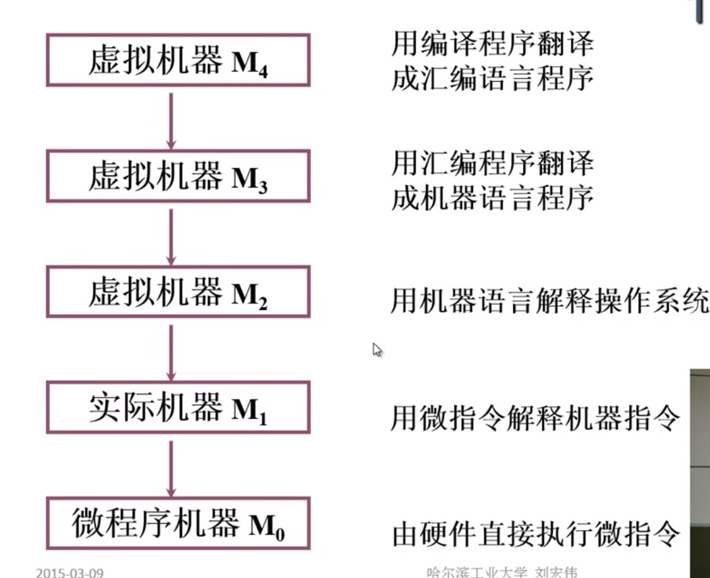
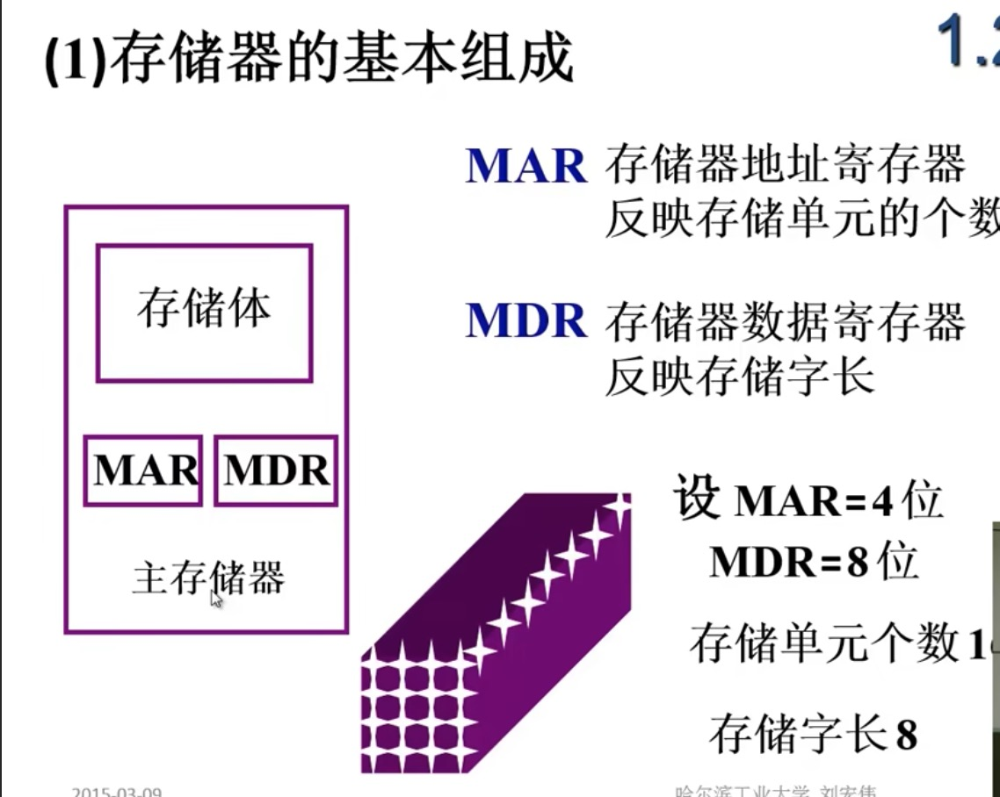
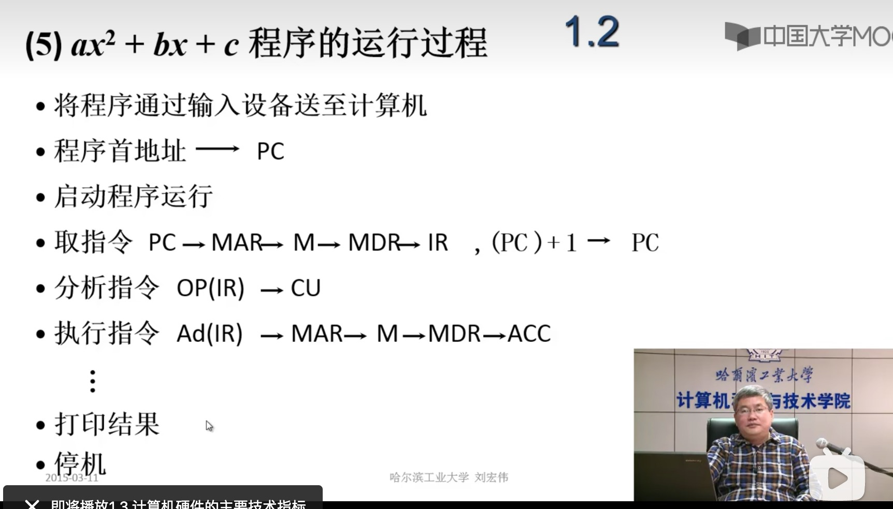

# 计算机组成原理
主要分析计算机硬件的逻辑实现，基本操作原理

指令解释执行流程

存储器的基本组成：

MAR:存储器地址寄存器 反映存储单元的个数
MDR ：存储器数据寄存器 反映存储字长

运算器基本结构：

程序执行流程：

## 系统总线
总线是连接各个部件的信息传输线，是各个设备部件的共享传输介质

## 总线的分类
- 片内总线 芯片内部总线
- 系统总线 系统各部直接的链接总线
  - 数据总线
  - 地址总线
  - 控制总线
- 通信总线

总线通信的方式：
- 同步通信
  - 定宽 定距的定时标 控制数据传输
  - 

分离式通信：
- 各模块均有权申请占用总线
- 采用异步方式不等对方回答
- 各模块准备数据时候不占用总线
- 总线被占用无空闲

存储器分类：
- 按介质分类
  - 半导体 TTL、mos 数据易丢失
  - 磁表面存储器
  - 磁芯存储器
  - 光盘存储器
  