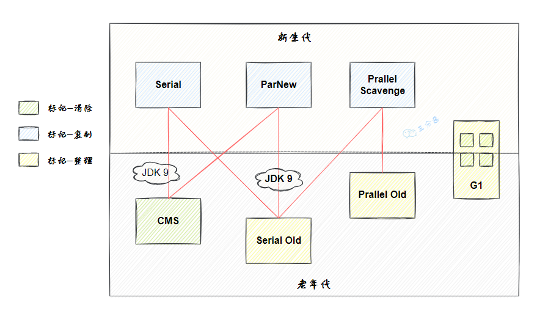

# java 
## java 基础

将一个字符串直接转化为字节数组和将一个字符串转为十六进制字符串再转化为字节数组。字节数组是一样的

jdk 安装

远程调试

```
CATALINA_OPTS="-server -Xdebug -Xnoagent -Djava.compiler=NONE -Xrunjdwp:transport=dt_socket,server=y,suspend=n,address=8788"
```

idea  debug config 中添加  Remote Jvm Debug

## java 安装配置

vi /etc/profile

JAVA_HOME=/usr/local/jdk1.8.0_231
JRE_HOME=$JAVA_HOME/jre
CLASS_PATH=.:$JAVA_HOME/lib/dt.jar:$JAVA_HOME/lib/tools.jar:$JRE_HOME/lib
PATH=$PATH:$JAVA_HOME/bin:$JRE_HOME/bin
export JAVA_HOME JRE_HOME CLASS_PATH PATH

source /etc/profile 使生效  Java -version 检测安装是否安装成功


## 分布式Session处理方案：


## Springboot：

```yaml
java -jar spring-boot-config.jar --spring.config.location=F:/application.properties
```


jar 中修改参数

```
java -jar aaa.jar --server.port = 8083

java -jar ftpagent-0.0.1.jar --external.devname=eno2
```

##  @Scheduled

1、fixedRate

例：@Scheduled(fixedRate = 5000) //上一次开始执行时间点之后5秒再执行

2、fixedDelay

例：@Scheduled(fixedDelay = 5000) //上一次执行完毕时间点之后5秒再执行

3、cron

例：@Scheduled(cron = "0 0/1 9-21 * * ?")//每天早上9点-晚上21点间执行，每次执行间隔一分钟


## 线程池
核心参数

```java
public ThreadPoolExecutor(int corePoolSize,
                            int maximumPoolSize,
                            long keepAliveTime,
                            TimeUnit unit,
                            BlockingQueue<Runnable> workQueue,	
                            ThreadFactory threadFactory,
                            RejectedExecutionHandler handler);

```
- 3.1 corePoolSize 线程池核心线程大小
线程池中维护的一个最少的线程数量,即使这些线程处于空闲状态,他们也不会被销毁,除非设置了allowCoreThreadTimeOut。

- 3.2 maximumPoolSize 线程池最大线程数量
一个任务被提交到线程池之后，首先会到工作队列中，如果工作队列满了，则会创建一个新的线程，然后从工作队列中取出一个任务交给新线程处理，而将刚提交上来的任务放入到工作队列中。线程池最大的线程数量由maximunPoolSize来指定。

- 3.3 keepAliveTime 空闲线程存活时间
一个线程如果处于空闲状态，并且当前的线程数量大于corePoolSize，那么在指定的时间后，这个空闲的线程将被销毁，这个指定的时间就是keepAliveTime。

- 3.4 unit 空闲线程存活时间单位
keepAliveTime的计量单位，是一个枚举java.util.concurrent.TimeUnit。

- 3.5 workQueue 工作队列
新任务被提交之后，会先进入到此工作队列中，任务调度时再从队列中取出任务。jdk一共提供了四种工作队列。
ArrayBlockingQueue 数组型阻塞队列：数组结构，初始化时传入大小，有界，FIFO（先进先出），使用一个重入锁，默认使用非公平锁，入队和出队共用一个锁，互斥。
LinkedBlockingQueue 链表型阻塞队列：链表结构，默认初始化大小为Integer.MAX_VALUE，有界（近似无解），FIFO，使用两个重入锁分别控制元素的入队和出队，用Condition进行线程间的唤醒和等待。
SynchronousQueue 同步队列：容量为0，添加任务必须等待取出任务，这个队列相当于通道，不存储元素。
PriorityBlockingQueue 优先阻塞队列：无界，默认采用元素自然顺序升序排列。
DelayQueue 延时队列：无界，元素有过期时间，过期的元素才能被取出。
- 3.6 threadFactory 线程工厂
创建新线程的时候使用的工厂，可以用来指定线程名，是否为daemon线程等等。

- 3.7 handler 拒绝策略
当工作队列中的任务已经达到了最大的限制，并且线程池中线程数量达到了最大限制，如果这时候有新任务进来，就会采取拒绝策略，jdk中提供了四种拒绝策略。
AbortPolicy：丢弃任务并抛出RejectedExecutionException异常。
DiscardPolicy：丢弃任务，但是不抛出异常。可能导致无法发现系统的异常状态。
DiscardOldestPolicy：丢弃队列最前面的任务，然后重新提交被拒绝的任务。
CallerRunsPolicy：由调用线程处理该任务。

线程池线程添加策略：
 

- 添加任务的方式
  - execute 方式添加任务
  ```java
  newExecutorService.execute(new Runnable() {
                @Override
                public void run() {
                    System.out.println("threadName;"+Thread.currentThread().getName()+",i"+temp);
                }
            });
  ```

 - threadPool.submit 方式添加任务
  ```java
  Future<Integer> result = threadPool.submit(new Callable<Integer>() {
                @Override
                public Integer call() throws Exception {
                    int num=new Random().nextInt(9);
                    System.out.println("随机数："+num);
                    return num;
                }
            });
  ```
  execute：只能执行不带返回值的任务； 
  submit：它可以执行有返回值的任务或者是没有返回值的任务 。
 - shutdown执行时线程池终止接收新任务，并且会将任务队列中的任务处理完；
 - shutdoNow执行时线程池终止接收新任务，并且会终止执行任务队列中的任务。

可以看到线程池的状态共有5种，分别为：

RUNNING：线程池创建之后的状态，这种状态下可以执行任务；
SHUTDOWN:该状态下线程池不再接受新任务，但是会将工作队列中的任务执行结束；
STOP：该状态下线程池不再接受新任务，并且会中断线程；
TIDYING:该状态下所有任务都已终止，将会执行terminated方法；
TEIMINATED：执行完terminated方法之后。

### 线程池优化
- 如果线程池中的任务执行时间比较长，长时间也就只能创建maxnumber数量的线程，所以根据实际情况选择使用线程池还是线程，线程池比较适合任务时间短且瞬时大量任务
- 核心线程数
  - IO密集型 应该多些线程  
    - 配置方式   CPU核数 * 2
    - CPU核数 / (1 - 阻塞系数)，阻塞系数在0.8~0.9之间
  - CPU 密集
    - CPU核数 + 1


## 1.校验

密码必须包含字母、数字和特殊符号且长度是6-32位：
 ```
 ^(?=.*[0-9])(?=.*[a-zA-Z])(?=.*[`~!@#$%^&*()-=_+;':",./<>?])(?=\S+$).{6,32}$
 ```

密码是8-16位字母和数字的组合

```
^(?![0-9]+$)(?![a-zA-Z]+$)[0-9A-Za-z]{8,16}$
```

^(?![0-9]+$)(?![a-zA-Z]+$)[0-9A-Za-z]{8,16}$
密码必须包含大写、小写、数字和特殊字符，且长度是6位以上

```
 ^(?=.*[0-9])(?=.*[A-Z])(?=.*[a-z])(?=.*[`~!@#$%^&*()-=_+;':",./<>?])(?=\S+$).{6,}$
```

```
public class PwdCheckUtil {
    /**
     * 密码必须包含大写、小写、数字和特殊字符，且长度是6位以上
     */
    private static final String PWD_REGEX = "^(?=.*[0-9])(?=.*[A-Z])(?=.*[a-z])(?=.*[`~!@#$%^&*()-=_+;':\",./<>?])(?=\\S+$).{6,}$";

    /**
     * 密码复杂度校验，判断有效性
     * @param password 密码信息
     * @return 校验密码是否合规有效
     */
    public static boolean isValidPassword(String password) {
        if (StringUtils.isBlank(password)) {
            return false;
        }
        return password.matches(PWD_REGEX);
    }
}
```
## 2.jar 相关


执行jar

nohup java -jar /home/htkj/agent/agent_test-1.0-SNAPSHOT-jar-with-dependencies.jar > /dev/null 2>&1 &

```
[Unit]
Description= ftp_agent
After=network.target remote-fs.target nss-lookup.target

[Service]
Type=simple
User=root
WorkingDirectory=/home/htkj/agent
ExecStart=nohup /usr/local/jdk8/bin/java -jar /home/htkj/agent/agent_test-1.0-SNAPSHOT-jar-with-dependencies.jar > /dev/null 2>&1 &
[Install]
WantedBy=multi-user.target


3.设置权限
  chmod 775  ftp_agent.service
  systemctl daemon-reload
4.设置自启动
  systemctl enable ftp_agent.service
5.启动服务
   systemctl start ftp_agent.service

```


监控查找进程

vim创建并保存 ftp_agent.service

agent_pid=`ps -ef | grep agent_test | grep v | awk '{print $2}'`

if [ -z "$agent_pid" ]; then
  systemctl start ftp_agent.service
  echo "`date +%Y-%m-%d` `date +%H:%M:%S`,start ftp agent" >>   ftp_agent_mornitor.log
else
  echo "`date +%Y-%m-%d` `date +%H:%M:%S`,ftp agent is running" >>   ftp_agent_mornitor.log

fi

定时任务配置，每隔3分钟执行一次

 */3 *  * * *  bash /home/mornitor/ftp_agent_mornitor.sh


直接打成jar包，需要在pom中添加，打出来的jar包以及依赖的jar独立存放

```
<build>
    <plugins>

        <plugin>
            <groupId>org.apache.maven.plugins</groupId>
            <artifactId>maven-jar-plugin</artifactId>
            <version>2.6</version>
            <configuration>
                <archive>
                    <manifest>
                        <addClasspath>true</addClasspath>
                        <classpathPrefix>lib/</classpathPrefix>
                        <mainClass>TestMain</mainClass>
                    </manifest>
                </archive>
            </configuration>
        </plugin>
        <plugin>
            <groupId>org.apache.maven.plugins</groupId>
            <artifactId>maven-dependency-plugin</artifactId>
            <version>2.10</version>
            <executions>
                <execution>
                    <id>copy-dependencies</id>
                    <phase>package</phase>
                    <goals>
                        <goal>copy-dependencies</goal>
                    </goals>
                    <configuration>
                        <outputDirectory>${project.build.directory}/lib</outputDirectory>
                    </configuration>
                </execution>
            </executions>
        </plugin>

    </plugins>
</build>

把jar和依赖的jar都打成一个jar，这种方便以jar为执行的方式

<build>
    <plugins>
 
        <plugin>
            <groupId>org.apache.maven.plugins</groupId>
            <artifactId>maven-assembly-plugin</artifactId>
            <version>2.5.5</version>
            <configuration>
                <archive>
                    <manifest>
                        <mainClass>TestMain</mainClass>
                    </manifest>
                </archive>
                <descriptorRefs>
                    <descriptorRef>jar-with-dependencies</descriptorRef>
                </descriptorRefs>
            </configuration>
        </plugin>
 
    </plugins>

```

```
把jar和依赖的jar都打成一个jar，这种方便以jar为执行的方式

<build>
	<plugins>
 
		<plugin>
			<groupId>org.apache.maven.plugins</groupId>
			<artifactId>maven-assembly-plugin</artifactId>
			<version>2.5.5</version>
			<configuration>
				<archive>
					<manifest>
						<mainClass>TestMain</mainClass>
					</manifest>
				</archive>
				<descriptorRefs>
					<descriptorRef>jar-with-dependencies</descriptorRef>
				</descriptorRefs>
			</configuration>
		</plugin>
 
	</plugins>
</build>
```

## jvm相关

### 内存模型：


### 1.tomcat 相关

##### 查看tomcat进程启动了多少个线程

1、 获取tomcat进程pid

```linux
ps -ef|grep tomcat
```

例如进程号是29295

2、 统计该tomcat进程内的线程个数

```linux
ps -Lf 29295|wc -l
```

3、查看该进程打开的文件数

```
lsof -p pid | wc -l
查询某个进程打开的文件列表

lsof | grep {pid}
查询某个进程打开的文件数目

lsof | grep {pid} | wc -l
查询进程使用的文件描述符

ls -l /proc/{pid}/fd/

查询进程使用的文件描述符数目

ls -l /proc/{pid}/fd/ | wc -l
1
查看系统文件描述符的最大设置

cat /proc/sys/fs/file-max
1
系统当前被使用的文件描述符数目

cat /proc/sys/fs/file-nr
```

### arthas 监控到JVM的实时运行状态

https://github.com/alibaba/arthas/releases


pstree -p 进程号，这个命令可以列出该进程的所有线程出来。

pstree -p 进程号 | wc -l,直接算出线程的总数过来

命令找不到  yum -y install psmisc

```
Handler dispatch failed; nested exception is java.lang.NoClassDefFoundError: Could not initialize class sun.awt.X11GraphicsEnvironment
org.springframework.web.util.NestedServletException: Handler dispatch failed; nested exception is java.lang.NoClassDefFoundError: Could not initialize class sun.awt.X11GraphicsEnvironment
	at org.springframework.web.servlet.DispatcherServlet.doDispatch(DispatcherServlet.java:978)
	at org.springframework.web.servlet.DispatcherServlet.doService(DispatcherServlet.java:897)
	at org.springframework.web.servlet.FrameworkServlet.processRequest(FrameworkServlet.java:970)
```
解决方案：
JAVA_OPTS="-server -Djava.awt.headless=true  -XX:+PrintGCDetails -XX:+PrintGCTimeStamps -XX:+PrintGCDateStamps -Xloggc:gc-%t.log -XX:+HeapDumpOnOutOfMemoryError  -XX:HeapDumpPath=/home/app/oom"


#### jvm 状态查看

```
https://blog.csdn.net/lufei0920/article/details/115196146
```


### JVM调优

为什么要做JVM调优？

一、防止出现OOM

即在系统部署之前，根据一些关键数据进行预估不同内存区域需要给多少内存合适

二、解决OOM

即线上出现了OOM，应该如何调优以保证程序能正常运行

二、减少full gc出现的频率

这个主要是堆区，如果设置的不合理就会频繁full gc，导致系统运行一阵暂停一阵，导致体验下降

### JVM调优的时机

- Heap内存（老年代）持续上涨达到设置的最大内存值；
- Full GC 次数频繁；
- GC 停顿时间过长（超过1秒）；
- 应用出现OutOfMemory 等内存异常；
- 应用中有使用本地缓存且占用大量内存空间；
- 系统吞吐量与响应性能不高或下降

### JVM调优的目标


吞吐量、延迟、内存占用三者类似CAP，构成了一个不可能三角，只能选择其中两个进行调优，不可三者兼得。

延迟：GC低停顿和GC低频率；
低内存占用；
高吞吐量;
选择了其中两个，必然会会以牺牲另一个为代价。

下面展示了一些JVM调优的量化目标参考实例：

Heap 内存使用率 <= 70%;
Old generation内存使用率<= 70%;
avgpause <= 1秒;
Full gc 次数0 或 avg pause interval >= 24小时 ;

### JVM调优的步骤


系统总运行时间 = 应用程序耗时 +GC 耗时。如果系统运行了 100 分钟， GC 耗时 1 分钟，则系统吞吐量为 99% 。 GC 的吞吐量一般不能低于 95% 


一般情况下，JVM调优可通过以下步骤进行：

分析系统系统运行情况：分析GC日志及dump文件，判断是否需要优化，确定瓶颈问题点；
确定JVM调优量化目标；
确定JVM调优参数（根据历史JVM参数来调整）；
依次确定调优内存、延迟、吞吐量等指标；
对比观察调优前后的差异；
不断的分析和调整，直到找到合适的JVM参数配置；
找到最合适的参数，将这些参数应用到所有服务器，并进行后续跟踪。
以上操作步骤中，某些步骤是需要多次不断迭代完成的。一般是从满足程序的内存使用需求开始的，之后是时间延迟的要求，最后才是吞吐量的要求，要基于这个步骤来不断优化，每一个步骤都是进行下一步的基础，不可逆行。 

CPU多核，关注用户停顿时间，JDK1.8及以上，JVM可用内存6G以上，那么选择G1。

参数配置：

```text
 //设置Serial垃圾收集器（新生代）
 开启：-XX:+UseSerialGC
 
 //设置PS+PO,新生代使用功能Parallel Scavenge 老年代将会使用Parallel Old收集器
 开启 -XX:+UseParallelOldGC
 
 //CMS垃圾收集器（老年代）
 开启 -XX:+UseConcMarkSweepGC
 
 //设置G1垃圾收集器
 开启 -XX:+UseG1GC
```

### **2、增加内存大小**

现象：垃圾收集频率非常频繁。

原因：如果内存太小，就会导致频繁的需要进行垃圾收集才能释放出足够的空间来创建新的对象，所以增加堆内存大小的效果是非常显而易见的。

注意：如果垃圾收集次数非常频繁，但是每次能回收的对象非常少，那么这个时候并非内存太小，而可能是内存泄漏导致对象无法回收，从而造成频繁GC。

参数配置：

```text
 //设置堆初始值
 指令1：-Xms2g
 指令2：-XX:InitialHeapSize=2048m
 
 //设置堆区最大值
 指令1：`-Xmx2g` 
 指令2： -XX:MaxHeapSize=2048m
 
 //新生代内存配置
 指令1：-Xmn512m
 指令2：-XX:MaxNewSize=512m
```

### **场景三：CPU经常100% 问题定位思路。**

问题分析：CPU高一定是某个程序长期占用了CPU资源。


1、所以先需要找出那个进行占用CPU高。

```text
 top  列出系统各个进程的资源占用情况。
```


2、然后根据找到对应进行里哪个线程占用CPU高。

```text
 top -Hp 进程ID   列出对应进程里面的线程占用资源情况
```


3、找到对应线程ID后，再打印出对应线程的堆栈信息

```text
 printf "%x\n"  PID    把线程ID转换为16进制。
 jstack PID 打印出进程的所有线程信息，从打印出来的线程信息中找到上一步转换为16进制的线程ID对应的线程信息。
```


4、最后根据线程的堆栈信息定位到具体业务方法,从代码逻辑中找到问题所在。

```text
 查看是否有线程长时间的watting 或blocked
 如果线程长期处于watting状态下， 关注watting on xxxxxx，说明线程在等待这把锁，然后根据锁的地址找到持有锁的线程
```

### **场景四：内存飚高问题定位思路。**

分析： 内存飚高如果是发生在java进程上，一般是因为创建了大量对象所导致，持续飚高说明垃圾回收跟不上对象创建的速度，或者内存泄漏导致对象无法回收。


1、先观察垃圾回收的情况

```text
 jstat -gc PID 1000 查看GC次数，时间等信息，每隔一秒打印一次。
  
 jmap -histo PID | head -20   查看堆内存占用空间最大的前20个对象类型,可初步查看是哪个对象占用了内存。
```

如果每次GC次数频繁，而且每次回收的内存空间也正常，那说明是因为对象创建速度快导致内存一直占用很高；如果每次回收的内存非常少，那么很可能是因为内存泄露导致内存一直无法被回收。

详细查看：

https://zhuanlan.zhihu.com/p/269597178


默认连接200，可以通过调整**maxThreads**  改变默认值

```
<Connector executor="tomcatThreadPool" port="8080" 						                            protocol="org.apache.coyote.http11.Http11Nio2Protocol" 
           connectionTimeout="20000" redirectPort="8443" 
           enableLookups="false" maxPostSize="10485760" URIEncoding="UTF-8"  acceptCount="100" acceptorThreadCount="2" disableUploadTimeout="true"                    maxConnections="10000" SSLEnabled="false"/>

```

设置垃圾回收

```
#年轻代、老年代均使用并行收集器，初始堆内存64M，最大堆内存512M
JAVA_OPTS="-XX:+UseParallelGC -XX:+UseParallelOldGC -Xms64m -Xmx512m -XX:+PrintGCDetails -XX:+PrintGCTimeStamps -XX:+PrintGCDateStamps -XX:+PrintHeapAtGC -Xloggc:../logs/gc.log"

将初始堆大小设置为128m，最大为1024m，初始年轻代大小64m，年轻代最大256m
JAVA_OPTS="-XX:+UseParallelGC -XX:+UseParallelOldGC -Xms128m -Xmx1024m -XX:NewSize=64m -XX:MaxNewSize=256m -XX:+PrintGCDetails -XX:+PrintGCTimeStamps -XX:+PrintGCDateStamps -XX:+PrintHeapAtGC -Xloggc:../logs/gc.log"


```

**吞吐量优先的应用**

一般吞吐量优先的应用都有一个很大的年轻代和一个较小的年老代。原因是，这样可以尽可能回收掉大部分短期对象，减少中期的对象，而年老代尽存放长期存活对象。


### 垃圾回收

https://blog.csdn.net/qq_43842093/article/details/129105466

Minor GC/Young GC、Major GC/Old GC、Mixed GC、Full GC都是什么意思？
部分收集（Partial GC）：指目标不是完整收集整个Java堆的垃圾收集，其中又分为：

新生代收集（Minor GC/Young GC）：指目标只是新生代的垃圾收集。

新创建的对象优先在新生代Eden区进行分配，如果Eden区没有足够的空间时，就会触发Young GC来清理新生代。

老年代收集（Major GC/Old GC）：指目标只是老年代的垃圾收集。目前只有CMS收集器会有单独收集老年代的行为。
混合收集（Mixed GC）：指目标是收集整个新生代以及部分老年代的垃圾收集。目前只有G1收集器会有这种行为。
整堆收集（Full GC）：收集整个Java堆和方法区的垃圾收集。 


#### 什么时候触发full GC：


Young GC之前检查老年代：在要进行 Young GC 的时候，发现老年代可用的连续内存空间 < 新生代历次Young GC后升入老年代的对象总和的平均大小，说明本次Young GC后可能升入老年代的对象大小，可能超过了老年代当前可用内存空间,那就会触发 Full GC。
Young GC之后老年代空间不足：执行Young GC之后有一批对象需要放入老年代，此时老年代就是没有足够的内存空间存放这些对象了，此时必须立即触发一次Full GC
老年代空间不足，老年代内存使用率过高，达到一定比例，也会触发Full GC。
空间分配担保失败（ Promotion Failure），新生代的 To 区放不下从 Eden 和 From 拷贝过来对象，或者新生代对象 GC 年龄到达阈值需要晋升这两种情况，老年代如果放不下的话都会触发 Full GC。
方法区内存空间不足：如果方法区由永久代实现，永久代空间不足 Full GC。
System.gc()等命令触发：System.gc()、jmap -dump 等命令会触发 full gc。


#### 对象什么时候会进入老年代？


##### 长期存活的对象将进入老年代

在对象的对象头信息中存储着对象的迭代年龄,迭代年龄会在每次YoungGC之后对象的移区操作中增加,每一次移区年龄加一.当这个年龄达到15(默认)之后,这个对象将会被移入老年代。

可以通过这个参数设置这个年龄值。

- XX:MaxTenuringThreshold 

##### 大对象直接进入老年代

有一些占用大量连续内存空间的对象在被加载就会直接进入老年代.这样的大对象一般是一些数组,长字符串之类的对。

HotSpot虚拟机提供了这个参数来设置。

-XX：PretenureSizeThreshold

##### 动态对象年龄判定

为了能更好地适应不同程序的内存状况，HotSpot虚拟机并不是永远要求对象的年龄必须达到- XX：MaxTenuringThreshold才能晋升老年代，如果在Survivor空间中相同年龄所有对象大小的总和大于Survivor空间的一半，年龄大于或等于该年龄的对象就可以直接进入老年代。

##### 空间分配担保

假如在Young GC之后，新生代仍然有大量对象存活，就需要老年代进行分配担保，把Survivor无法容纳的对象直接送入老年代。


#### 垃圾收集器：

图中标出了它们的工作区域、垃圾收集算法，以及配合关系。



##### Serial收集器(最初级 单线程 )

Serial收集器是最基础、历史最悠久的收集器。

如同它的名字（串行），它是一个单线程工作的收集器，使用一个处理器或一条收集线程去完成垃圾收集工作。并且进行垃圾收集时，必须暂停其他所有工作线程，直到垃圾收集结束——这就是所谓的“Stop The World”。

Serial/Serial Old 分别收集新生代和老年代

##### ParNew (多线程 多线程收集新生代)

ParNew收集器实质上是Serial收集器的多线程并行版本，使用多条线程进行垃圾收集。


##### Parallel Scavenge（新生代收集器）

Parallel Scavenge收集器是一款新生代收集器，基于标记-复制算法实现，也能够并行收集。和ParNew有些类似，但Parallel Scavenge主要关注的是垃圾收集的吞吐量——所谓吞吐量，就是CPU用于运行用户代码的时间和总消耗时间的比值，比值越大，说明垃圾收集的占比越小。 

- Parallel Old

Parallel Old是Parallel Scavenge收集器的老年代版本，支持多线程并发收集，基于标记-整理算法实现。

##### CMS收集器（老年代的收集器）

CMS（Concurrent Mark Sweep）收集器是一种以获取最短回收停顿时间为目标的收集器，同样是老年代的收集器，采用标记-清除算法。

CMS收集齐的垃圾收集分为四步：

初始标记（CMS initial mark）：单线程运行，需要Stop The World，标记GC Roots能直达的对象。
并发标记（（CMS concurrent mark）：无停顿，和用户线程同时运行，从GC Roots直达对象开始遍历整个对象图。
重新标记（CMS remark）：多线程运行，需要Stop The World，标记并发标记阶段产生对象。
并发清除（CMS concurrent sweep）：无停顿，和用户线程同时运行，清理掉标记阶段标记的死亡的对象


##### Garbage First收集器 （局部收集  G1主要解决了内存碎片过多的问题。）

G1把连续的Java堆划分为多个大小相等的独立区域（Region），每一个Region都可以根据需要，扮演新生代的Eden空间、Survivor空间，或者老年代空间。收集器能够对扮演不同角色的Region采用不同的策略去处理。


这样就避免了收集整个堆，而是按照若干个Region集进行收集，同时维护一个优先级列表，跟踪各个Region回收的“价值，优先收集价值高的Region。

G1收集器的运行过程大致可划分为以下四个步骤：

初始标记（initial mark），标记了从GC Root开始直接关联可达的对象。STW（Stop the World）执行。
并发标记（concurrent marking），和用户线程并发执行，从GC Root开始对堆中对象进行可达性分析，递归扫描整个堆里的对象图，找出要回收的对象、
最终标记（Remark），STW，标记再并发标记过程中产生的垃圾。
筛选回收（Live Data Counting And Evacuation），制定回收计划，选择多个Region 构成回收集，把回收集中Region的存活对象复制到空的Region中，再清理掉整个旧 Region的全部空间。需要STW。 


最重要的是MaxGCPauseMillis，可以通过它设定G1的目标停顿时间，它会尽量的去达成这个目标。G1HeapRegionSize可以设置小堆区的大小，一般是2的次幂。
InitiatingHeapOccupancyPercent，启动并发GC时的堆内存占用百分比。G1用它来触发并发GC周期，基于整个堆的使用率，而不只是某一代内存的使用比例，默认是45%


##### ZGC

ZGC（Z Garbage Collector）是Java HotSpot虚拟机中的一种新型垃圾收集器，它旨在提供更高效的内存回收性能，同时满足低延迟和一致性要求。ZGC采用了并发的、可扩展的、多线程的收集策略，可以在不进行全局停顿的情况下完成内存回收。

并发的垃圾回收：ZGC将垃圾收集过程划分为多个阶段，并在各个阶段之间进行并发执行。这使得在进行垃圾回收时，应用程序可以继续运行，从而降低了停顿时间。
内存一致性：ZGC通过使用读写屏障（Read-Write Barrier）和染色指针（Colored Pointer）等技术，确保了在并发模式下，内存一致性得到维护。这有助于开发人员避免一些并发编程中的问题。
扩展性：ZGC设计为可扩展的，可以适应不同大小的内存和不同的硬件环境。它使用了一种可扩展的、并行的标记算法，可以在大规模内存环境中高效运行。
多线程：ZGC充分利用了多线程的优势，在各个阶段都使用了并行处理和多线程技术，以提高垃圾回收的效率

 ```
 //设置项显式启用ZGC
 -XX:+UseZGC
 
 //默认情况下，ZGC取消对未使用内存的限制，将其返回到操作系统
 //禁用此功能
 -XX:-ZUncommit
 
 //取消限制延迟。此延迟指定内存在符合取消限制条件之前应该使用多长时间
 -XX:ZUncommitDelay=<seconds>（默认值为300秒）
 
 ```


####  有了CMS，为什么还要引入G1？

优点：CMS最主要的优点在名字上已经体现出来——并发收集、低停顿。

缺点：CMS同样有三个明显的缺点。

Mark Sweep算法会导致内存碎片比较多
CMS的并发能力比较依赖于CPU资源，并发回收时垃圾收集线程可能会抢占用户线程的资源，导致用户程序性能下降。
并发清除阶段，用户线程依然在运行，会产生所谓的理“浮动垃圾”（Floating Garbage），本次垃圾收集无法处理浮动垃圾，必须到下一次垃圾收集才能处理。如果浮动垃圾太多，会触发新的垃圾回收，导致性能降低。 

#### 垃圾收集器应该如何选择？

这里简单地列一下上面提到的一些收集器的适用场景：

Serial ：如果应用程序有一个很小的内存空间（大约100 MB）亦或它在没有停顿时间要求的单线程处理器上运行。
Parallel：如果优先考虑应用程序的峰值性能，并且没有时间要求要求，或者可以接受1秒或更长的停顿时间。
CMS/G1：如果响应时间比吞吐量优先级高，或者垃圾收集暂停必须保持在大约1秒以内。
ZGC：如果响应时间是高优先级的，或者堆空间比较大。 

#### 线上服务CPU占用过高怎么排查


1、所以先需要找出那个进程占用CPU高。

top 列出系统各个进程的资源占用情况。
2、然后根据找到对应进行里哪个线程占用CPU高。

top -Hp 进程ID 列出对应进程里面的线程占用资源情况
3、找到对应线程ID后，再打印出对应线程的堆栈信息

printf “%x\n” PID 把线程ID转换为16进制。
jstack PID 打印出进程的所有线程信息，从打印出来的线程信息中找到上一步转换为16进制的线程ID对应的线程信息。
4、最后根据线程的堆栈信息定位到具体业务方法,从代码逻辑中找到问题所在。

查看是否有线程长时间的watting 或blocked，如果线程长期处于watting状态下， 关注watting on xxxxxx，说明线程在等待这把锁，然后根据锁的地址找到持有锁的线程 


#### 内存飙高问题怎么排查？

分析：内存飚高如果是发生在java进程上，一般是因为创建了大量对象所导致，持续飚高说明垃圾回收跟不上对象创建的速度，或者内存泄露导致对象无法回收。

1、先观察垃圾回收的情况

jstat -gc PID 1000 查看GC次数，时间等信息，每隔一秒打印一次。

 新生代垃圾回收统计jstat  -gcnew pid

新生代内存统计jstat  -gcnewcapacity pid

元数据空间统计（持久代）jstat  -gcmetacapacity pid


jmap -histo PID | head -20 查看堆内存占用空间最大的前20个对象类型,可初步查看是哪个对象占用了内存。
如果每次GC次数频繁，而且每次回收的内存空间也正常，那说明是因为对象创建速度快导致内存一直占用很高；如果每次回收的内存非常少，那么很可能是因为内存泄露导致内存一直无法被回收。

2、导出堆内存文件快照

jmap -dump:live,format=b,file=/home/myheapdump.hprof PID dump堆内存信息到文件。
3、使用visualVM对dump文件进行离线分析，找到占用内存高的对象，再找到创建该对象的业务代码位置，从代码和业务场景中定位具体问题。

####  频繁 minor gc 怎么办？

优化Minor GC频繁问题：通常情况下，由于新生代空间较小，Eden区很快被填满，就会导致频繁Minor GC，因此可以通过增大新生代空间`-Xmn`来降低Minor GC的频率。

#### 频繁Full GC怎么办？

Full GC的排查思路大概如下：

清楚从程序角度，有哪些原因导致FGC？
大对象：系统一次性加载了过多数据到内存中（比如SQL查询未做分页），导致大对象进入了老年代。
内存泄漏：频繁创建了大量对象，但是无法被回收（比如IO对象使用完后未调用close方法释放资源），先引发FGC，最后导致OOM.
程序频繁生成一些长生命周期的对象，当这些对象的存活年龄超过分代年龄时便会进入老年代，最后引发FGC. （即本文中的案例）
程序BUG
代码中显式调用了gc方法，包括自己的代码甚至框架中的代码。
JVM参数设置问题：包括总内存大小、新生代和老年代的大小、Eden区和S区的大小、元空间大小、垃圾回收算法等等。

1. 清楚排查问题时能使用哪些工具

   公司的监控系统：大部分公司都会有，可全方位监控JVM的各项指标。

   JDK的自带工具，包括jmap、jstat等常用命令：

```
# 查看堆内存各区域的使用率以及GC情况
jstat -gcutil -h20 pid 1000
# 查看堆内存中的存活对象，并按空间排序
jmap -histo pid | head -n20
# dump堆内存文件
jmap -dump:format=b,file=heap pid

```

排查指南
查看监控，以了解出现问题的时间点以及当前FGC的频率（可对比正常情况看频率是否正常）
了解该时间点之前有没有程序上线、基础组件升级等情况。
了解JVM的参数设置，包括：堆空间各个区域的大小设置，新生代和老年代分别采用了哪些垃圾收集器，然后分析JVM参数设置是否合理。
再对步骤1中列出的可能原因做排除法，其中元空间被打满、内存泄漏、代码显式调用gc方法比较容易排查。
针对大对象或者长生命周期对象导致的FGC，可通过 jmap -histo 命令并结合dump堆内存文件作进一步分析，需要先定位到可疑对象。
通过可疑对象定位到具体代码再次分析，这时候要结合GC原理和JVM参数设置，弄清楚可疑对象是否满足了进入到老年代的条件才能下结论。

####  有没有处理过内存泄漏问题？是如何定位的？

内存泄漏是内在病源，外在病症表现可能有：

应用程序长时间连续运行时性能严重下降
CPU 使用率飙升，甚至到 100%
频繁 Full GC，各种报警，例如接口超时报警等
应用程序抛出 OutOfMemoryError 错误
应用程序偶尔会耗尽连接对象
严重内存泄漏往往伴随频繁的 Full GC，所以分析排查内存泄漏问题首先还得从查看 Full GC 入手。主要有以下操作步骤：

使用 jps 查看运行的 Java 进程 ID

使用top -p [pid] 查看进程使用 CPU 和 MEM 的情况

使用 top -Hp [pid] 查看进程下的所有线程占 CPU 和 MEM 的情况

将线程 ID 转换为 16 进制：printf "%x\n" [pid]，输出的值就是线程栈信息中的 nid。

例如：printf "%x\n" 29471，换行输出 731f。

抓取线程栈：jstack 29452 > 29452.txt，可以多抓几次做个对比。

在线程栈信息中找到对应线程号的 16 进制值，如下是 731f 线程的信息。线程栈分析可使用 Visualvm 插件 TDA。
 使用jstat -gcutil [pid] 5000 10 每隔 5 秒输出 GC 信息，输出 10 次，查看 YGC 和 Full GC 次数。通常会出现 YGC 不增加或增加缓慢，而 Full GC 增加很快。

或使用 jstat -gccause [pid] 5000 ，同样是输出 GC 摘要信息。

或使用 jmap -heap [pid] 查看堆的摘要信息，关注老年代内存使用是否达到阀值，若达到阀值就会执行 Full GC。

如果发现 Full GC 次数太多，就很大概率存在内存泄漏了

使用 jmap -histo:live [pid] 输出每个类的对象数量，内存大小(字节单位)及全限定类名。

生成 dump 文件，借助工具分析哪 个对象非常多，基本就能定位到问题在那了

使用 jmap 生成 dump 文件： 

```
# jmap -dump:live,format=b,file=29471.dump 29471
Dumping heap to /root/dump ...
Heap dump file created

```

#### MinorGC，MajorGC、FullGC都什么时候发生

MinorGC在年轻代空间不足的时候发生，MajorGC指的是老年代的GC，出现MajorGC一般经常伴有MinorGC。

FullGC有三种情况。

1. 当老年代无法再分配内存的时候
2. 元空间不足的时候
3. 显示调用System.gc的时候。另外，像CMS一类的垃圾回收器，在MinorGC出现promotion failure的时候也会发生FullGC


### 虚拟机执行

一个类从被加载到虚拟机内存中开始，到从内存中卸载，整个生命周期需要经过七个阶段：加载 （Loading）、验证（Verification）、准备（Preparation）、解析（Resolution）、初始化 （Initialization）、使用（Using）和卸载（Unloading），其中验证、准备、解析三个部分统称为连接（Linking）。


#### 什么是双亲委派机制

双亲委派模型

双亲委派模型的工作过程：如果一个类加载器收到了类加载的请求，它首先不会自己去尝试加载这个类，而是把这个请求委派给父类加载器去完成，每一个层次的类加载器都是如此，因此所有的加载请求最终都应该传送到最顶层的启动类加载器中，只有当父加载器反馈自己无法完成这个加载请求时，子加载器才会尝试自己去完成加载。 

#### 为什么要用双亲委派机制？ (不同的类加载器加载的class 为不同的对象)

答案是为了保证应用程序的稳定有序。

例如类java.lang.Object，它存放在rt.jar之中，通过双亲委派机制，保证最终都是委派给处于模型最顶端的启动类加载器进行加载，保证Object的一致。反之，都由各个类加载器自行去加载的话，如果用户自己也编写了一个名为java.lang.Object的类，并放在程序的 ClassPath中，那系统中就会出现多个不同的Object类。


```
<build>
        <finalName>demo</finalName>
        <plugins>
            <plugin>
                <artifactId>exec-maven-plugin</artifactId>
                <groupId>org.codehaus.mojo</groupId>
                <executions>
                    <execution>
                        <id>uncompress</id>
                        <phase>install</phase>
                        <goals>
                            <goal>exec</goal>
                        </goals>
                    </execution>
                </executions>
                <configuration>
                    <executable>${basedir}/../check-style/test.sh</executable>
                </configuration>
            </plugin>
        </plugins>
    </build>
```


# 多线程
## 线程的状态
- 新建状态： 使用 new Thread 类或其子类建立一个线程对象后，该线程对象就处于新建状态。
- 就绪状态：调用了start()方法之后，该线程就进入就绪状态（就绪队列中），等待JVM里线程调度器的调度
- 运行状态：执行 run()，此时线程便处于运行状态。处于运行状态的线程最为复杂，它可以变为阻塞状态、就绪状态和死亡状态
- 阻塞状态：如果一个线程执行了sleep（睡眠）、suspend（挂起）等方法，失去所占用资源之后，该线程就从运行状态进入阻塞状态
- 死亡状态：一个运行状态的线程完成任务或者其他终止条件发生时，该线程就切换到终止状态


##  锁

### 重入锁
锁重入的意思就是当一个线程得到一个对象锁后，再次请求此对象锁时是可以再次得到该对象的锁的。synchronized关键字拥有锁重入的功能，在一个synchronized方法/块内部调用本对象的其他synchronized方法/块时，是永远可以得到锁的，原因是Java中线程获得对象锁的操作是以线程为单位的，而不是以调用为单位的。同一个线程获得一个对象锁之后，再次访问这个对象的其他同步方法，所需的对象锁没有发生变化。

也就是说，当这个这个线程获取对象锁的时候，可以再次对这个对象加锁，

###  锁粗化
就是将多个连续的加锁、解锁操作连接在一起，扩展成一个范围更大的锁。
扩大加锁解锁的范围

###  锁消除
通过对运行上下文的扫描，去除不可能存在共享资源竞争的锁，通过这种方式消除没有必要的锁，可以节省毫无意义的请求锁时间
###  偏向锁
偏向锁的核心思想是，如果一个线程获得了锁，那么锁就进入偏向模式，此时Mark Word 的结构也变为偏向锁结构，当这个线程再次请求锁时，无需再做任何同步操作，即获取锁的过程，这样就省去了大量有关锁申请的操作，从而也就提供程序的性能。

偏向锁失败后，并不会立即膨胀为重量级锁，而是先升级为轻量级锁。

偏向锁的释放采用了一种只有竞争才会释放锁的机制，线程是不会主动去释放偏向锁，需要等待其他线程来竞争

注意：只要有线程执行同步代码，在没有竞争的情况下就是偏向锁


###  轻量级锁
是两个线程交替执行同步代码块，没有同一时刻执行的场景

### 自旋锁
轻量级获取锁失败后，为了避免线程操作系统层面挂起，耗费时间的问题,因为线程占用锁的时间较短，线程执行几个空循环等待锁释放的过程。

在经过若干次循环后，如果得到锁，就顺利进入临界区。如果还不能获得锁，那就会将线程在操作系统层面挂起，这就是自旋锁的优化方式，这种方式确实也是可以提升效率的。最后没办法也就只能升级为重量级锁了。


###  重量级锁
同一时间访问同一锁的场合，就会导致轻量级锁膨胀为重量级锁。
重量级锁也就是sychronized对象锁。


####  sychronized
实现原理：
JVM可以从方法常量池中的方法表结构(method_info Structure) 中的 ACC_SYNCHRONIZED 访问标志区分一个方法是否同步方法。当方法调用时，调用指令将会 检查方法的 ACC_SYNCHRONIZED 访问标志是否被设置，如果设置了，执行线程将先持有monitor（虚拟机规范中用的是管程一词）， 然后再执行方法，最后再方法完成(无论是正常完成还是非正常完成)时释放monitor。在方法执行期间，执行线程持有了monitor，其他任何线程都无法再获得同一个monitor。

传统的synchronized锁：队列锁

- java内置关键字
- 无法获取锁的状态
- 能自动释放
- 可重入 非公平 不可中断
- 适合少量代码的同步， 有方法和代码块锁
A: synchronized static是某个类的范围，synchronized static cSync{}防止多个线程同时访问这个类中的synchronized static 方法。它可以对类的所有对象实例起作用。

B: synchronized 是某实例的范围，synchronized isSync(){}防止多个线程同时访问这个实例中的synchronized 方法。

synchronized底层实现原理:


####  ReentrantLock

ReentrantLock的时候一定要手动释放锁，并且加锁次数和释放次数要一样,加锁和释放次数不一样导致的死锁
Lock所是一个接口，其所有的实现类为

ReentrantLock(可重入锁)
ReentrantReadWriteLock.ReadLock(可重入读写锁的读锁)
ReentrantReadWriteLock.WriteLock(可重入读写锁的写锁)


####  voilate

### Synchronized和ReentrantLock对比
#### 相同之处
都是加锁方式同步，而且都是阻塞式的同步，也就是说当如果一个线程获得了对象锁，进入了同步块，其他访问该同步块的线程都必须阻塞在同步块外面等待。

synchronized 与Lock都是可重入锁，同一个线程再次进入同步代码的时候.可以使用自己已经获取到的锁。

####  不同之处


### 乐观锁 VS 悲观锁

乐观锁在Java中是通过使用无锁编程来实现，最常采用的是CAS算法，Java原子类中的递增操作就通过CAS自旋实现的

悲观锁：synchronized关键字和Lock的实现。


#### ThreadLocal
1. ThreadLocal是什么
   ThreadLocal叫做线程变量，意思是ThreadLocal中填充的变量属于当前线程，该变量对其他线程而言是隔离的。ThreadLocal为变量在每个线程中都创建了一个副本，那么每个线程可以访问自己内部的副本变量
   作用：
   1、在进行对象跨层传递的时候，使用ThreadLocal可以避免多次传递，打破层次间的约束。
   2、线程间数据隔离
   3、进行事务操作，用于存储线程事务信息。
   4、数据库连接，Session会话管理。
   threadLocals属性对应在ThreadLocal中定义的ThreadLocalMap对象。 
#####  总结

（1）每个Thread维护着一个ThreadLocalMap的引用

（2）ThreadLocalMap是ThreadLocal的内部类，用Entry来进行存储

（3）ThreadLocal创建的副本是存储在自己的threadLocals中的，也就是自己的ThreadLocalMap。

（4）ThreadLocalMap的键值为ThreadLocal对象，而且可以有多个threadLocal变量，因此保存在map中

（5）在进行get之前，必须先set，否则会报空指针异常，当然也可以初始化一个，但是必须重写initialValue()方法。

（6）ThreadLocal本身并不存储值，它只是作为一个key来让线程从ThreadLocalMap获取value。


threadLocal 如何实现变量副本？
本质上就是一个Map 存放数据的map
注意点：
重点来了，突然我们ThreadLocal是null了，也就是要被垃圾回收器回收了，但是此时我们的ThreadLocalMap生命周期和Thread的一样，它不会回收，这时候就出现了一个现象。那就是ThreadLocalMap的key没了，但是value还在，这就造成了内存泄漏。

解决办法：使用完ThreadLocal后，执行remove操作，避免出现内存溢出情况。


#### synchronized和Lock锁的区别

synchronized:

是java内置的关键字
无法获取锁的状态
会自动释放锁
线程一在获得锁的情况下阻塞了，第二个线程就只能傻傻的等着
是不可中断的、非公平的、可重入锁
适合锁少量的同步代码
有代码块锁和方法锁
Lock:

是java的一个类
可判断是否获取了锁
需手动释放锁，如果不释放会造成死锁
线程一在获得锁的情况下阻塞了，可以使用tryLock()尝试获取锁
非公平的、可判断的、可重入锁
适合锁大量的同步代码
只有代码块锁
使用Lock锁，JVM将花费较少的时间来调度线程，性能更好。并且具有更好的扩展性（拥有更多的子类）


静态方法是依附于类而不是对象的，当synchronized修饰静态方法时，锁是class对象

## 线程池

```
corePoolSize：核心线程数，也是线程池中常驻的线程数，线程池初始化时默认是没有线程的，当任务来临时才开始创建线程去执行任务

maximumPoolSize：最大线程数，在核心线程数的基础上可能会额外增加一些非核心线程，需要注意的是只有当workQueue队列填满时才会创建多于corePoolSize的线程(线程池总线程数不超过maxPoolSize)

keepAliveTime：非核心线程的空闲时间超过keepAliveTime就会被自动终止回收掉，注意当corePoolSize=maxPoolSize时，keepAliveTime参数也就不起作用了(因为不存在非核心线程)；

unit：keepAliveTime的时间单位

workQueue：用于保存任务的队列，可以为无界、有界、同步移交三种队列类型之一，当池子里的工作线程数大于corePoolSize时，这时新进来的任务会被放到队列中

threadFactory：创建线程的工厂类，默认使用Executors.defaultThreadFactory()，也可以使用guava库的ThreadFactoryBuilder来创建

handler：线程池无法继续接收任务(队列已满且线程数达到maximunPoolSize)时的饱和策略，取值有AbortPolicy、CallerRunsPolicy、DiscardOldestPolicy、DiscardPolicy 
```


线程池核心线程在，任务队列满之前不会创建新的线程，当任务队列满了之后有新任务进来之后创建新的线程，当线程数量达到最大线程数任务队列是满的情况下执行拒绝策略。


##### workQueue队列

SynchronousQueue(同步移交队列)：队列不作为任务的缓冲方式，可以简单理解为队列长度为零。 不是一个真正的队列，是一个生产任务的线程，也可以说是一种管理直接在线程间移交信息的机制。
LinkedBlockingQueue(无界队列)：队列长度不受限制，当请求越来越多时(任务处理速度跟不上任务提交速度造成请求堆积)可能导致内存占用过多或OOM LinkedBlockingQueue会默认一个类似无限大小的容量(Integer.MAX_VALUE)，这样的话，如果生产者的速度一旦大于消费者的速度，也许还没有等到队列满阻塞产生，系统内存就有可能已被消耗殆尽了。相对于ArrayBlockingQueue，LinkedBlockingQueue生产者和消费者分别使用两把重入锁来实现同步，所以可以提高系统的并发度。
ArrayBlockintQueue(有界队列)：队列长度受限，当队列满了就需要创建多余的线程来执行任务默认情况下为非公平的，即不保证等待时间最长的队列最优先能够访问队列。查看源码就可以知道ArrayBlockingQueue生产者方放入数据、消费者取出数据都是使用同一把[重入锁](https://so.csdn.net/so/search?q=重入锁&spm=1001.2101.3001.7020)，这就两者无法真正的实现生产者和消费者的并行。


 

#####  handler拒绝策略

AbortPolicy：中断抛出异常
DiscardPolicy：默默丢弃任务，不进行任何通知
DiscardOldestPolicy：丢弃掉在队列中存在时间最久的任务
CallerRunsPolicy：让提交任务的线程去执行任务(对比前三种比较友好一丢丢) 

```java
public ThreadPoolExecutor(int corePoolSize, int maximumPoolSize, long keepAliveTime, TimeUnit unit, BlockingQueue workQueue, ThreadFactory threadFactory, RejectedExecutionHandler handler) {
        if (corePoolSize 0 || maximumPoolSize <= 0 || maximumPoolSize keepAliveTime 0)
        throw new IllegalArgumentException();
        if (workQueue == null || threadFactory == null || handler == null) throw new NullPointerException();
        this.corePoolSize = corePoolSize;
        this.maximumPoolSize = maximumPoolSize;
        this.workQueue = workQueue;
        this.keepAliveTime = unit.toNanos(keepAliveTime);
        this.threadFactory = threadFactory;
        this.handler = handler;
    }
```

#### 线程lamda表达式：

```java
       多行语句
       new Thread(() ->{
           String res= testComan("ssss");

            System.out.println(res);
        } ).start();
        
        单行语句，直接调用方法即可
         new Thread(() -> testComan("ssss")).start();
        
        
```


**线程池五种状态**


##### CyclicBarrier

用于协调多个线程同步执行操作的场合，所有线程等待完成,然后一起做事情( 相互之间都准备好,然后一起做事情 )

CyclicBarrier

可以循环使用
工作线程之间必须等到同一个点才能执行
CountDownLacth

CountDownLacth 不能reset
工作线程之间彼此不关心

## 连接池：

- **C3P0** 是一个开源组织提供的一个数据库连接池，**速度相对较慢，稳定性还可以。**hibernate官方推荐使用

- **Druid** 是阿里提供的数据库连接池，据说是集DBCP 、C3P0 、Proxool 优点于一身的数据库连接池，但是速度不确定是否有BoneCP快

  连接池对比

https://blog.csdn.net/HSH205572/article/details/86608332


## 垃圾回收

-XX:PrintHeapAtGC: 打印GC前后的详细堆栈信息。

**-XX:+PrintGCDetails：**输出形式：[GC [DefNew: 8614K->781K(9088K), 0.0123035 secs] 118250K->113543K(130112K), 0.0124633 secs] [GC [DefNew: 8614K->8614K(9088K), 0.0000665 secs][Tenured: 112761K->10414K(121024K), 0.0433488 secs] 121376K->10414K(130112K), 0.0436268 secs]

**-XX:+PrintGCTimeStamps** -XX:+PrintGC：PrintGCTimeStamps可与上面两个混合使用
输出形式：11.851: [GC 98328K->93620K(130112K), 0.0082960 secs]

**-XX:+PrintGCApplicationConcurrentTime：**打印每次垃圾回收前，程序未中断的执行时间。可与上面混合使用。输出形式：Application time: 0.5291524

**seconds**

-XX:+PrintGCApplicationStoppedTime：打印垃圾回收期间程序暂停的时间。可与上面混合使用。输出形式：Total time for which application threads were stopped: 0.0468229 seconds

1.垃圾回收的对象位于哪里？

主要是堆区，


### 垃圾回收器的适用范围和功能：


**收集器设置**

**-XX:+UseSerialGC:**设置串行收集器

**-XX:+UseParallelGC:**设置并行收集器

**-XX:+UseParalledlOldGC:**设置并行年老代收集器

**-XX:+UseConcMarkSweepGC:**设置并发收集器

**垃圾回收统计信息**

**-XX:+PrintGC**

**-XX:+PrintGCDetails**

**-XX:+PrintGCTimeStamps**

**-Xloggc:filename**

#### 年轻代 复制算法 

   所有新生成的对象首先都是放在年轻代的。年轻代的目标就是尽可能快速的收集掉那些生命周期短的对象

#### 老年代 标记-清除或标记-整理算法

   在年轻代中经历了N次垃圾回收后仍然存活的对象，就会被放到年老代中。因此，可以认为年老代中存放的都是一些生命周期较长的对象


年轻代 老年代 均属于堆区


元空间：逻辑上存在，物理上不存在 ，因为：存储在本地磁盘内,不占用虚拟机内存


## springMVC初始化流程（二）


## 分布式：

### 分布式定时任务处理方案：


配置加载顺序为：context-param -> listener -> filter -> servlet

HttpServletBean 调用init 初始化-》  initServletBean()-》initWebApplicationContext()->this.onRefresh()->initStrategies()


## 网关

网关是所有服务的代理出口，鉴权、流量、限流等

### 网关是什么


### 网关实现原理

### 网关具体实现


## 设计模式

### 适配器

1. 类的适配器模式


2. 对象适配器

## 并发

## 高级应用

- 时间轮算法 HashedWheelTimer

  适用场景
  订单超时
  分布式锁中为线程续期的看门狗
  心跳检测

  


## 逃逸分析

## Shiro  分析


## 打包

pom.xml 配置


```

<?xml version="1.0" encoding="UTF-8"?>
<project xmlns="http://maven.apache.org/POM/4.0.0" xmlns:xsi="http://www.w3.org/2001/XMLSchema-instance"
         xsi:schemaLocation="http://maven.apache.org/POM/4.0.0 https://maven.apache.org/xsd/maven-4.0.0.xsd">
    <modelVersion>4.0.0</modelVersion>
    <parent>
        <groupId>org.springframework.boot</groupId>
        <artifactId>spring-boot-starter-parent</artifactId>
        <version>2.7.5</version>
        <relativePath/> <!-- lookup parent from repository -->
    </parent>
    <groupId>com.rain.test</groupId>
    <artifactId>testpackage</artifactId>
    <version>0.0.1</version>
    <name>testpackage</name>
    <description>testpackage</description>
    <properties>
        <java.version>1.8</java.version>
        <!-- 配置时间戳格式-->
        <maven.build.timestamp.format>yyyyMMddHHmmss</maven.build.timestamp.format>
    </properties>
    <dependencies>
        <dependency>
            <groupId>org.springframework.boot</groupId>
            <artifactId>spring-boot-starter-web</artifactId>
        </dependency>
    </dependencies>

    <build>
        <plugins>
            <!-- 指定间戳，为后面zip文件名用-->
            <plugin>
                <groupId>org.codehaus.mojo</groupId>
                <artifactId>build-helper-maven-plugin</artifactId>
                <version>3.3.0</version>
                <executions>
                    <execution>
                        <id>timestamp-property</id>
                        <goals>
                            <goal>timestamp-property</goal>
                        </goals>
                    </execution>
                </executions>
                <configuration>
                    <name>build.time</name>
                    <pattern>yyyyMMddHHmmss</pattern>
                    <timeZone>GMT+8</timeZone>
                    <locale>zh_CN</locale>
                    <fileSet/>
                    <regex/>
                    <source/>
                    <value/>
                </configuration>
            </plugin>
            <!-- 指定打包插件 -->
            <plugin>
                <groupId>org.apache.maven.plugins</groupId>
                <artifactId>maven-assembly-plugin</artifactId>
                <version>3.4.2</version>
                <configuration>
                    <!-- 打出来的zip是否包含 package.xml 中定义的id -->
                    <appendAssemblyId>false</appendAssemblyId>
                    <descriptors>
                        <descriptor>src/main/resources/deployment/package.xml</descriptor>
                    </descriptors>
                    <finalName>${artifactId}-${version}-${build.time}</finalName>
                </configuration>
                <executions>
                    <execution>
                        <id>make-assembly</id>
                        <phase>package</phase> <!--this is used for inheritance merges  绑定到这个生命周期-->
                        <goals>
                            <goal>single</goal> <!--执行一次-->
                        </goals>
                    </execution>
                </executions>
            </plugin>

        </plugins>
    </build>

</project>

```

package.xml

```
<assembly xmlns="http://maven.apache.org/plugins/maven-assembly-plugin/assembly/1.1.2"
          xmlns:xsi="http://www.w3.org/2001/XMLSchema-instance"
          xsi:schemaLocation="http://maven.apache.org/plugins/maven-assembly-plugin/assembly/1.1.2 http://maven.apache.org/xsd/assembly-1.1.2.xsd">
    <id>packagezip</id>
    <formats>
        <format>zip</format>
    </formats>
    <!--if auto generate a root folder-->
    <includeBaseDirectory>false</includeBaseDirectory>
    <fileSets>
        <!-- 指定打包resource 下的shell 脚本-->
        <fileSet>
            <outputDirectory>/script</outputDirectory>
            <directory>src/main/resources/script</directory>
            <includes>
                <include>**/**.sh</include>  <!--把shell脚本打进去-->
            </includes>
            <fileMode>755</fileMode>
        </fileSet>
        <!-- 指定打包resource  application.properties文件作为外置配置文件-->
        <fileSet>
            <outputDirectory>/</outputDirectory>
            <directory>src/main/resources/</directory>
            <includes>
                <include>application.properties</include>  <!--把shell脚本打进去-->
            </includes>
            <fileMode>644</fileMode>
        </fileSet>
    </fileSets>

    <!--copy the jar into the zip-->
    <files>
        <file>
            <source>${project.build.directory}${file.separator}${artifactId}-${version}.jar</source>
            <outputDirectory>/</outputDirectory>
            <fileMode>755</fileMode>
        </file>
    </files>
    <!--package the jar and figure out if contain artifact, if true there will be many dependency jars-->
    <!--<dependencySets>
        <dependencySet>
            <outputDirectory>/</outputDirectory>
            <useProjectArtifact>false</useProjectArtifact>
        </dependencySet>
    </dependencySets>-->
</assembly>
```

 maven-assembly-plugin 参数详细介绍：

https://www.cnblogs.com/powerwu/articles/16686555.html


## 播放视频：


读取文件流，写入响应请求中

**流式传输**

在网络上传输音、视频信息有两个方式：下载和流式传输。

下载：就是把音、视频文件完全下载到本机后开始播放，它的特点是必须等到视频文件下载完成方可播放，播放等待时间较长，无法去播放还未下载的部分视频。

流式传输：就是客户端通过链接视频服务器实时传输音、视频信息，实现“边下载边播放”。

流式传输包括如下两种方式：

\1) 顺序流式传输

即顺序下载音、视频文件，可以实现边下载边播放，不过，用户只能观看已下载的视频内容，无法快进到未下载的视频部分，顺序流式传输可以使用Http服务器来实现，比如Nginx、Apache等。

2)实时流式传输

实时流式传输可以解决顺序流式传输无法快进的问题，它与Http流式传输不同，它必须使用流媒体服务器并且使用流媒体协议来传输视频，它比Http流式传输复杂。常见的实时流式传输协议有RTSP、RTMP、RSVP等。

**流媒体系统的概要结构**


# 问题排查 

## 1. tomcat 打开文件太多问题排查
```
#添加垃圾回收参数
JAVA_OPTS="-server -Djava.awt.headless=true  -XX:+PrintGCDetails -XX:+PrintGCTimeStamps -XX:+PrintGCDateStamps -Xloggc:gc-%t.log -XX:+HeapDumpOnOutOfMemoryError  -XX:HeapDumpPath=oom.dump"
```

 

查看 系统文件限制
ulimit -a 

针对所有用户的设置，在/etc/security/limits.conf文件，其是可以对系统用户、组进行cpu、文件数等限制的，通过它可以针对某个用户或全部进行限制。但不能超越系统的限制；
格式：
#<domain>   <type> <item> <value>
*           soft   noproc        102400


用来查看当前pid 打开多少文件的问题
lsof -p  pid 


lsof -p 1305 | wc -l 

ulimit -n 4096
/proc/sys/fs/file-max

 - 针对所有用户的设置，在/etc/security/limits.conf文件，其是可以对系统用户、组进行cpu、文件数等限制的，通过它可以针对某个用户或全部进行限制。但不能超越系统的限制；

        （*表示所有用户、soft表示可以超出，但只是警告；hard表示绝对不能超出，unlimited用于表示不限制）
     
    - 如果想对所有用户设置，也可以放在/etc/profile文件里面，下面是该文件里面的默认参数：   
    ulimit -S -c 0 > /dev/null 2>&1

    #cat /proc/sys/fs/file-max

    查看系统允许打开的最大文件数

#cat /proc/sys/fs/file-max

查看每个用户允许打开的最大文件数
ulimit -a
发现系统默认的是open files (-n) 1024，问题就出现在这里。
另外方法：
1.使用ps -ef |grep java (java代表你程序，查看你程序进程) 查看你的进程ID，记录ID号，假设进程ID为1305
2.使用：lsof -p 1305 | wc -l 查看当前进程id为1305的 文件操作状况
执行该命令出现文件使用情况为 1192
3.使用命令：ulimit -a 查看每个用户允许打开的最大文件数
发现系统默认的是open files (-n) 1024，问题就出现在这里。
4.然后执行：ulimit -n 4096
将open files (-n) 1024 设置成open files (-n) 4096

## Java OOM优化

先看资源使用情况

 top -H -p pid 

查看内存使用情况，主要看堆使用情况

jmap -heap PID

jmap pid  共享对象的起始地址、映射大小、共享对象路径的全程。

jmap -histo pid：查看堆中对象数量和大小

jstat -gc  22876

 jstat -gc  22876   1000 100   表示 一秒钟打一次 总共打100次 

用来查询当前进程下，各区已使用的内存占比情况 总垃圾回收统计

jstat -gcutil 22876  1000 100 

jstat -gcnew与jstat -gcold是用来排查年轻代和年老代的内存占用情况


类加载统计 jstat -class pid

编译统计jstat -compiler pid

堆内存统计 jstat -gccapacity pid

jstat -gccause 垃圾回收器分析统计

 jstat -gcmetacapacity 18750 1000  元数据内存空间统计

jstat -gcnewcapacity 18750 新生代内存空间统计

 jstat -gcold 18750 老年代垃圾回收统计

1. Java.lang.OutOfMemoryError: **GC overhead limit exceeded**

   这种问题一般都是 

该*java.lang.OutOfMemoryError：GC开销超过极限*误差信号，你的应用程序花费太多的时间做垃圾收集太少的结果JVM的方式。默认情况下，如果 JVM 花费超过**98% 的总时间进行 GC 并且在 GC 之后仅回收不到 2% 的堆，则**JVM 被配置为抛出此错误。

#####  查看服务器默认的垃圾回收器

-XX:+PrintCommandLineFlags 

加载了过多的资源，jvm清理不及时导致


2.java.lang.OutOfMemoryError:java heap space   ====JVM Heap(堆)溢出

如果不是代码问题可以手动设置堆大小

OutOfMemoryError： PermGen space

如果使用默认值需要可以根据实际情况，调整永久代大小

老年代溢出 一般都是 创建大对象未及时释放

解决方法：手动设置MaxPermSize大小

OutOfMemoryError： unable to create new native thread

可能原因

1. 系统内存耗尽，无法为新线程分配内存
2. 创建线程数超过了操作系统的限制


3.java.long.StackOverflowError  =======栈溢出

栈溢出了，JVM依然是采用栈时的虚拟机，这个和C和Pascal都是一样的。函数的调用过程都体现在堆栈和退栈上了。

　　　　调用构造函数的 "层" 太多了，以至于把栈区溢出了。

　　　　通常来讲，一般栈区远远小于堆区的，因为函数调用过程往往不会多余上千层，而即使每个函数调用需要1K的空间

　　　　（这个大约相当于C函数内声明了256个int类型的变量，那么栈区也不过需要1MB的空间。通常栈的大小 1-2MB的。

　　　　通常递归也不要递归层次过多，很容易溢出。

　　　　解决方法：修改程序。


java -XX:+PrintFlagsFinal -version | grep ThreadStackSize


查看是否有系统有因为内存溢出杀掉进程

egrep -i -r 'Out Of' /var/log

​	


## JVM 面试系列

1. 38个JVM精选问答

   https://juejin.cn/post/6936390496122044423


## 参考文档：

https://returnac.cn/pages/JAVA/%E5%9F%BA%E7%A1%80/%E4%B8%8D%E5%8F%AF%E4%B8%8D%E8%AF%B4%E7%9A%84Java-%E9%94%81%E4%BA%8B.html#%E5%89%8D%E8%A8%80
